**静态路由、DHCP、帧中继**

1.  静态路由

    1.  静态路由的相关概念

路由：网络信息从信源到信宿的路径。

路由器：路由器的作用就是将各个网络彼此连接起来。

路由器主要负责将数据包传送到本地和远程目的网络，其方法是：

1.确定发送数据包的最佳路径

2.将数据包转发到目的地

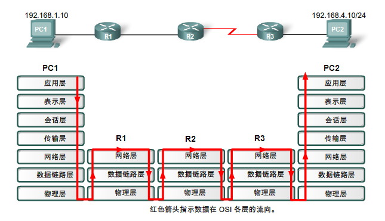

图 1‑1 数据流向图

路由表简介：
------------

路由器的主要功能是将数据包转发到目的网络，即转发到数据包目的 IP
地址。为此，路由器需要搜索存储在路由表中的路由信息。

路由表是保存在 RAM
中的数据文件，其中存储了与直连网络以及远程网络相关的信息。路由表包含网络与下一跳的关联信息。这些关联告知路由器：要以最佳方式到达某一目的地，可以将数据包发送到特定路由器（下一跳）或指定从某个接口发出（出接口）。

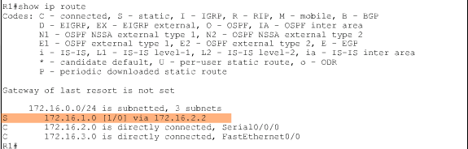

图 1‑2 路由表截图

<!--more-->

路由表的组成：

表 1‑1 路由表内容描述

| 序号 | 截图内容               | 相关描述                                 |
| ---- | ---------------------- | ---------------------------------------- |
| 1    | 172.16.0.0/24          | 主类网络是172.16.0.0，划分成了24位的子网 |
| 2    | is subnetted,3 subnets | 被划分了子网，总共有3个子网              |
| 3    | S                      | 代表路由类型：static，静态路由           |
| 4    | 172.16.1.0             | 目标子网网络号（目标网段）               |
| 5    | 172.16.2.2             | 下一跳地址                               |

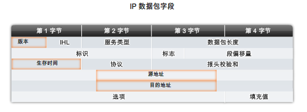

图 1‑3 数据包字段截图图

路由器收到数据包，查看IP数据包头部的目的地址，匹配路由表中的路由条目，找到下一跳或出接口，通过相应接口转发。

1.  静态路由的方式

    1.  静态路由的配置方式：

-   指定下一跳：

`ip route .0 255.255.255.0 12.1.1.2`

-   指定出接口：

`ip route .0 255.255.255.0 fastethernet 0/0`

两种方式是否一样呢？

### 静态路由实验

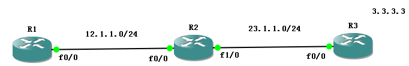

图 1‑4 静态路由实验拓扑图

#### 实验一 指定下一跳

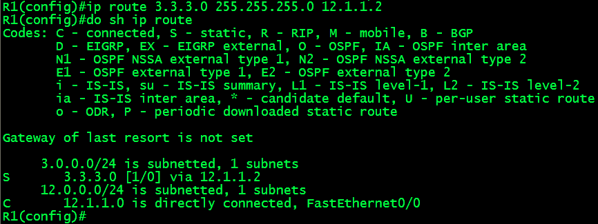

图 1‑5 静态路由配置及查看截图

R1 ping .3，数据包要发给下一跳12.1.1.2，R1
将ip包头封装到icmp包（ping包），继续封装以太网头部，发现不知道12.1.1.2的mac地址，无法完成封装，由于12.1.1.2和自己是同一网段，发出arp请求12.1.1.2的mac地址，R2收到arp广播后将F0/0的mac地址回复给R1，R1完成数据封装，发给R2，R2以同样方式发送给R3。

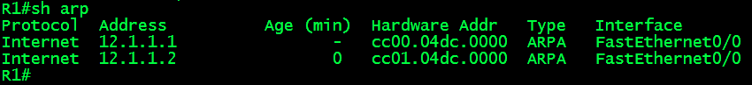

图 1‑6 查看arp截图

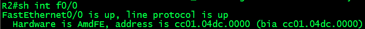

图 1‑7 查看接口截图

#### 实验二 指定出接口

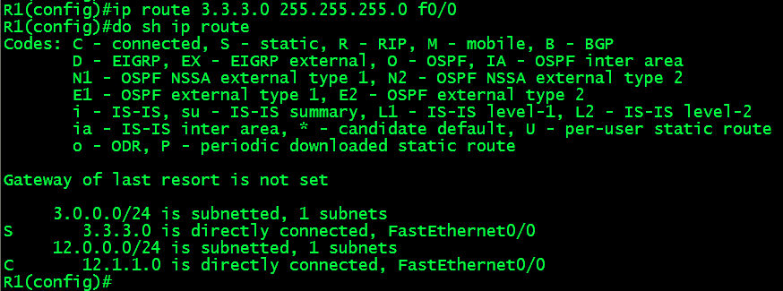

首先比较下路由表的不同，我们会发现一个现象：.0 is directly
connected，fastethernet0/0，路由器竟然认为3.3.3.0是直连路由。同样R1 ping
3.3.3.3，仍然无法完成二层目标mac的封装，因此发送arp请求，但是，由于R1认为3.3.3.0是直连网络，会直接请求3.3.3.3的mac地址！问题出现了，12.1.1.0网段有3.3.3.3这个主机吗？谁来回应R1？如果没有人来回应R1，那么就无法完成二层封装，数据无法发送出去，可是为什么会ping通？

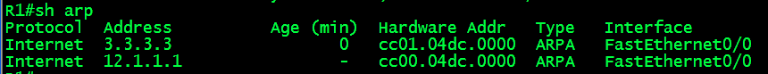

图 1‑8 查看arp截图


图 1‑9 查看接口截图

我们发现R1请求到的.3的mac地址竟然是R2的F0/0的mac地址，说明R2欺骗了R1，但是这是一个善意的谎言，因为R2知道如何去3.3.3.3，因此只要R1把数据包交给R2,R2可以帮R1转发出去，此技术叫做代理ARP，R2知道如何去往目的地，因此代理目标主机回复ARP请求，将主机的mac回复给请求者。

### 实验总结

-   使用下一跳：

R1只会请求下一跳的mac地址

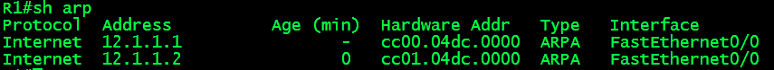

图 1‑10 查看arp截图

-   使用出接口：

由于R1认为目标与自己是直连的，所以会对每个目标发送arp请求，R2就得代理多次。

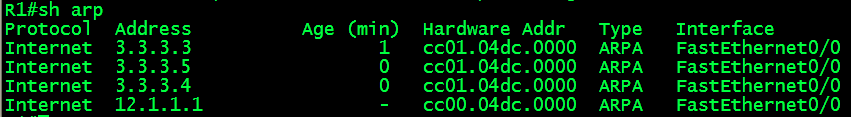

图 1‑11 查看arp截图

由此看出，使用出接口，不仅对同一网段不同目标访问都需要一次arp请求，占用arp缓存空间，并且需要R2开启代理arp功能。

cisco路由器默认开启代理arp

关闭代理arp的配置方法：

```
R2(config)#int f0/0

R2(config-if)#no ip proxy-arp
```


### 静态指定arp

arp是一种动态请求目标ip地址对应mac地址的协议，上面我们关闭了代理arp，动态无法进行地址解析，我们可以使用静态指定arp的方式进行地址解析。

R1(config)\#ar.3 cc01.0b4c.0000 arpa

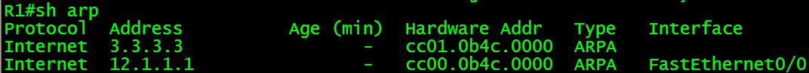

图 1‑12 查看arp截图

1.  静态默认路由

    1.  默认路由的概念

默认路由的表现形式为0.0.0.0
0.0.0.0，即目标网络号为0.0.0.0，子网掩码为0.0.0.0，在ip地址中0.0.0.0表示任意，那么任意网络号加上任意掩码表示为任意路由。通常用于互联网出口设备，用于表示互联网路由。

### 默认路由的配置

```
Router(config)#ip route .0 0.0.0.0 12.1.1.2

R1#show ip route

S* 0.0.0.0/0 [1/0] via 12.1.1.2

```


1.  DHCP（Dynamic Host Configuration Protocol）

    1.  DHCP的用途及工作机制

如果没有一个动态的分配ip地址的机制，所有人都需要手动指定ip地址，并且要记住网关和DNS服务器的地址，除此之外，非常容易造成地址冲突！ip地址分配，管理工作十分繁琐。

DHCP主要用途：动态的为网络中的主机分配IP地址

DHCP使用udp报文，client使用udp 68，server使用udp 67

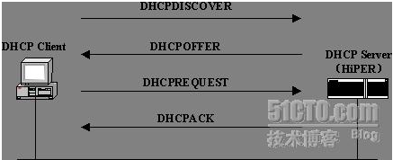

图 2‑1 DHCP工作机制图

-   第一个包discover：用于客户端寻找dhcp服务器

-   第二个包offer:用于服务器分配ip，子网掩码，dns，租期等信息

-   第三个包request：用于客户确认使用此ip

-   第四个包ack：被使用服务器端确认

注：linux系统中第一、三个包是广播包；第二、四个包是单播包，cisco系统中四个包全部是广播。

1.  DHCP的配置：

    1.  Server端配置

```
R1(config)#service dhcp------开启dhcp服务

R1(config)#ip dhcp excluded-address .253 12.1.1.254-----排除不分配的地址

R1(config)#ip dhcp pool cisco------建立dhcp地址池命名为cisco

R1(dhcp-config)#network .0 255.255.255.0------分配的网段及掩码

R1(dhcp-config)#default-router .1------默认网关

R1(dhcp-config)#dns 202.103.24.68-------dns服务器的地址

R1(dhcp-config)#lease 7--------租期为7天，一个地址可以用7天，默认为1天

```


### Client端配置：

路由器作为dhcp client端：

```
R2(config)#interface f0/0

R2(config-if)#ip address dhcp
```


DHCP中继
--------

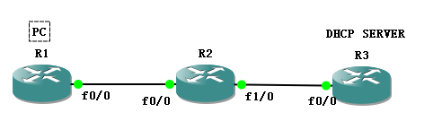

图 2‑2 DHCP中继实验拓扑图

```
R1:

R1(config)#interface f0/0

R1(config-if)#ip address dhcp

R2:

R2(config)#interface f0/0

R2(config-if)#ip add .2 255.255.255.0

R2(config-if)#ip helper-address .3

R3:

R3(config)#ip dhcp pool office

R3(dhcp-config)#network .0 255.255.255.0

R3(dhcp-config)#default-router .2

R3(config)#ip route .0 255.255.255.0 23.1.1.2

```


DHCP分配特定ip地址
------------------

```
R3(config)#ip dhcp pool cisco

R3(dhcp-config)#host 192.168.10.88 255.255.255.0

R3(dhcp-config)#client-identifier 01aa.bbcc.ddee.ff----给mac地址为aabb.ccdd.eeff的设备分配固定的192.168.10.88掩码为255.255.255.0

```


1.  帧中继

    1.  帧中继相关概念

帧屮继是一种在20世纪90年代初期形成的包交换技术
,是一个提供高性能的数据链路层和物理层的规范。帧中继比点到点链路更划算,并且可以运行在64Kbs\~
45Mb/s(T3)之间。帧中继提供动态分配带宽和拥塞控制特性。

包交换 (Packet
switching)这是一种WAN交换方法,允许和其他公司共享带宽以节省资金。可以将包交换想像为一种看起来像租用线路
,但费用更像电路交换的一种网络。不利因素是,如果需要经常传输数据,则不要考虑这种类型,应当使用租用线路。如果是偶然的突发性的数据传输,那么包交换可以满足需要。

帧中继网络环境
--------------

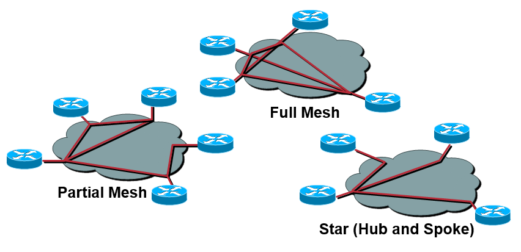

1.  帧中继术语

    1.  帧中继封装类型

当在Cisco路由器上配置帧中继时,需要在串行接口上将帧中继指定为一种封装。帧中继有两种封装类型：

-   cisco

-   IETF(Internet Engineering Task Force)

    1.  虚电路

帧中继使用虚电路工作方式
,所谓“虚”是相对于租用线路使用的真正电路而言的。这些虚电路是由连接到提供商
“网云”上的几干台设各构成的链路。帧中继为两台DTE设备之间建立的虚电路
,使它们就像通过一条电路连接起来一样,实际上将帧放入一个很大的共享设施里
。有两种虚电路——永久虚电路和交换虚电路。

-   永久虚电路 (Permanent Virtual
    Circuits,PVC)是目前最常用的类型。永久的意思是电信公司在内部创建映射,并且只要你付费,虚电路就一直有效。

-   交换虚电路 (switched Virtual
    Circuits,SVC)更像电话呼叫。当数据需要传输时,建立虚电路;数据传输完成后拆除虚电路。

    1.  数据链路连接标识符 (DLCI)

帧中继PVC使用数据链路连接标识符 (Data Link Connection
Identifiers,DICI)标识DTE设备。帧中继服务提供商分配 DLCI值 ,帧中继用
DLCI值区分网络上的不同虚电路。因为在一个多点帧中继接口上可以有多个虚电路,所以这种接口可以有多个DLCI。

### 本地管理接口(LMI) 

本地管理接口(Local Management
Interface,LMI)是路由器和它所连接的第一个帧中继交换机之间使用的信令标准。它允许传递有关服务提供商网络和DTE(路由器)之间虚电路的操作和状态信息。

-   KeepaIives(保持激活) 验证数据的通畅。

-   Multicasting(组播)这是一个可选的扩展LMI规范,允许在例如帧中继网络上有效
    发布路由信息和ARP请求。组播使用 1019\~1022之间的 DLCI保留号码。

-   G1obaI addressing(全局寻址)为 DLCI提供全局意义,允许帧 中继网云像LAN一样 。

-   Satus of virtual circuits(虚电路状态)提供DLCI状态信息。
    当无规律LMI流量发送时,这些状态查询和状态信息用于保持激活。

    1.  帧中继配置

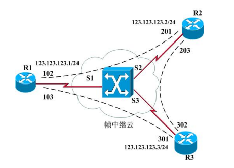

图 3‑1 帧中继实验拓扑

如图3-1，R1需要将数据发送给R2（ip为123.123.123.2）时，R1对数据进行2层封装使用DLCI=102来完成。数据到了帧中继交换机，帧中继交换机根据帧中继交换表进行交换转发：从S1接口收到一个DLCI为102的帧时，交换机把帧从S2接口发出，并且将二层地址改为201，这样R2就会接收R1发来的数据包。

通过以上的转发过程，发送方路由器R1需要知道3层封装目标ip=123.123.123.2时，2层地址应该封装哪一个DLCI。

静态指定映射：

```
Interface s1

encapsulation frame-relay

no frame-relay inverse-arp

ip address 123.123.123.1 255.255.255.0

frame-relay map ip 123.123.123.2 102

```


帧中继是一个非广播多路访问的环境。如果路由器R1
DLCI=102的PVC上发送一个广播，只有R2可以收到，R3是无法收到的，如果R1发送的广播想让R2和R3都收到，必须分别在PVC
102和PVC 103上各发送一次，这就是非广播的含义。

帧中继配置：

帧中继交换机：

```
R4(config)#frame-relay switching-------在路由器上开启帧中继交换机功能

R4(config)#interface s0/0

R4(config-if)#encapsulation frame-relay-------将接口封装为帧中继协议

R4(config-if)#frame-relay intf-type dce------帧中继交换机接口类型为dce端

R4(config-if)#clock rate 64000

R4(config-if)#frame-relay lmi-type cisco-----lmi的标准类型

R4(config-if)#frame-relay route 102 interface s0/1 201-----创建帧中继交换表

R4(config-if)#frame-relay route 103 interface s0/2 301

R4(config-if)#no shutdown

R4(config-if)#interface s0/1

R4(config-if)#encapsulation frame-relay

R4(config-if)#frame-relay intf-type dce

R4(config-if)#clock rate 64000

R4(config-if)#frame-relay lmi-type cisco

R4(config-if)#frame-relay route 201 interface s0/0 102

R4(config-if)#no shut

R4(config)#interface s0/2

R4(config-if)#encapsulation frame-relay

R4(config-if)#frame-relay intf-type dce

R4(config-if)#clock rate 64000

R4(config-if)#frame-relay lmi-type cisco

R4(config-if)#frame-relay route 301 interface s0/0 103

R4(config-if)#no shutdown

```


查看：

`Show frame-relay route`

DTE端：

```
R1(config)#interface s0/0

R1(config-if)#encapsulation frame-relay

R1(config-if)#no frame-relay inverse-arp

R1(config-if)#ip address 123.1.1.1 255.255.255.0

R1(config-if)#frame-relay lmi-type cisco

R1(config-if)#frame-relay map ip 123.1.1.2 102

R1(config-if)#frame-relay map ip 123.1.1.3 103

R1(config-if)#no shutdown

R2(config)#interface s0/0

R2(config-if)#encapsulation frame-relay

R2(config-if)#no frame-relay inverse-arp

R2(config-if)#ip address 123.1.1.2 255.255.255.0

R2(config-if)#frame-relay lmi-type cisco

R2(config-if)#frame-relay map ip 123.1.1.1 201

R2(config-if)#no shutdown

R3(config)#interface s0/0

R3(config-if)#encapsulation frame-relay

R3(config-if)#no frame-relay inverse-arp

R3(config-if)#ip address 123.1.1.3 255.255.255.0

R3(config-if)#frame-relay lmi-type cisco

R3(config-if)#frame-relay map ip 123.1.1.1 301

R3(config-if)#no shutdown

```


查看：

`Show frame-relay map`

帧中继子接口
------------

帧中继在一个串行接口上有多条虚电路,并且将每条虚电路视为一个单独的接口,它被认为是子接口。将子接口想像为一个由IOS软件定义的逻辑接口。帧中继子接口可分为两种：

### 点到点子接口（point-to-point）

   当一台虚电路连接一台路由器到另一个路由时
   ,使用点到点子接口。每个点到点子接口需要自己的子网。

   配置：


 ```
   R1(config)#int s2/0

   R1(config-if)#encapsulation frame-relay

   R1(config-if)#frame-relay lmi-type cisco

   R1(config-if)#no shutdown

   R1(config-if)#exit

   R1(config)#int s2/0.102 point-to-point

   R1(config-subif)#ip address 10.1.1.1 255.255.255.0

   R1(config-subif)#frame-relay interface-dlci 102

   R1(config-fr-dlci)#exit

 ```


### 多点子接口

   当路由器位于星状虚电路的中心时,使用多点子接口。所有连接到帧中继交换机上的路由器接口都使用一个子网。

   配置：

```
   R1(config)#int s2/0

   R1(config-if)#encapsulation frame-relay

   R1(config-if)#frame-relay lmi-type cisco

   R1(config-if)#no shutdown

   R1(config-if)#exit

   R1(config)#int s2/0.103 multipoint

   R1(config-subif)#ip address 11.1.1.1 255.255.255.0

   R1(config-subif)#frame-relay map ip 11.1.1.3 103

   R1(config-subif)#exit

```
