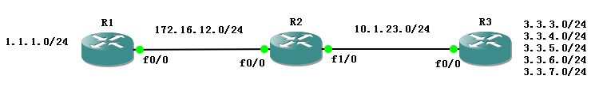

**RIP路由信息协议**

路由分类
========

动态路由协议按照范围来分：
--------------------------

-   IGP（intra gateway protocol）内部网关路由协议

Rip，eigrp，ospf

-   EGP（edge gateway protocol）边界网关路由协议

Egp，bgp

动态路由协议按类型来分：
------------------------

-   距离矢量路由协议:rip,eigrp

-   链路状态路由协议:ospf,is-is

-   路径矢量：bgp

距离矢量路由协议
----------------

距离矢量路由协议的由来是因为路由是以矢量（距离，方向）的方式被通告出去的，其中距离是根据度量（metric）定义的，方向是根据下一跳定义的。

<!--more-->

RIP
===

RIP的特点
---------

管理距离：120

使用跳数作为选择路径的度量

如果某网络的跳数超过了15，RIP便无法提供到达该网络的路由。

默认情况下，每30秒通过广播或组播发送一次路由更新。

RIP的版本
---------

-   RIPv1

-   RIPv2

-   RIPng

RIPv1的消息格式
---------------

RIP 消息的数据部分封装在 UDP
数据段内，其源端口号和目的端口号都被设为520。在消息从所有配置了 RIP
的接口发送出去之前，IP 报头和数据链路报头会加入广播地址作为目的地址。


图 2‑1 RIP数据包结构图

Rip请求包：每个配置了RIP的接口在启动时都会发送请求消息，要求所有邻居发送完整的路由表。

Rip应答包：默认情况下启用RIP的路由器每30秒通过广播发送一次完整的路由表进行路由更新；在收到请求包的情况下通过单播方式向请求方发送完整的路由表。

RIPv1的数据包内只有目标网络，但是没有子网掩码，因此RIPv1不支持VLSM（可变长子网掩码），只支持有类路由。

在有类网络环境中，假定同一主类网络使用相同掩码，由于路由传递过程中不携带掩码，接收方路由器以自己的接口掩码作为路由掩码。

RIP路由更新的过程
-----------------

第一步：路由器只直连路由。


图 2‑2 RIP路由表更新示意图1

第二步：每30秒将自己的整张路由表通过Rip应答包发送出去，收到路由后通过跳数选择最优的路由放入路由表。


图 2‑3 RIP路由表更新示意图2


图 2‑4 RIP路由表更新示意图3

有类路由收发规则
----------------

-   路由器发送路由更新，路由条目的掩码必须和出接口掩码相同，否则不发该路由条目；

-   路由器发送路由更新，如果路由条目掩码为32位，路由器认为该条路由为主机路由，即使和出接口掩码不同，仍然发送该路由条目；

-   路由器接收路由更新，由于路由更新中不携带掩码，路由器收到路由条目后，以进接口的掩码安装到路由条目中；

-   路由器接收路由更新，使用进接口的掩码匹配路由后，发现主机位不全为0，则认为该路由为主机路由，在路由表中生成32位主机路由。

>   注：同一主类网络被划分的各个子网，叫做连续的子网

假定拓扑：所有ip属于同一主类网络！


图 2‑5 有类路由更新机制实验图

RIPv1的配置：
```
R1(config)#router rip------开启rip进程

R1(config-router)#version 1-------版本1

R1(config-router)#network 172.16.0.0-----宣告直连的有类网络
```


图 2‑6 RIP路由表截图

### 情景1 将R2的loopback 0的掩码改为25位
```
R2(config)#int lo0

R2(config-if)#ip add 172.16.2.1 255.255.255.128
```


图 2‑7 情景1RIP路由表截图

现象：172.16.2.0的路由条目消失在R1的路由表中。

### 情景2 将R2的loopback 0的掩码改为32位
```
R2(config)#int lo0

R2(config-if)#ip add 172.16.2.1 255.255.255.255
```


图 2‑8情景2 RIP路由表截图

现象：R1的路由表中出现了172.16.2.1/32的路由条目

### 情景3 将R1的F0/0接口掩码改为25位
```
R1(config)#int f0/0

R1(config-if)#ip add 172.16.12.1 255.255.255.128
```


图 2‑9 情景3RIP路由表截图

现象：R1路由表中所有Rip条目都变为25位

### 情景4：将R2的F0/0接口掩码改为25位，R2的loopback的地址改为172.16.2.129，掩码改为25位
```
R2(config)#int lo0

R2(config-if)#ip add 172.16.2.129 255.255.255.128

R2(config-if)#int f0/0

R2(config-if)#ip add 172.16.12.2 255.255.255.128
```


图 2‑10 情景4RIP路由表截图

现象：R1的路由表中产生了一条172.16.2.128/32的路由条目

RIP边界汇总
-----------

两个不同接口属于不同主类网络是RIP边界路由器，此路由器会自动将路由条目汇总为主类网络的掩码进行路由更新。


图 2‑11 RIP汇总实验拓扑图


图 2‑12 R2 RIP路由表截图

R2的路由表中仍然是24位路由


图 2‑13 R1 RIP路由表

R1的路由表中出现了.0/8的主类路由


图 2‑14 R3 RIP路由表

R3的路由表中出现了172.16.0.0/16的主类路由

RIP的被动接口
-------------


图 2‑15 RIP被动接口实验拓扑图

现在需求R1和R2相互更新RIP路由信息，R3和R4相互更新RIP路由信息，但不希望R2和R3之间相互更新路由信息。

对于R2来说很容易实现：
```
R2(config)#router rip

R2(config-router)#network 192.168.12.0
```
不宣告172.16.23.0网段就可以了。

但是R3如何实现呢？如何要向R4发送路由更新，就必须宣告172.16.34.0网段，但是rip宣告主类网络，172.16.0.0同时也包括了172.16.23.0网段。
```
R3(config)#router rip

R3(config-router)#network 172.16.0.0

R3(config-router)#passive-interface fastEthernet 0/0
```
Passive-interface：被动接口，使得RIP路由器只从此接口接收路由更新，不发送路由更新！

只希望F0/0发rip更新，其他接口都不发rip更新
```
router rip

version 1

passive-interface default-----所有接口都设置passive接口

no passive-interface FastEthernet0/0

network 172.16.0.0
```
RIP默认路由
-----------


图 2‑16 RIP默认路由实验拓扑图

拓扑说明：R1为内网路由器，R2为网关，R3为internet路由器，默认情况下，网关需要写一条静态缺省路由指向外网，但是内部的每一台路由器都需要这样操作吗？动态路由协议是否可以传递缺省路由呢？

### 方法一：
```
R2:

ip route .0 0.0.0.0 202.100.1.3---R2缺省路由指向R3

router rip

version 1

network 172.16.0.0

default-information originate----下发默认路由
```
R1:


图 2‑17 RIP默认路由实验方法一验证截图

### 方法二：


图 2‑18 RIP默认路由实验拓扑图

`ip default-network`
一个直连路由或静态路由（路由可以是子网路由，但是default-network只能接主类）

建议方案，在网关上添加一个环回口，使用该环回口当默认网络。

R2：
```
interface Loopback0

ip address 2.2.2.2 255.255.255.255

ip default-network 2.2.2.0
```


图 2‑19 RIP默认路由实验方法二验证截图

R1：


图 2‑20 RIP默认路由实验方法二验证截图

`注：先ip default-network 2.2.2.0，然后再ip route 0.0.0.0 0.0.0.0 202.100.1.2`

### 方法三：
```
R4(config)#ip route .0 0.0.0.0 f0/0

R4(config)#router rip

R4(config-router)#redistribute static ----重分发静态路由，让rip可以学习静态路由
```
RIP环路
-------


图 2‑21 RIP路由环路示意图

解决环路的方法：

-   水平分割（默认开启，可以手动关闭）

从一个接口收到的路由不会再从这个接口发出
```
R1(config)#int f0/0

R1(config-if)#no ip split-horizon
```
-   最大跳数

一条路由失效后立刻将其定义为16跳（不可达）

-   触发更新

路由器一条路由失效后立刻发送路由更新

-   毒性逆转

以上图为例，.0的路由down掉了之后，Router
C将10.4.0.0标记毒性路由（表示该路由不可达，rip使用16跳）发送给Router B，Router
B立刻向Router
C回复一条毒性路由，打破水平分割原则，防止C向B发毒性路由的同时，B将自己的路由更新给C，造成环路。

RIP计时器
---------

1.  update
    timer（更新计时器）：平均每30秒发送一次应答包，通过一个RIP_Jitter的随机抖动变量来错开更新时间（25.5-30S）

2.  invalid
    timer（无效计时器）：当180秒后还没收到路由更新，路由条目被变为16跳，标记为不可达。

3.  flush timer（刷新计时器）：当无效计时器超时60秒后，该路由从路由表删除。

4.  holddown
    timer（抑制计时器）：180秒，路由器如果在相同的接口上收到某个路由条目的距离比原先收到的距离大，那么将启动一个抑制计时器，在抑制计时器的时间内该目的标记为不可到达，直到计时器超时，路由器才可以接受有关此路由的更新信息。

5.  sleep
    timer（触发更新计时器）：默认是5秒，表示随机抖动在1-5秒内，防止同时触发更新“风暴”。

修改RIP计时器：
```
R1(config)#router rip

R1(config-router)#timer basic 30（更新） 180（无效） 180（抑制） 240（刷新）
5000（触发更新，毫秒为单位）
```
>注：在rip的database里面invalid timer时间 180秒到了 ,就进入holddown 180秒, 但是flush 计时器是和invalid 一起开始的, 所以总共240 秒一到.本路由就会被清除掉,而不是等到 holddown 的180秒 走完, 总共要等invaild+holddown=360, 实际的时间 最高就是240 秒左右(有一定的偏差)

接口下修改rip更新间隔：
```
R1(config)#int f0/0

R1(config-if)#ip rip advertise 10
```
RIPv1的局限性
-------------

### 不支持不连续子网


R1：


发现R1收到的是172.16.0.0的有类路由，并且有两个下一跳，负载均衡。


### 不支持关闭自动汇总


我们希望R2,R3如果能关闭自动汇总，是否可以解决此问题？
```
R2(config)#router rip

R2(config-router)#no auto-summary

R3(config)#router rip

R3(config-router)#no auto-summary
```
R1：


仍然汇总成主类路由，负载均衡。

### 不支持手动汇总


R1：


R2有很多172.16.0.0/16的子网网络，如果子网过多，增加路由条目，增加路由器R1的负担，172.16.2.0到172.16.5.0都属于172.16.0.0/21，我们希望可以用一条汇总来代替诸多繁杂的路由条目
```
R2：

R2(config)#int f0/0

R2(config-if)#ip summary-address rip 172.16.0.0 255.255.248.0
```
R1：


说明R2并没有发出汇总路由，原因：手动汇总后，掩码改变，与发出路由更新接口不匹配，所以无法发出，并且原有明细路由也无法发出路由更新。

RIPv2
-----

RIPv2与RIPv1相同，封装在UDP
520端口，不同的是：使用组播地址224.0.0.9发送路由更新；支持子网掩码（即支持VLSM）；支持手动汇总；支持身份认证。

RIPv2的消息格式
---------------


图 2‑22 RIP消息格式截图


图 2‑23 RIPv2实验拓扑图

RIPv2基本配置
-------------
```
R1：

router rip

version 2

network .0

network 172.16.0.0

no auto-summary

R2:

router rip

version 2

network .0

network 172.16.0.0

no auto-summary

R3：

router rip

version 2

network .0

network .0

no auto-summary
```
查看路由表：


图 2‑24 R1路由表截图

非连续子网，收到的是无类路由！因为路由更新中携带子网掩码。

RIPv2手动汇总
-------------



图 2‑25 RIPv2手工汇总实验拓扑图

原R1路由表：


图 2‑26 汇总前R1路由表截图

R3有多个.0/21的子网网络，希望由汇总路由进行路由更新。

R3：出接口发汇总路由！

现R1路由表:


图 2‑27 汇总后R1路由表截图

大大简化路由表，减轻路由器的负担！

防止环路：

`R3(config)#ip route 172.16.0.0 255.255.248.0 null0`

RIPv2身份认证
-------------

RIPv2是通过更改RIP消息中的正常情况下应该是第一个路由条目的字段来支持认证。因此在含有认证的单个更新消息中，最大可以携带的路由条目被减少到24条。认证是通过设置地址族标识符为0xFFFF来标识。路由标记设置为认证类型


图 2‑28 RIPv2数据包认证字段

RIPv2的认证类型：

1.  明文认证

2.  MD5认证

### 明文认证
```
R1：

key chain cisco

key 1

key-string cisco

interface FastEthernet0/0

ip address 12.1.1.1 255.255.255.0

ip rip authentication key-chain cisco
```


### MD5认证
```
R1:

interface FastEthernet0/0

ip address 12.1.1.1 255.255.255.0

ip rip authentication mode md5

ip rip authentication key-chain cisco
```


RIP版本
-------

RIPv1：


图 2‑29 查看路由协议截图

RIPv2：


图 2‑30 查看路由协议截图

默认版本：


图 2‑31 查看路由协议截图

总结：

默认版本------发送v1路由更新，接收v1，v2路由更新

RIPv1----------发送v1路由更新，接收v1路由更新

RIPv2----------发送v2路由更新，接收v2路由更新

修改RIP路由器收发路由更新版本：
```
interface FastEthernet0/0

ip address 172.16.12.1 255.255.255.0

ip rip send version 1 2-------发v1，v2

ip rip receive version 1 2-----收v1，v2
```


RIP的负载均衡
-------------
```
R1(config)#router rip

R1(config-router)#maximum-paths 16（默认是4）
```
RIP Feature
-----------

### 单播更新：

通过单播方式向RIP邻居发送路由更新，使用广播和组播的原因在于，不清楚RIP邻居在哪里，如果知道RIP邻居的IP地址，就可以让RIP路由器向指定邻居发送路由更新

回顾被动接口，如果只想让一个接口发送路由更新
```
R1：

router rip

version 1

passive-interface default-----所有接口都设置passive接口

no passive-interface FastEthernet0/0
```
注：passive-interface只针对组播和广播路由更新

方法二：
```
R1：

router rip

passive-interface default

network 172.16.0.0

neighbor 172.16.12.2-----单播定向发送路由更新

R2：

router rip

passive-interface default

network 172.16.0.0

neighbor 172.16.12.1
```
### RIP触发更新

在低速链路上，如果定期发送广播更新，十分消耗原本就很紧张的带宽资源，如果使用触发更新，将很好的降低链路资源的消耗。

只能在点到点链路使用！并且需要两端都使用才生效。
```
R1：

interface Serial0/0

ip address 172.16.12.1 255.255.255.0

ip rip triggered

R2:

interface Serial0/0

ip address 172.16.12.2 255.255.255.0

ip rip triggered
```
### RIP版本2发送广播
```
interface Serial0/0

ip address .1 255.255.255.0

ip rip v2-broadcast
```
适用于比较老旧的设备不识别rip的组播地址。