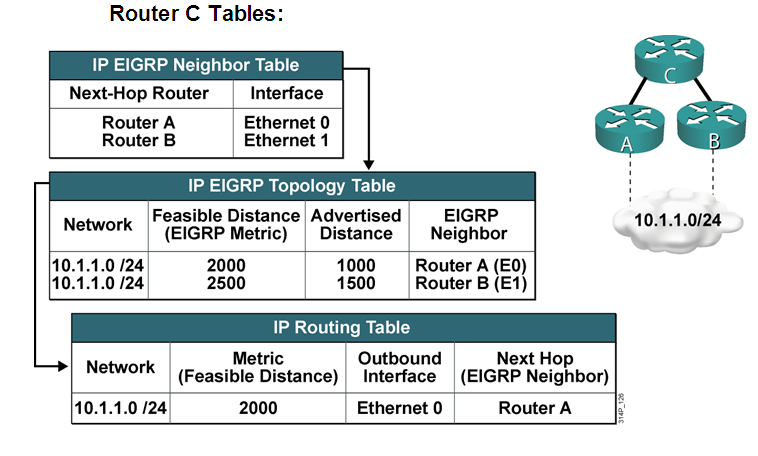

**EIGRP路由协议基础部分**

EIGRP的概述
===========

EIGRP是一种高级距离矢量路由协议，具有一定链路状态性质的距离矢量路由协议。

距离矢量路由协议：通过相邻路由器周期性更新整张路由表，获取路由信息，通过算法选出最佳路径，所有信息仅限于邻居之间共享。

链路状态路由协议：虽然只通告直连信息，但是这些信息可以在同一个区域内共享，使得路由器了解该区域的拓扑情况，构建同一区域的整张拓扑表，然后根据算法选出最佳路径。

EIGRP的高级距离矢量性：同样也构建拓扑表，但是这张拓扑表和链路状态路由协议不同的是：EIGRP的拓扑表示根据邻居传递的路由构造的，并不是根据链路状态信息。

<!----more--->

EIGRP的特点
===========

1.  高级距离矢量性

2.  无类路由协议

3.  快速收敛

4.  增量更新

5.  支持多种网络层协议（PDM，Protocol-dependent Modules）

6.  使用组播（224.0.0.10）和单播更新

7.  支持手工汇总

8.  支持非等价负载均衡（cisco专利）

EIGRP的封装
===========

EIGRP数据包承载在IP之上，对应ip报头中protocol=88，EIGRP依靠私有协议RTP（可靠传输协议）保证EIGRP数据包的可靠传输。

RTP：用来管理EIGRP数据包的发送和接收，可靠的发送是指发送是有保障的(通过ack确认)而且数据包是有序的发送的（通过序列号）。


TLV：type/length/value，类型/长度/数值。


图 3‑1 EIGRP报头格式截图

EIGRP报头
---------

-   版本：2

-   操作码：EIGRP数据包类型

>   1代表更新（update）：用于传递路由更新信息。和RIP不同，EIGRP只有在必要的时候传递必要的信息，并且仅仅传递给需要路由信息的路由器。第一个更新包使用组播发送，重传更新包用单播发送。更新包是可靠传输的。

>   3代表查询（query）：向EIGRP邻居查询路由信息，查询包可以用组播或单播发送，是可靠传输。

>   4代表回应（reply）：对路由器的查询信息进行响应，回应包总是单播发送的，是可靠传输。

>   5代表hello或确认（ACK）：hello用于发现邻居和维护邻居关系，使用组播方式发送，并且是不可靠传输；当hello包不包含数据时就是ACK，ACK用于确认可靠传输的EIGRP数据包，ACK总是单播发送并且是不可靠传输。

在高速链路上，例如以太网，点到点链路（PPP、HDLC），Hello的间隔时间为5秒，抑制时间为15秒，即15秒后还没收到邻居的hello包，便认为邻居失效，重置邻居。

在带宽小于等于1.544Mbps的低速链路，例如帧中继，ATM，hello的间隔时间为60秒，抑制时间为180秒。

接口下修改hello间隔时间：

`R1(config-if)#ip hello-interval eigrp 100 5-----100为eigrp进程号，5为hello间隔时间。`

接口下修改抑制时间：

`R1(config-if)#ip hold-time eigrp 100 15----100为eigrp进程号，15为holdtime。`

-   校验和：计算EIGRP整个数据包。

-   序列号：RTP用于保证有序传输的机制。

-   确认号：RTP用于保证可靠传输的机制。一个非零ACK字段的hello包将视为确认包，而不是hello包。

-   自治域系统号：一个EIGRP协议域的标识号。

    1.  EIGRP报文

        1.  参数TLV的EIGRP报文


图 3‑2 EIGRP报文格式截图

EIGRP的metric计算：

完整公式：

（K5不等于0时）


默认情况下：K1（带宽系数）=1，K2（负载系数）=0，K3（延迟系数）=1，K4（可信度系数）=0，K5（MTU系数）=0

当K5=0时

Metric=K1XBW+K3Xdelay

BW(带宽)=[10^7/(整条链路最小的链路带宽，kbps)]*256

Delay（延迟）=[整条路径（路由进接口）的延迟总和，10usec]*256

注：如果10^7除最小带宽为非整数，则取整，例如串行链路带宽为1.544Mbps，10^7除1544=6476.68，取整为6476，如果10^7/最小带宽<1，则取1，例如环回口，带宽为8Gbps，此时取1.

修改K值：
```
router eigrp 100

metric weights 0 1 0 1 0
```
1（第一个值为tos只能为0，第二个K1带宽的系数，第三个K2负载的系数，第四个K3延迟的系数，第五个K4可信度的系数，第六个K5
MTU的系数）

等待时间：holdtime

### IP内部路由TLV的EIGRP报文

图 3‑3 EIGRP报文格式截图

-   延迟：路由进方向的接口延迟总和，单位为10us。一个0xFFFFFFFF的延迟标识一个不可达的路由

-   带宽：路由进方向整个路径上的最小接口带宽。

-   MTU（最大传输单元）：路由进方向整个链路上最小的MTU。

跳数：一个在0x01-0xFF的数，即1到255跳，256跳表示路由不可达。

-   可靠性：一个在0x01-0xFF的数，用来反映到达目的地出站接口的误码率总和。0xFF表示100%可靠链路。

-   负载：一个在0x01-0xFF的数，用来反映到达目的地出站接口负载的总和。0x01表示一条最小负载的链路。

-   前缀长度：即掩码长度。

-   目的地址：表示一个路由的目标地址。该字段长度可变，如果没有满足4个8位组的边界长，将用0补齐。

EIGRP的邻居列表
===============


图 4‑1 EIGRP邻居列表截图

EIGRP邻居列表的描述：

表 4‑1 EIGRP邻居列表内容描述

| 序号 | 内容                            | 描述                                                         |
| ---- | ------------------------------- | ------------------------------------------------------------ |
| 1    | Process 100                     | AS号为100                                                    |
| 2    | H                               | 邻居列表的序列号，从0开始计数                                |
| 3    | Address                         | 邻居的接口ip地址                                             |
| 4    | Interface                       | 本地连接邻居的接口                                           |
| 5    | Hold                            | holdtimer从15s开始倒计时                                     |
| 6    | Uptime                          | 邻居建立之后经过的时间                                       |
| 7    | SRTT（smooth round-trip timer） | 平滑往返时间，一个可靠报文发出至接收到ACK的时间，单位：毫秒  |
| 8    | RTO(retransmission timeout)     | 发出一个可靠报文，如果没有收到ACK，经过RTO之后重传报文，一共重传16次，还没有收到ACK，重置邻居关系，该时间是通过cisco的算法得出，不是固定值，单位ms |
| 9    | Q                               | 重传队列中等待发送数据包的数量                               |
| 10   | Seq                             | 从邻居收到的最新可靠传输数据包的序列号， RTP跟踪这些序列号，保证数据包的有序性 |

注：EIGRP的hello-interval和holdtime都不影响EIGRP的邻居建立。

1.  EIGRP拓扑表

    1.  DUAL算法（扩散更新算法）

扩散更新算法是一个收敛算法，设计思想是即使是暂时的环路还是对网络性能造成影响。Cisco
EIGRP使用DUAL算法称该协议100%无环。

相关术语
--------

-   可行距离 (feasible distance，FD):到达每一个目标网段的最小度量值作为该目标网段的可行距离。

-   后继路由器（successor，S）：到达目标网络的最佳下一跳路由器。

-   可行后继路由器（feasible successor，FS）：作为后继路由器的备份下一跳路由器，如果后继路由器失效，FS将自动切换为S，即次佳下一跳。为了避免环路，不是所有的路由器都可以成为FS，必须要满足FC。

-   可行性条件（feasible condition，FC）：希望成为FS的路由器的通告距离AD小于目前的FD。

-   通告距离AD（advertise distance，AD）：下一跳路由器到达目标地址的距离。

    1.  相关实验


图 5‑1 EIGRP拓扑表实验拓扑图

R1可以收到从R2和R3发送的34.1.1.0/24路由，通过计算开销，R1以R3作为下一跳开销为200，R1以R2为下一跳开销为250，因此R1到34.1.1.0网络的FD为200，R3为最佳下一跳即S，R2是否能成为FS，首先看是否满足FC，R2的AD为150<R1到34.1.1.0的FD为200，因此R2为R1到达34.1.1.0的FS。

查看完整的拓扑表：


查看通过dual算法计算后的拓扑表：


EIGRP路由表
===========

通过拓扑表计算出的最佳路径放进路由表，如下图所示：



图 6‑1 EIGRP路由表构建过程

EIGRP邻据状态机制
=================


图 7‑1 EIGRP邻居状态机

1.  EIGRP非等价负载均衡

    1.  EIGRP等价负载均衡

EIGRP的默认负载均衡路径数为4，最大为16。
```
R1(config)#router eigrp 100

R1(config-router)#maximum-paths 16
```
EIGRP非等价负载均衡
-------------------

EIGRP的非等价负载均衡必要条件：只有后继路由器（S）和可行后继路由器（FS）才能实现非等价负载均衡，并非所有链路都可以成为负载均衡的链路。

Variance（差异变量）用来确定哪些路由可以实现非等价负载均衡。Variance是一个倍数因子，默认为1，实现等价负载均衡。


图 8.2‑1 EIGRP非等价负载均衡实验拓扑图

拓扑说明：R1到.4的FD为300，R2为FS，R1通过R2到达4.4.4.4的开销为400，如果要实现非等价负载均衡，FD*variance>=通过R2到达4.4.4.4的开销，即300*variance>=400（variance值必须为整数）

实验配置：
```
R1：

R1(config)#router eigrp 100

R1(config-router)#no auto-summary

R1(config-router)#metric weight 0 0 0 1 0 0

R1(config-router)#network 12.1.1.1 0.0.0.0

R1(config-router)#network 13.1.1.1 0.0.0.0

R1(config-router)#exit

R1(config)#interface f0/0

R1(config-if)#delay 5

R1(config-if)#exit

R2：

R2(config)#router eigrp 100

R2(config-router)#no auto-summary

R2(config-router)#metric weight 0 0 0 1 0 0

R2(config-router)#network 12.1.1.2 0.0.0.0

R2(config-router)#network 23.1.1.2 0.0.0.0

R2(config-router)#exit

R2(config)#interface f1/0

R2(config-if)#delay 5

R2(config-if)#exit

R3：

R3(config)#router eigrp 100

R3(config-router)#no auto-summary

R3(config-router)#metric weight 0 0 0 1 0 0

R3(config-router)#network 13.1.1.3 0.0.0.0

R3(config-router)#network 23.1.1.3 0.0.0.0

R3(config-router)#network 34.1.1.3 0.0.0.0

R4：

R4(config)#router eigrp 100

R4(config-router)#no auto-summary

R4(config-router)#metric weight 0 0 0 1 0 0

R4(config-router)#network 34.1.1.4 0.0.0.0

R4(config-router)#network 4.4.4.4 0.0.0.0
```
验证结果：

`R1#show ip eigrp topology`

`P 4.4.4.4/32, 2 successors, FD is 133120`

via 23.1.1.3 (133120/130560), FastEthernet1/0

via 12.1.1.1 (133120/131840), FastEthernet0/0