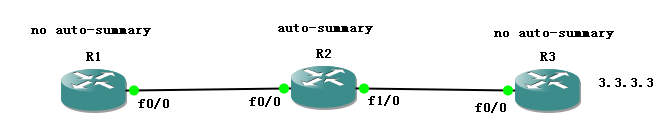

EIGRP query和reply报文
======================

路由表形成后，EIGRP拓扑表里的条目为P（passive）状态，EIGRP没有周期性更新，因此在拓扑没有变更时，路由都处于被动状态。

当拓扑发生变更时，例如后继路由器（S）失效，路由器首先执行本地计算，即对所有的可行后继路由器，重新计算到达目的地的距离，距离最小的FS成为S。当路由器进行本地计算时，路由条目仍然处于被动状态，发送路由更新即可。


<!---more---->

如果拓扑表中没有FS，那么路由器将要进行扩散计算，路由器将路由改为active状态，向邻居路由器发送查询报文，在完成扩散计算回到被动状态之前，路由器不能改变后继路由器，不能开始进行另一个扩散更新算法。

对于每一台接收查询的邻居路由器，如果有到达目标的路由，回复reply包，如果没有到达目标的路由，继续向除了收到查询的邻居路由器发送查询报文，直至到网络边界路由器没有该路由，回复reply通告没有该路由，本地路由器将设置一个答复状态标记来不断的跟踪所有未处理的查询报文。当本地路由器收到所有发送到邻居路由器的查询的答复时，扩散计算就算完成了。


图 1‑1 EIGRP扩散查询过程

query报文格式
-------------


图 1‑2 EIGRP查询报文格式

由图1-2可以发现，EIGRP
query报文实际上由EIGRP报头+内部路由类型TLV报文组成的，被查询的路由延迟为4294967295，即0xFFFFFFFF。

reply报文格式
-------------


图 1‑3 EIGRP reply报文格式

由图1-3可以发现，EIGRP
reply报文实际上也是由EIGRP报头+内部路由类型TLV报文组成的，被查询的路由延迟为4294967295，即0xFFFFFFFF，通过单播方式反馈查询路由器。

查看查询包和应答包：


图 1‑4 EIGRP数据包查询截图

EIGRP SIA
---------

如果路由器没有收到发出的每一个查询的答复报文，路由器通过活动计时器（active
timer）3min之后宣告该路由“卡”在活动状态（stuck-in-active，SIA），将没有答复的邻居从邻居列表中删除，并认为该邻居回复了一个无穷大的度量，重置邻居关系。

修改活动计时器：
```
R1(config)\#router eigrp 100

R1(config-router)\#timers active-time 3
```
EIGRP查询流程
-------------


图 1‑5 EIGRP查询过程

拓扑说明：

A、B为中心站点，C、D、E为分支站点，A、B为以太链路，其余为低速链路，A到达.0网络的S为B，没有FS，C、D、E到10.1.1.0网络的S为B，FS为A，当10.1.1.0网络失效时，B发送查询报文给A、C、D、E，C、D、E都有FS，因此会向B回复reply，同时A也收到B的查询包，而A没有FS，A继续向C、D、E发送查询包，由于C、D、E的FS就是A，因此无法将A再回复给A，继续向B发送查询，结果，原本是B发出的查询，反而又向B查询。

EIGRP SIA解决方案：
-------------------

-   路由汇总

-   stub区域

    1.  EIGRP路由汇总


图 1‑6 EIGRP路由汇总实验拓扑图
```
R3(config)\#int f1/0

R3(config-if)\#ip summary-address eigrp 100 3.3.3.0 255.255.255.0
```


图 1‑7 R2 EIGRP路由表

汇总路由如何减小EIGRP的查询范围？

当一条明细路由失效，路由器发送查询包查询的是明细路由，而邻居路由器的路由表只有汇总路由，没有明细路由，直接回复reply告知该明细路由不可达。
```
R3：

R3(config)\#int loopback0

R3(config-if)\#shutdown
```


图 1‑8 R2 debug query报文截图


图 1‑9 R1 debug query报文截图

### EIGRP stub

配置了eigrp
stub的路由器在hello包中标识自己为stub路由器，邻居路由器收到该hello包，不会再向这台路由器发送查询包。


图 1‑10 EIGRP stub实验拓扑图

R2没有配置eigrp stub之前


```
R3：

R3(config)\#interface lo0

R3(config-if)\#shutdwon

R3\#debug eigrp packet query
```


图 1‑11 R3 debug query报文截图

R2配置eigrp stub
```
R2(config)\#router eigrp 100

R2(config-router)\#eigrp stub
```
再次shutdown lo0，R3不向R2发送查询包

Eigrp 自动汇总
==============

EIGRP自动汇总
-------------



图 2‑1 EIGRP自动汇总实验拓扑图

R1：


图 2‑2 R1 EIGRP路由表截图

.3/32并没有被汇总

R2：


图 2‑3 R2 EIGRP路由表截图

Null0，空接口，相当于发往该接口的数据包被丢弃。为什么要产生一条指向null0的汇总路由，假设不产生该汇总路由，R2上有一条默认路由指向R1，R1又有汇总路由指向R2，容易产生环路。EIGRP自动汇总和手动汇总都会产生指向null0的汇总路由。

Eigrp自动汇总和RIP自动汇总的区别
--------------------------------

将上图的路由协议改为ripv2，同样是R2开启auto-summary

R1：


图 2‑4 R1 RIP路由表截图

所有路由都被汇总。

R2：


图 2‑5 R2 RIP路由表截图

没有产生指向null0的汇总路由。因此rip汇总时，建议手动添加一条指向null0的静态汇总路由。

小结：eigrp只对路由器直连路由进行汇总，rip对整个路由表的路由都进行汇总。

EIGRP认证
=========

MD5校验是EIGRP协议唯一支持的认证方式，因为明文认证大多使用在邻居设备不能全部支持MD5认证的情况下，而EIGRP只在cisco设备之间宣告，因此都支持MD5认证。

EIGRP认证的步骤：和RIP的MD5认证类似

1.  定义钥匙链：

`R1(config)\#key chain ccie`

1.  在钥匙链上定义一把或一组钥匙
```
R1(config-keychain)\#key 1

R1(config-keychain-key)\#key-string cisco

R1(config-keychain)\#key 2

R1(config-keychain-key)\#key-string cisco123
```

1.  在接口上启用认证并制定使用的钥匙链
```
R1(config)\#interface FastEthernet0/0

R1(config-if)\#ip address .1 255.255.255.0

R1(config-if)\#ip authentication mode eigrp 100 md5

R1(config-if)\#ip authentication key-chain eigrp 100 ccie

```

EIGRP被动接口
=============

回顾rip passive interface，不发送路由更新，但接收路由更新

Eigrp passive interface
```
R1(config)\#router eigrp 100

R1(config-router)\#passive-interface f0/0

R1(config-router)\#

\*Mar 1 00:10:34.027: %DUAL-5-NBRCHANGE: IP-EIGRP(0) 100: Neighbor .2
(FastEthernet0/0) is down: interface passive

R1(config-router)\#end

R1\#debug eigrp packet

EIGRP Packets debugging is on

(UPDATE, REQUEST, QUERY, REPLY, HELLO, IPXSAP, PROBE, ACK, STUB, SIAQUERY,
SIAREPLY)
```
总结：EIGRP被动接口不发送也不接收任何eigrp报文，断邻居。

EIGRP报文带宽占用率
===================

通常在一个大型的EIGRP网络中引起SIA的原因
是网络拥塞严重数据链路带宽较低以及路由器内存过低或CPU利用率负荷过大等等。如果这些有限的资源必须处理数量很大的查询的话，这一个问题将会进步恶化。

interface FastEthernet0/0

bandwidth 10

ip address .1 255.255.255.0

ip bandwidth-percent eigrp 100 200

将eigrp报文占用带宽比例设置为200%，为设置bandwidth的200%，并非实际带宽的200%

EIGRP默认路由
=============


图 6‑1 EIGRP默认路由实验拓扑图

ip default-network
------------------

1.  创建一个主类地址
```
interface Loopback0

ip address .2 255.0.0.0
```

1.  宣告进eigrp
```
router eigrp 100

network .0

network .2 0.0.0.0

no auto-summary
```

1.  宣告默认网络

ip default-network .0


图 6‑2 R1 EIGRP路由表截图

与rip不同，rip只要在网关路由器的路由表中有这条路由，然后宣告默认网络即可，而eigrp必须在路由表中存在的是有类路由！

重分发静态路由
--------------
```
R2(config)\#ip route .0 0.0.0.0 f1/0

R2(config)\#router eigrp 100

R2(config-router)\#redistribute static
```
将静态路由重分发进eigrp的路由进程


图 6‑3 R1 EIGRP路由表截图

EIGRP Leak-map
==============

在eigrp发送汇总路由的同时也发送明细路由
```
R2(config)\#access-list 1 permit 2.2.2.2

R2(config-if)\#route-map cisco permit 10

R2(config-route-map)\#match ip address 1

R2(config)\#int s0/0

R2(config-if)\#ip summary-address eigrp 100 2.2.0.0 255.255.0.0 leak-map cisco

R1\#show ip route eigrp

2.0.0.0/8 is variably subnetted, 2 subnets, 2 masks

D 2.2.2.2/32 [90/2297856] via 192.168.1.2, 00:07:10, Serial0/0

D 2.2.0.0/16 [90/2297856] via 192.168.1.2, 00:10:55, Serial0/0
```