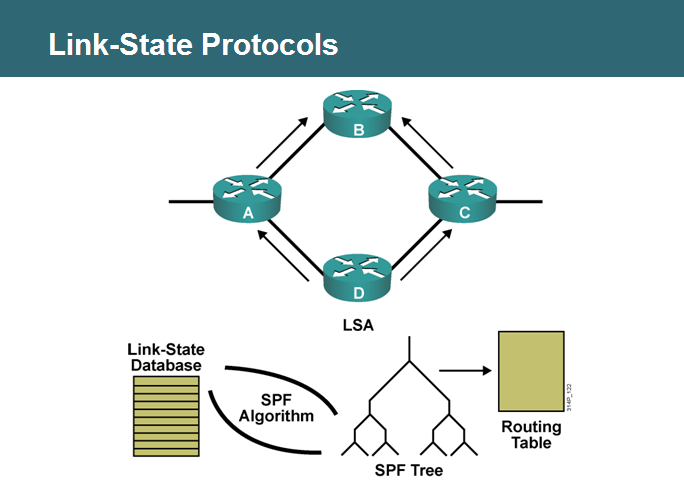
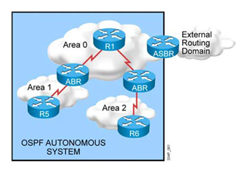
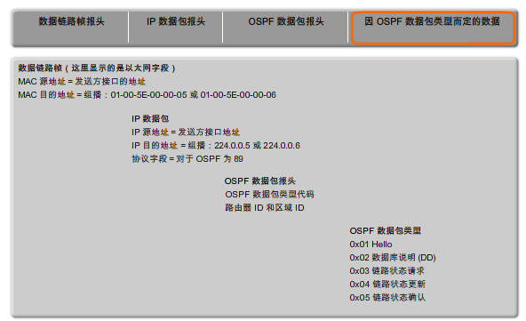
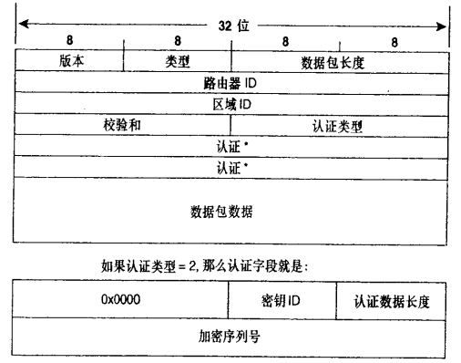
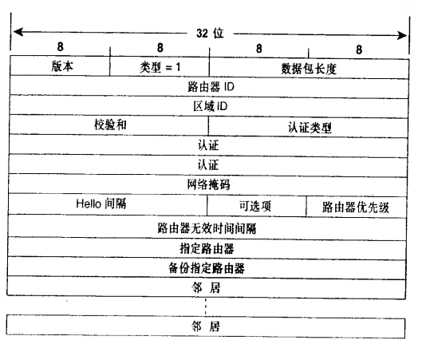
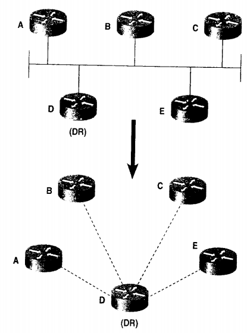
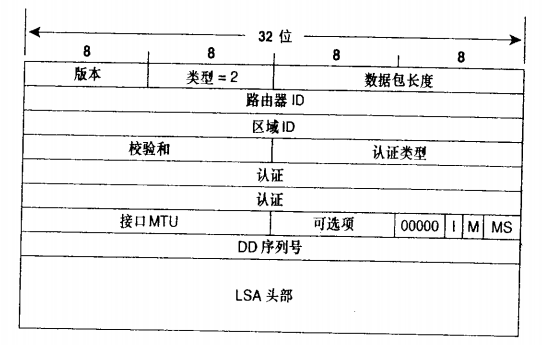
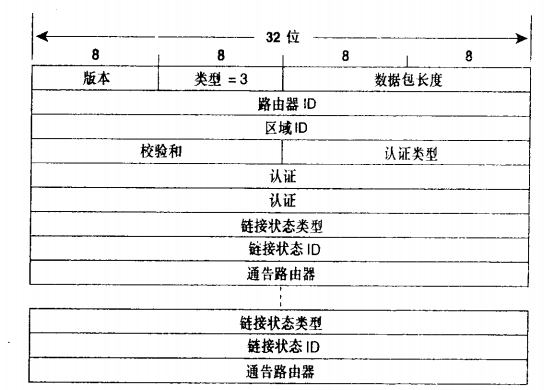
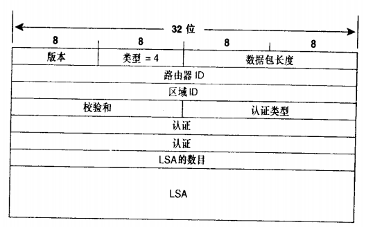
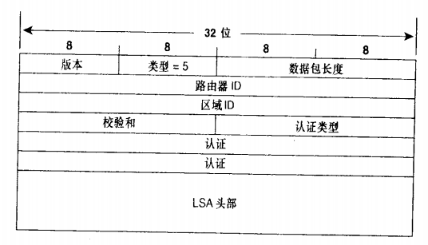

**OSPF路由协议基础部分**

# OSPF的概述

OSPF是一种链路状态路由协议。不同于距离矢量路由协议依照传闻进行路由选择的工作方式，链路状态路由器从其他路由器那里获取第一手信息。每台路由器会产生一些关于自己、本地直连链路、这些链路的状态和所有直连邻居的信息（LSA）。这些信息从一台路由器传送到另一台路由器，每台路由器都在一份信息拷贝，但绝不改动信息。最终目的是每台路由器都有一个相同的相关网络的信息，并且每台路由器以自己为根独立的计算各自的最优路径。

<!---more---->

图 1‑1 链路状态路由协议收敛过程

链路状态路由协议包括：

- OSPF
- IS-IS

OSPF正如它的命名一样，使用Dikstra的最短路径优先（SPF）算法，并且是一个开放的协议，即公有协议。

# OSPF的特点

1. 使用区域化的概念，这样可以有效的减少算法对CPU和内存的占用，构建一个层次化的网络拓扑。
2. 支持无类路由，VLSM，CIDR
3. 支持无大小限制、任意的度量值
4. 局部更新
5. 支持多条路径的等价负载均衡
6. 使用组播地址更新（224.0.0.5和224.0.0.6）
7. 支持认证

# OSPF区域

- Transit area（backbone area）传输区域或骨干区域

只有area 0属于传输区域

- Regular areas（nonbackbone areas）常规区域或非骨干区域

非0区域都属于常规区域

所有的常规区域必须与骨干区域相连。

图 3‑1 OSPF区域

通过区域的划分减少链路状态信息的泛洪，链路状态信息只在同一区域内同步；通过手工汇总减少路由条目；构造一个层次化的网络。

# 路由器类型

- ABR：区域边界路由器(Area Border Router)连接区域0和其他一个或多个区域的路由器
- ASBR：自治系统边界路由器(Autonomous System Boundary
  Router)连接外部网络的路由器
- 内部路由器：R5、R6等
- 骨干路由器：R1

# OSPF的数据报文

图 5‑1 OSPF报文结构

OSPF数据包承载在ip之上，协议号为89，分为OSPF数据包头部和OSPF数据包数据部分。

## OSPF报头结构

图 5‑2 OSPF报头结构

### OSPF报头详细描述

表 5‑1 OSPF报头描述

| 序号 | 报头内容                    | 描述                                                         |
| ---- | --------------------------- | ------------------------------------------------------------ |
| 1    | 版本（version）             | 版本1用于实验阶段；                                          |
|      |                             | 版本2用于ipv4；                                              |
|      |                             | 版本3用于ipv6。                                              |
| 2    | 类型(type)                  | 代码1，代表hello包；                                         |
|      |                             | 代码2，代表DBD（数据库描述）包；代码3，代表LSR（链路状态请求）包；代码4，代表LSU（链路状态更新）包；代码5，代表LSack（链路状态确认）包 |
| 3    | 数据包长度（Packet Length） | OSPF数据包长度，包括头部长度                                 |
| 4    | 路由器ID（Router ID）       | 始发路由器的ID，唯一性，在启用ospf路由进程的时候选举，因此与选择router-id的接口是否宣告进ospf没有任何关系。 |
| 5    | 区域ID（Area ID）           | 始发路由器所在的区域                                         |
| 6    | 校验和（Checksum）          | 对整个OSPF数据包进行差错校验                                 |
| 7    | 认证类型（AuType）          | 正在使用的认证模式，0为不认证，1为明文认证，2为MD5认证       |
| 8    | 认证（Authentication）      | 如果AuType=0，不检查该字段，如果AuType=1，将包含一个密钥，如果AuType=2，这个认证字段将包含KEY ID、认证数据长度、加密序列号、认证密钥。 |

### Router-ID

路由器ID是在OSPF区域内唯一标识一台路由器的ip地址。

Cisco路由器通过以下方式得到路由器ID：

1. 使用命令router-id手工配置
2. 如果没有手工配置，路由器选择最大的环回接口ip地址作为router-id
3. 如果没有换回接口，则使用最大的物理接口ip地址作为router-id
   1. OSPF hello报文

Hello包用于建立ospf邻居关系，并维护邻居关系，在两台路由器形成邻居之前，必须要相互认可几个参数：

图 5‑3 OSPF hello报文结构

### hello报文详细描述

表 5‑2 OSPF hello报文内容描述

| 序号 | 报文内容                                   | 描述                                                         | 备注                                                         |
| ---- | ------------------------------------------ | ------------------------------------------------------------ | ------------------------------------------------------------ |
| 1    | 网络掩码（Network Mask）                   | 发送ospf hello包的接口网络掩码                               | 如果这个掩码和接收该hello包的接口网络掩码不匹配，该hello包被丢弃 |
| 2    | Hello时间间隔（hello interval）            | 接口发送hello包的间隔时间，对于以太网链路和点到点链路，默认为10秒。非广播多路访问链路和点到多点链路是30秒。 | 如果发送和接收路由器没有相同的值，那么它们就不能建立一种邻居关系 |
| 3    | 路由器优先级（Router Priority）            | 用来选择DR和BDR路由器                                        | 如果该字段设置为0，那么该路由器将没有资格被选举为DR和BDR     |
| 4    | 路由器无效时间间隔（Router Dead Interval） | 为hello interval的4倍，如果在这段时间内没有收到邻居路由器的hello包，认为邻居路由器失效。 | 如果收到hello包的时间和接收接口配置的deadinterval不匹配，那么这个hello包被丢弃 |
| 5    | 指定路由器（DR）                           | 网络上指定路由器接口的ip地址                                 | 不是指定路由器的路由器ID                                     |
| 6    | 备份指定路由器（BDR）                      | 网络上备份指定路由器接口的ip地址                             | N/A                                                          |
| 7    | 邻居（Neighbor）                           | 从网络上收到来自邻居的有效hello包，则会在这个字段列出所有的邻居RID | N/A                                                          |

### 修改ospf的hello interval和dead interval

R1(config)\#int s0/0

R1(config-if)\#ip ospf hello-interval 10

R1(config-if)\#ip ospf dead-interval 10

### 指定路由器（DR）和备份指定路由器（BDR）

对于OSPF路由协议来说，在多路访问网络中LSA的泛洪存在两个问题：

1. 构建相关路由器之间的邻接关系时，会创建很多不必要的LSA。
2. LSA的泛洪会比较混乱。

在OSPF网络中，如果要在每一台路由器和它的邻居路由器形成完全网状的OSPF邻接关系，5台路由器需要形成10个邻接关系，产生25条LSA通告

图 5‑4 OSPF建立邻接关系示意图

为了在多路访问的网络环境中避免这些问题的发生，可以在网络上选举一台指定路由器完成以下工作：

- 描述这个多路访问网络和OSPF区域内其余相连的路由器；
- 管理这个多路访问网络上的LSA泛洪。

DR描述一个多路访问网络，网络上的其他路由器都将和这个指定路由器形成邻接关系，而不是所有路由器都相互形成邻接关系。

图 5‑5 OSPF DR建立邻接关系示意图

关于指定路由器的一个重要问题：如果DR失效，就必须重新选举一台新的指定路由器。网络上的所有路由器也要重新的建立邻接关系。为了避免这个问题，网络上除了选举DR之外，还选举BDR。DR和BDR形成邻接关系，当DR失效，BDR将成为新的DR。并且BDR也和其他路由器形成邻接关系，所以当BDR成为新的DR时，无需重新建立邻接关系，将影响降低到最小。

DR和BDR的选举过程：

1. 路由器和邻居路由器之间首先要建立two-way状态，接着查看hello包的优先级、DR、BDR字段，列出所有具有DR和BDR选举资格的路由器列表（即优先级要大于0）
2. 所有路由器都宣称自己是DR和BDR
3. 通过优先级高的选举为BDR，如果优先级相同选择RID最高的最为BDR
4. 由于没有DR的存在，BDR成为DR，重新选举BDR。

在选举成功后，其他的路由器都叫做DRother。即使接入一台优先级更高的路由器，也不会成为新的DR，它只能等待DR失效，原来的BDR成为DR，它再成为BDR。

## 数据库描述数据包（DBD）

DBD包用于正在建立的邻接关系。DBD包的主要目的是描述始发路由器数据库中的LSA摘要信息，以便接收路由器能够确定所收到的LSA在其数据库中是否已经存在这些LSA。LSA的摘要信息只需要列出该LSA的头部即可。

图 5‑6 OSPF DBD数据报文格式

### DBD报文详细描述

表 5‑3 DBD报文详细描述

| 序号 | 报文内容                                | 描述                                                         |
| ---- | --------------------------------------- | ------------------------------------------------------------ |
| 1    | 接口MTU（Interface MTU）                | 是指在数据包不分片的情况下，始发路由器接口可以发送的最大IP数据包大小 |
| 2    | I位（Initial位）                        | 当发送DBD包是第一个时，该位置位为1，后续DBD包将该位设置为0   |
| 3    | M位（More位）                           | 当发送的DBD包不是最后一个包时，该位置位1，最后一个DBD包将该位置0 |
| 4    | MS位（Master/Slave位）                  | 在数据库同步过程中，该位置1，用来指明始发DBD数据包的路由器是一个主路由器。从路由器将该位置0 |
| 5    | 数据库描述序列号（DBD Sequence Number） | 在数据库的同步过程中，确保路由器能够收到完整的数据库描述数据包序列。使用序列号进行隐式确认。 |
| 6    | LSA头部（LSA Header）                   | 列出始发路由器的链路状态数据库中的LSA头部信息。在LSA头部信息里有足够的信息可以唯一的标识一个LSA |

主从关系的选举：通过Router-ID的比较，Router-id大的为master

确认机制：

- 显式确认：通过ack明确的进行确认。
- 隐式确认：从路由器使用主路由器相同的序列号进行确认。
  1. 链路状态请求包（LSR）

在数据库同步过程中如果收到了DBD包，路由器将会查看DBD里有哪些LSA不在自己的数据库中，或者哪些LSA比自己数据库中的LSA更新。然后将这些LSA记录在链路请求列表中。接着路由器会发送LSR包向它的邻居请求完整的LSA。

图 5‑7 OSPF LSR报文格式

### LSR报文详细描述

表 5‑4 LSR报文详细描述

| 序号 | 报文内容                         | 描述                     |
| ---- | -------------------------------- | ------------------------ |
| 1    | 链路状态类型（Link State Type）  | 用来指明LSA的类型        |
| 2    | 链路状态ID（Link State ID）      | 用来指明LSA的名字        |
| 3    | 通告路由器（Advertising Router） | 是指发送LSA的路由器的RID |

## 链路状态更新包（LSU）

用于LSA的泛洪和响应LSR请求包。

图 5‑8 OSPF LSR报文机构

LSA数量（Number of LSA）：支持这个LSR包中包含的LSA的数量。

链路状态通告（LSA）：LSU数据包中携带的完整的链路状态通告信息，一个LSU可以携带多个LSA。

## 链路状态确认包（LSAck）

保证LSA可靠的泛洪扩散。一台路由器从它的邻居路由器收到的每一个LSA都必须在LSAck包中进行明确的确认。被确认的LSA是根据在LSAck包里包含它的头部来辨别的，多个LSA可以通过单个SLAck确认。一个LSAck包的组成除了OSPF头部和一个LSA不透的列表之外，没有其他多余的内容了。

图 5‑9 OSPF LSAck报文结构