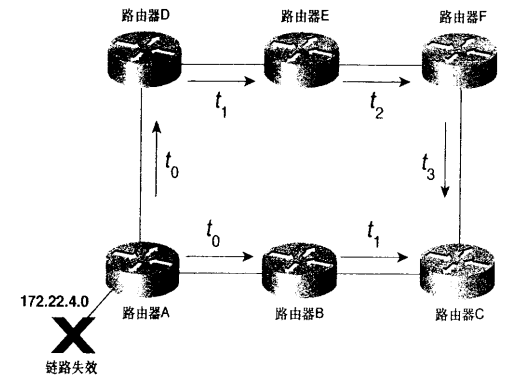
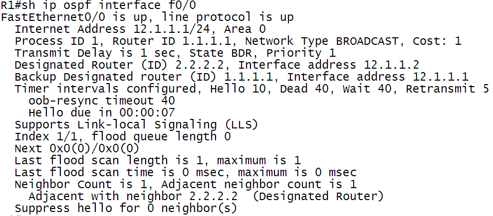
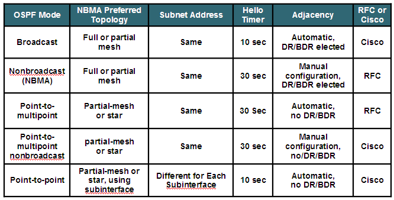

OSPF邻居状态机和网络类型

# OSPF邻居状态机

OSPF路由器需要邻居路由器在几种邻居状态之间转换后，才能形成邻居之间的完全邻接关系。

- Down（失效状态）：这是一个邻居会话的初始状态，指明在一个deadinterval的时间内还没有收到来自邻居路由器的hello包。除非在NBMA网络中的那些邻居路由器，否则，hello包不会发送给那些失效的邻居路由器。在NBMA网络环境中，hello包每个pollinterval（2倍hello
  interval）的时间发送一次。

<!---more--->

- Initial（初始状态）：表明在最近的deadinterval时间内收到了来自邻居路由器的hello包，但双向通信仍然没有建立。
- Two-way（双向通信状态）：表明本地路由器已经在来自邻居路由器的hello包中的邻居字段看到了自己的路由器ID，意味双向通信建立成功。在多路访问的网络中，邻居路由器必须在这个状态或者更高状态时才有资格被选为该网络的DR或BDR。
- ExStart（信息交换初始状态）：在这一状态下，本地路由器和它的邻居路由器将建立主/从关系，通过发送空的DBD报文，I/M/MS全部置1，进行主/从的选举，具有最高路由器ID的路由器将成为主路由器。
- Exchange（信息交换状态）：在这一状态下，邻居路由器之间发起DBD包交换，由主路由器发起，从路由器通过使用主路由器的相同序列号进行隐式确认。通过DBD交换，得知本地路由器缺少的LSA，通过向邻居发送LSR请求完整的LSA，邻居路由器收到LSR之后发送LSU包含了请求的LSA，最后LSAck确认。
- Loading（信息加载状态）：在这一状态，本地路由器将会向它的邻居路由器发送LSR，请求最新的LSA。虽然在Exchange状态已经经历这一过程，但是如果LSA条目过多，在Exchange状态没有更新完所有请求的LSA，将在这一阶段完成，也会出现在Exchange状态已经完成了所有的LSA通告，因此没有loading阶段。
- Full（完全邻接状态）：路由器之间建立完全邻接状态，即收敛状态。

# 链路状态通告的扩散泛洪

在路由器形成邻居关系后，需要建立邻接关系的路由器之间需要相互传递链路状态通告（LSA），LSA被发送给每个邻居，路由器保存接收到的LSA，并以此向每个邻居转发，除了发送该LSA的邻居之外。LSA几乎是立刻被转发的，相对于距离矢量路由更新而言，不需要先更新自己的路由表再进行发送，这就是当网络拓扑改变时，链路状态路由协议收敛速度远远快于距离矢量路由协议的原因。

关于链路状态通告泛洪的两个重要参数：

1. 序列号
2. 老化时间



图 2‑1 OSPF LSA泛洪示意图

## 序列号

当路由器A连接的子网172.22.4.0发生故障，因而路由器A向邻居路由器B和路由器D泛洪扩散一个LSA，以便通告该链路的新状态。路由器B和路由器D向它们的邻居扩散该LSA，依次类推。

路由器C在t1时刻，收到来自路由器B传递的LSA，路由器C将相关信息输入到链路状态数据库（LSDB），并向路由器F转发。在t3时刻，另一份相同的LSA拷贝经过A-D-E-F-C到达路由器C。路由器C发现LSDB中已经存在该LSA，那么路由器C会不会将该LSA继续转发给路由器B呢？答案是不转发，因为路由器C是从邻居路由器B收到这个通告的。

当路由器A发送LSA时，在每个拷贝中的序列号都是一样的。这个序列号和LSA的其他部分一起被保存在路由器的LSDB中，当路由器收到数据库中已存在的LSA且序列号相同时，路由器将丢弃这些信息。如果信息相同但是序列号更大，则接收的信息和新序列号被保存到数据库中，并且泛洪扩散。

序列号在数据包中占32bits，防止序列号耗尽问题，采用了棒棒糖形序列号空间。当路由器重启后，路由器发送序列号为最小值的LSA，邻居检查数据库时发现该路由器重启前LSA的序列号为0x00005de3，这时邻居将把这个LSA发给重启的路由器。

LSA的序列号最小值：0x80000001

LSA的序列号最大值：0x7FFFFFFF

## 老化时间

老化过程为泛洪扩散过程增加了另一层可靠性，定义了一个最大年龄差距（MaxAgeDiff）值。路由器可能接收到一个LSA的多个拷贝，其中序列号相同，年龄不同。如果年龄的差距小于MaxAgeDiff，则认为是正常的网络延迟造成了年龄差距，因此原有LSDB中的LSA继续保存，忽略新收到的LSA；如果年龄差距大于MaxAgeDiff，则认为网络发生异常，较新的LSA被记录下来，并将数据包扩散出去。OSPF的MaxAgeDiff为15min。

# OSPF接口信息

Show ip ospf interface f0/0



接口状态：up，up

接口ip地址：12.1.1.1，掩码24位；接口宣告区域0

Ospf进程号1；路由器ID 1.1.1.1；网络类型：广播；开销：1

注：ospf开销计算公式：10\^8/接口带宽，10\^8为默认参考值，当网络中拥有100M链路和1000M链路，那么算出来的值都为1，无法区分链路的优劣，如果结果为小数，取整。

可以修改默认参考值来区分不同链路的开销值
```
R1(config)\#router ospf 1

R1(config-router)\#auto-cost reference-bandwidth 100 （默认为100Mb）
```
修改开销值：
```
R1(config)\#int f0/0

R1(config-if)\#ip ospf cost 1
```
传输延迟：1秒，LSA每经过一台路由器老化时间加1

修改传输延迟：
```
R1(config)\#int f0/0

R1(config-if)\#ip ospf transmit-delay 1
```
状态：BDR；优先级为1，用于选举DR/BDR

指定路由器ID：2.2.2.2；接口地址：12.1.1.2

备份指定路由器ID：1.1.1.1；接口地址：12.1.1.1

计时器：hello间隔：10秒，无效时间：40秒，等待时间：40秒，重传间隔：5秒（等待时间等于无效时间，在路由器宣告ospf接口后开始计时，等待时间过后开始选举DR/BDR）

Hello计时器：下一次发送hello的剩余时间

邻居路由器：形成邻接关系的路由器ID

# OSPF接口状态机

- 失效（down）：初始化接口状态。这个阶段，接口上没有任何路由协议的通信
- 点到点（point to point）：这种接口状态适用于点到点、点到多点等网络类型的接口
- 等待（waiting）：这种接口状态适用于多路访问网络环境，选举DR/BDR前所经历的等待时间就是这个状态。
- 指定路由器（DR）：指定路由器
- 备份指定路由器（BDR）：备份指定路由器
- DRohter：非DR,BDR的路由器

# OSPF网络类型

## 点到点网络

点到点网络，像PPP,HDLC链路，连接单独一对路由器。在点到点网络上的有效邻居总是可以形成邻接关系的，不选举DR/BDR，使用224.0.0.5发送ospf数据包，hello间隔为10秒。

## 广播型网络

多路访问网络可以连接多于两台的设备，例如以太网，不是所有路由器都形成邻接关系，需要选举DR/BDR，DR/BDR使用224.0.0.5发送ospf数据包给DRother，DRother使用224.0.0.6发送ospf数据包给DR/BDR，hello间隔为10秒。

## 非广播多路访问（NBMA）网络

NBMA网络，例如帧中继，ATM等，可以连接两台以上的路由器，但是没有广播数据包的能力。不是所有路由器都形成邻接关系，需要选举DR/BDR，并且所有的OSPF数据包都为单播，hello间隔为30秒。

## 点到多点网络（point-to-multipoint）

点到多点网络可以看作是多个点到点链路的集合，不需要选举DR/BDR，ospf数据包以组播方式发送给每一个已知邻居，hello间隔为30秒。

表 5‑1 OSPF网络类型



# 帧中继环境中的ospf

帧中继交换机：
```
Frame-relay switching

interface Serial0/0

no ip address

encapsulation frame-relay

serial restart-delay 0

clock rate 64000

frame-relay lmi-type cisco

frame-relay intf-type dce

frame-relay route 102 interface Serial0/1 201

frame-relay route 103 interface Serial0/2 301

interface Serial0/1

no ip address

encapsulation frame-relay

serial restart-delay 0

clock rate 64000

frame-relay lmi-type cisco

frame-relay intf-type dce

frame-relay route 201 interface Serial0/0 102

interface Serial0/2

no ip address

encapsulation frame-relay

serial restart-delay 0

clock rate 64000

frame-relay lmi-type cisco

frame-relay intf-type dce

frame-relay route 301 interface Serial0/0 103
```
点到多点网络类型：
```
R1：

interface Serial0/0

ip address 123.1.1.1 255.255.255.0

encapsulation frame-relay

ip ospf network point-to-multipoint

serial restart-delay 0

frame-relay map ip 123.1.1.3 103 broadcast

frame-relay map ip 123.1.1.2 102 broadcast

no frame-relay inverse-arp

router ospf 1

router-id 1.1.1.1

log-adjacency-changes

network 1.1.1.1 0.0.0.0 area 0

network 123.1.1.1 0.0.0.0 area 0

R2：

interface Serial0/0

ip address 123.1.1.2 255.255.255.0

encapsulation frame-relay

ip ospf network point-to-multipoint

serial restart-delay 0

frame-relay map ip 123.1.1.1 201 broadcast

no frame-relay inverse-arp

router ospf 1

router-id 2.2.2.2

log-adjacency-changes

network 2.2.2.2 0.0.0.0 area 0

network 123.1.1.2 0.0.0.0 area 0

R3：

interface Serial0/0

ip address 123.1.1.3 255.255.255.0

encapsulation frame-relay

ip ospf network point-to-multipoint

serial restart-delay 0

frame-relay map ip 123.1.1.1 301 broadcast

no frame-relay inverse-arp

router ospf 1

router-id 3.3.3.3

log-adjacency-changes

network 3.3.3.3 0.0.0.0 area 0

network 123.1.1.3 0.0.0.0 area 0
```
非广播网络类型：
```
R1：

interface Serial0/0

ip address 123.1.1.1 255.255.255.0

encapsulation frame-relay

serial restart-delay 0

frame-relay map ip 123.1.1.3 103

frame-relay map ip 123.1.1.2 102

no frame-relay inverse-arp

router ospf 1

router-id 1.1.1.1

log-adjacency-changes

network 1.1.1.1 0.0.0.0 area 0

network 123.1.1.1 0.0.0.0 area 0

neighbor 123.1.1.2

neighbor 123.1.1.3

R2：

interface Serial0/0

ip address 123.1.1.2 255.255.255.0

encapsulation frame-relay

ip ospf priority 0

serial restart-delay 0

frame-relay map ip 123.1.1.3 201

frame-relay map ip 123.1.1.1 201

no frame-relay inverse-arp

router ospf 1

router-id 2.2.2.2

log-adjacency-changes

network 2.2.2.2 0.0.0.0 area 0

network 123.1.1.2 0.0.0.0 area 0

R3：

interface Serial0/0

ip address 123.1.1.3 255.255.255.0

encapsulation frame-relay

ip ospf priority 0

serial restart-delay 0

frame-relay map ip 123.1.1.3 301

frame-relay map ip 123.1.1.1 301

no frame-relay inverse-arp

router ospf 1

router-id 3.3.3.3

log-adjacency-changes

network 3.3.3.3 0.0.0.0 area 0

network 123.1.1.3 0.0.0.0 area 0
```
广播型网络：
```
R1：

interface Serial0/0

ip address 123.1.1.1 255.255.255.0

encapsulation frame-relay

ip ospf network broadcast

serial restart-delay 0

frame-relay map ip 123.1.1.3 103 broadcast

frame-relay map ip 123.1.1.2 102 broadcast

no frame-relay inverse-arp

router ospf 1

router-id 1.1.1.1

log-adjacency-changes

network 1.1.1.1 0.0.0.0 area 0

network 123.1.1.1 0.0.0.0 area 0

R2：

interface Serial0/0

ip address 123.1.1.2 255.255.255.0

encapsulation frame-relay

ip ospf network broadcast

ip ospf priority 0

serial restart-delay 0

frame-relay map ip 123.1.1.3 201 broadcast

frame-relay map ip 123.1.1.1 201 broadcast

no frame-relay inverse-arp

router ospf 1

router-id 2.2.2.2

log-adjacency-changes

network 2.2.2.2 0.0.0.0 area 0

network 123.1.1.2 0.0.0.0 area 0

R3：

interface Serial0/0

ip address 123.1.1.3 255.255.255.0

encapsulation frame-relay

ip ospf network broadcast

ip ospf priority 0

serial restart-delay 0

frame-relay map ip 123.1.1.3 301 broadcast

frame-relay map ip 123.1.1.1 301 broadcast

router ospf 1

router-id 3.3.3.3

log-adjacency-changes

network 3.3.3.3 0.0.0.0 area 0

network 123.1.1.3 0.0.0.0 area 0
```