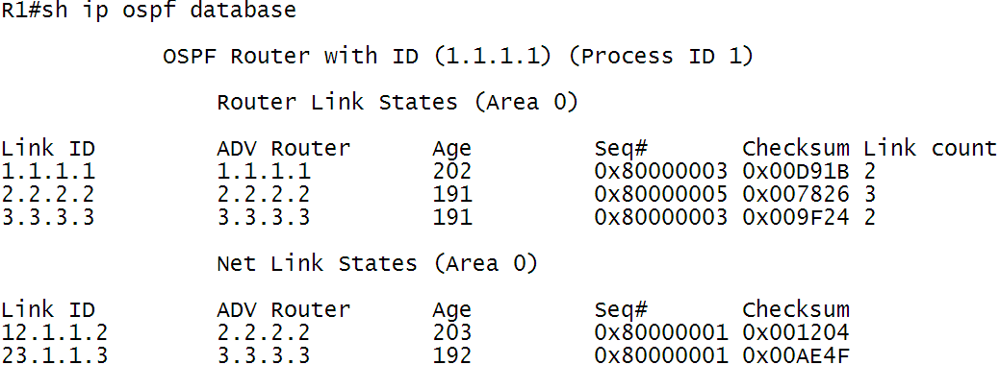
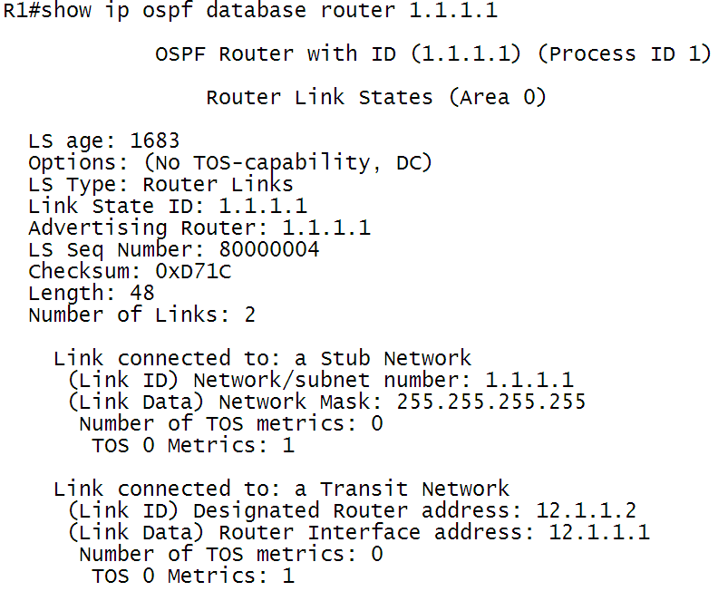
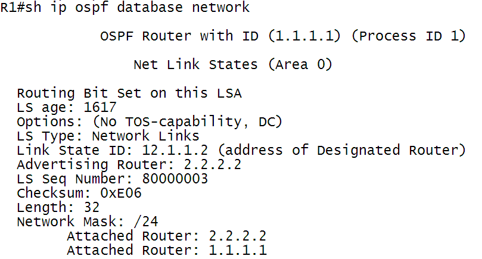
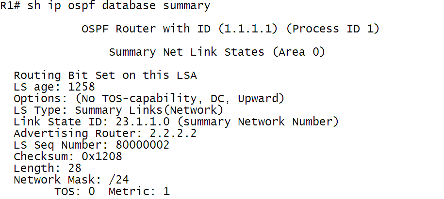
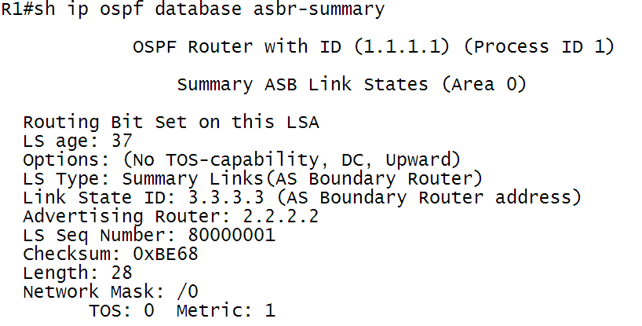
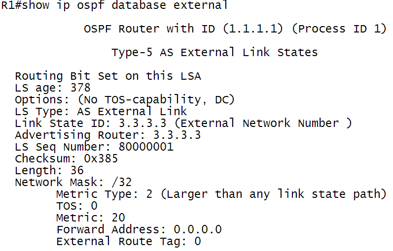

# OSPF的链路状态数据库（LSDB）

一台路由器中所有的有效LSA都被存放在它的链路状态数据库中。正确的LSA可以描述一个OSPF区域网络拓扑的结构。因为一个区域中的每一台路由器都要利用这个数据库的信息来计算它自己的最短路径树，因此同一区域的数据库的统一性对于正确的路由器选择就变得十分重要。

<!---more--->

查看OSPF链路状态数据库：

`Show ip ospf database`

图 1‑1 OSPF数据库信息截图

如前面提到的序列号、老化时间，当LSA在传递过程中按照转发延迟增加老化时间，当保存在LSDB中时，老化时间是逐渐增大的，当LSA的老化时间到达了1小时，那么它们将从OSPF域中被清除。这就意味着，在这里必须有一种机制来防止正常的LSA到达最大生存时间。这种机制就是链路状态刷新（link
state
refresh）。每隔30min始发这条LSA的路由器将泛洪扩散这条LSA的一个新拷贝，并将它的序列号增加1，老化时间设置为0。其他OSPF路由器一旦收到这个新拷贝，就会用这个新拷贝替换该LSA原来的拷贝，并重新计算老化时间。

# LSA的类型

由于OSPF定义了多种路由器的类型，因而定义多种LSA的类型也是有必要的。

类型1：路由器LSA（Router LSA）

类型2：网络LSA（Network LSA）

类型3：网络汇总LSA（Network summary LSA）

类型4：ASBR汇总LSA（ASBR summary LSA）

类型5：AS外部LSA（External LSA）

类型6：组成员LSA

类型7：NSSA外部LSA（NSSA External LSA）

类型8：外部属性LSA

类型9：Opaque Link-Local LSA（链路本地范围）

类型10：Opaque Area LSA（本地区域范围）

类型11：Opaque AS LSA（AS范围）

## 路由器LSA

每一台路由器都会产生路由器LSA通告。这个最基本的LSA通告列出了路由器所有的链路或接口，并指明了它们的状态和沿每条链路方向出站的开销，以及该链路上所有已知的OSPF邻居。

路由器LSA在整个区域内部泛洪。

`Show ip ospf database router`查看：

图 2‑1 OSPF路由器LSA信息

### 路由器LSA详细描述

表 2‑1 1类LSA详细描述

| 序号 | LSA内容                        | 描述                                           |
| ---- | ------------------------------ | ---------------------------------------------- |
| 1    | OSPF Router with ID（1.1.1.1） | 这台路由器的router-id                          |
| 2    | Router Link States（area 0）   | 这是一条1类LSA，属于区域0                      |
| 3    | LS age：1683                   | LSA老化时间                                    |
| 4    | LS type：Router Links          | LSA类型为路由器LSA                             |
| 5    | Link State ID：1.1.1.1         | 链路状态通告的名称为1.1.1.1（自己的router-id） |
| 6    | Advertising Router             | 通告路由器为1.1.1.1（自己的router-id）         |
| 7    | LS Seq Number：80000004        | LSA序列号                                      |
| 8    | Chesksum：0xD71C               | 校验和                                         |
| 9    | Length：48                     | LSA长度                                        |
| 10   | Number of Links：2             | 链路的数量                                     |

## 网络LSA

每一个多路访问网络中的指定路由器（DR）将会产生网络LSA通告。网络LSA在同一区域内泛洪。

`Show ip ospf database network` 查看：

图 2‑2 OSPF网络LSA信息

### 网络LSA详细描述

表 2‑2 OSPF网络LSA详细描述

| 序号 | LSA内容                  | 描述                                                 |
| ---- | ------------------------ | ---------------------------------------------------- |
| 1    | LS type：Network Links   | LSA类型为网络LSA                                     |
| 2    | Link State ID：12.1.1.2  | 链路状态通告的名称为12.1.1.2（DR路由器的接口ip地址） |
| 3    | Advertising Router       | 通告路由器为2.2.2.2（DR路由器的router-id）           |
| 4    | LS Seq Number：80000003  | LSA序列号                                            |
| 5    | Chesksum：0xE06          | 校验和                                               |
| 6    | Length：32               | LSA长度                                              |
| 7    | Network Mask：/24        | 网络掩码长度                                         |
| 8    | Attached Router：1.1.1.1 | 该网络连接的所有路由器的Router-ID                    |
|      | Attached Router：2.2.2.2 |                                                      |

## 网络汇总LSA

由区域边界路由器（ABR）始发。ABR路由器将发送网络汇总LSA到一个区域，用来通告该区域外部其他区域的目的地址。

`Show ip ospf database summary` 查看

图 2‑3 OSPF网络汇总LSA信息

### 网络汇总LSA详细描述

表 2‑3 OSPF网络汇总LSA详细描述

| 序号 | LSA内容                                           | 描述                                        |
| ---- | ------------------------------------------------- | ------------------------------------------- |
| 1    | LS type：Summary Links（Network）                 | LSA类型为网络汇总LSA                        |
| 2    | Link State ID：23.1.1.0（Summary Network Number） | 链路状态通告的名称为23.1.1.0（汇总网络号）  |
| 3    | Advertising Router                                | 通告路由器为2.2.2.2（ABR路由器的router-id） |
| 4    | LS Seq Number：80000002                           | LSA序列号                                   |
| 5    | Chesksum：0x1208                                  | 校验和                                      |
| 6    | Length：28                                        | LSA长度                                     |
| 7    | Network Mask：/24                                 | 网络掩码长度                                |
| 8    | Metric：1                                         | 该路由的开销                                |

## ASBR汇总LSA

ASBR汇总LSA也是由ABR路由器始发的。用于在网络中通告ASBR所在的位置。

`Show ip ospf database asbr-summary` 查看

图 2‑4 OSPF ASBR汇总LSA信息

### ASBR汇总LSA详细描述

表 2‑4 ASBR汇总LSA详细描述

| 序号 | LSA内容                                              | 描述                                               |
| ---- | ---------------------------------------------------- | -------------------------------------------------- |
| 1    | LS type：Summary Links（AS Boundary Router）         | LSA类型为ASBR汇总LSA                               |
| 2    | Link State ID：3.3.3.3（AS Boundary Router Address） | 链路状态通告的名称为3.3.3.3（ASBR路由器Router-ID） |
| 3    | Advertising Router                                   | 通告路由器为2.2.2.2（ABR路由器的router-id）        |
| 4    | LS Seq Number：80000001                              | LSA序列号                                          |
| 5    | Chesksum：0xBE68                                     | 校验和                                             |
| 6    | Length：28                                           | LSA长度                                            |
| 7    | Network Mask：/0                                     | 没有掩码                                           |
| 8    | Metric：1                                            | 该路由的开销                                       |

## AS外部LSA

始发于ASBR，用来通告ospf域外的目的网络，外部LSA是唯一不与区域相关联的LSA通告，在整个OSPF域内泛洪扩散。

`Show ip ospf database external` 查看

图 2‑5 OSPF外部LSA信息

### 外部LSA详细描述

表 2‑5 OSPF外部LSA详细描述

| 序号 | LSA内容                                           | 描述                                                         |
| ---- | ------------------------------------------------- | ------------------------------------------------------------ |
| 1    | LS type：AS External Link                         | LSA类型为AS外部LSA                                           |
| 2    | Link State ID：3.3.3.3（External Netwrok Number） | 链路状态通告的名称为3.3.3.3（外部网络号）                    |
| 3    | Advertising Router                                | 通告路由器为3.3.3.3（ASBR路由器的router-id）                 |
| 4    | LS Seq Number：80000001                           | LSA序列号                                                    |
| 5    | Chesksum：0x385                                   | 校验和                                                       |
| 6    | Length：36                                        | LSA长度                                                      |
| 7    | Network Mask：/32                                 | 网络掩码长度                                                 |
| 8    | Metric Type：2                                    | 开销类型为2，不累加内部开销，内部metric依靠forward metric来计算 |
| 9    | Metric：20                                        | 重分发进OSPF的路由的seed metric                              |

### OSPF的路由优先级

O\>O IA\>外部（当metric相同的时候，O E1\>O
N1，当metric不同的时候，选择metric小的；O E1\>O E2 ; O N1\>O N2）