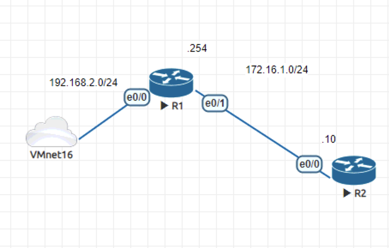
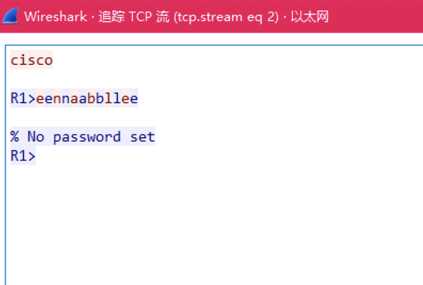
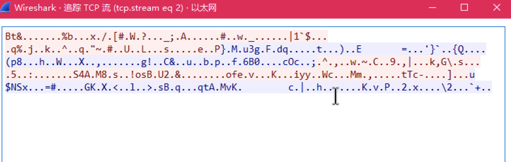
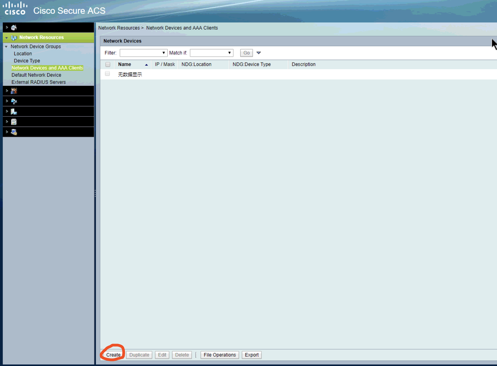
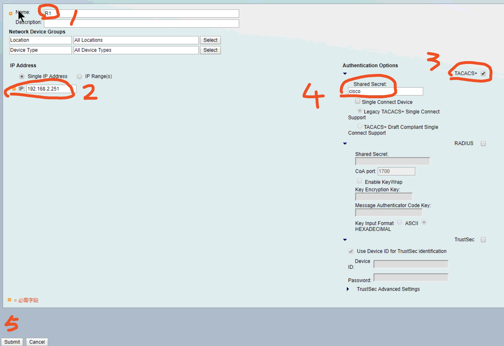
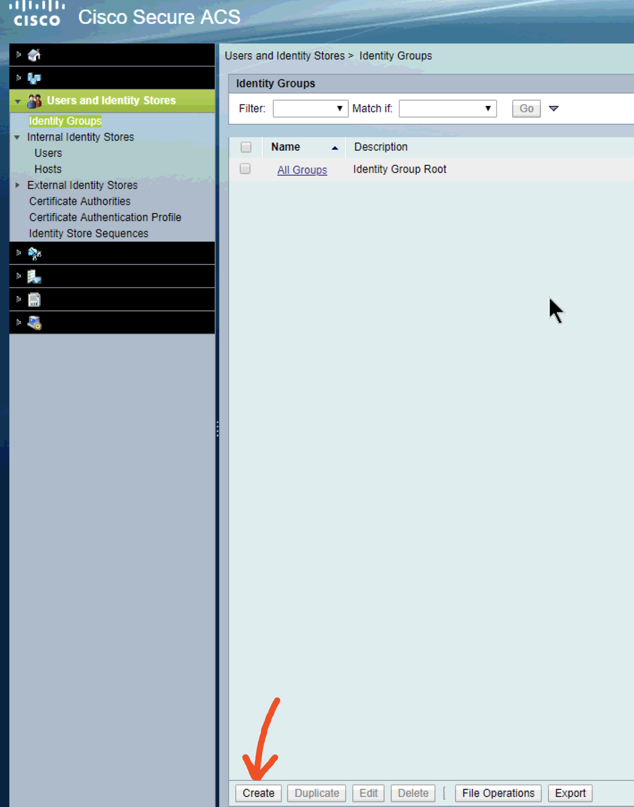
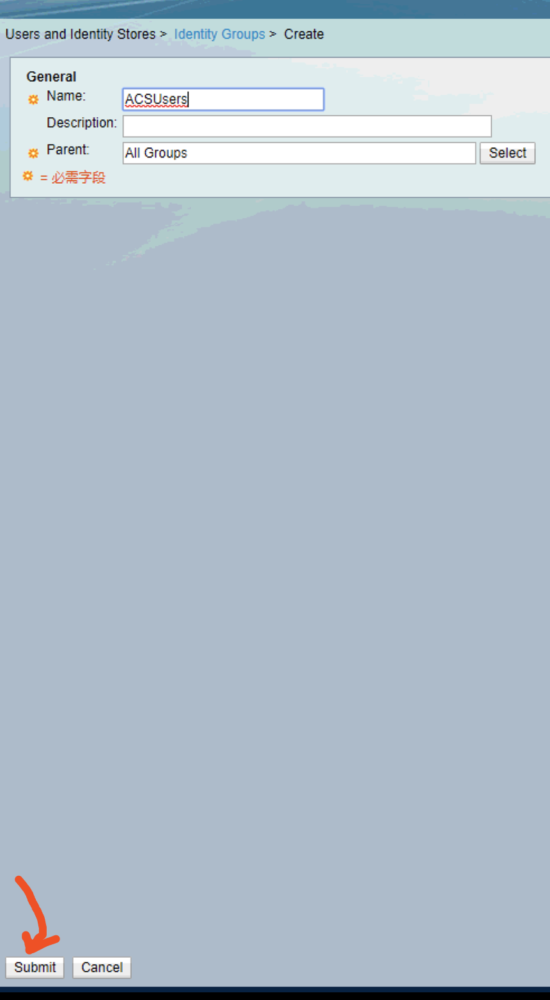
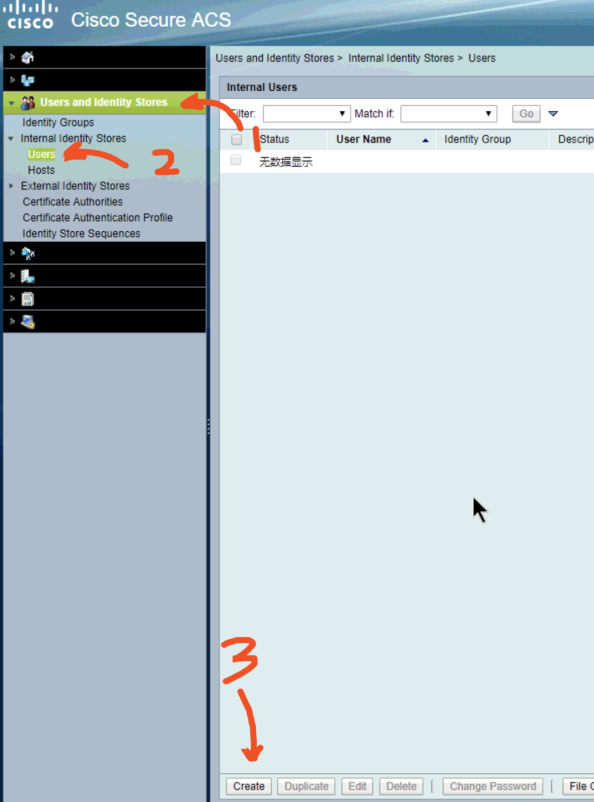
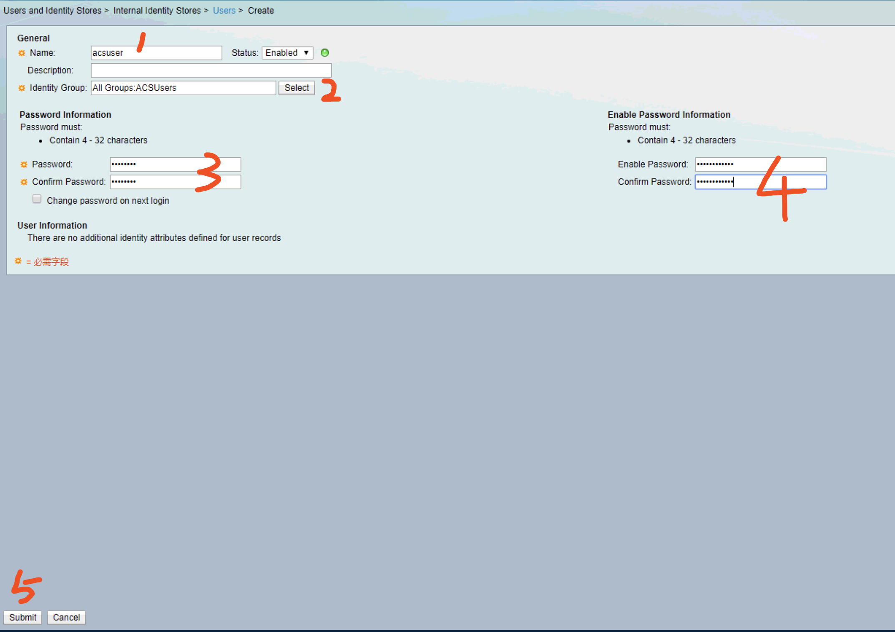

# 基本的设备管理

设备在上架以后，一般会配置远程访问方便管理员调试设备，先看两个最基本的管理方式。

<!--more-->

## 通过Telnet管理设备



拓扑如下，VMnet16中有一台ACS5.2设备（Cisco的老产品，现在已由ISE取代，这里为了实验演示采用ACS5.2）。在R1上配置telnet远程访问。在R2上测试。

```bash
##IP配置略

R1(config)#line vty 0 4 \\进入虚拟线路vty0～4配置
R1(config-line)#password cisco \\配置登录密码为Cisco

##在R2上测试
R2#telnet 172.16.1.254
Trying 172.16.1.254 ... Open


User Access Verification

Password: 
R1>enable
% No password set \\由于没有设置enable密码，所以无法进入特权模式
R1>

##在R1上配置enable密码
R1(config)#enable password cisco \\使用明文的方式存储密码 可以使用show run命令看到
R1#show run | in enable password
enable password cisco

##这里推荐使用密文的方式存储密码。
R1(config)#no enable password cisco \\将之前配置的enable密码去掉
R1(config)#enable secret cisco  \\使用密文的方式存储密码
R1(config)#do show run | in enable  
enable secret 5 $1$3/N0$wqldLLB3LOtZd0DDhfHpj/ \\可以发现这边的密码已经看不到原文了
R1(config)#
```

## 通过SSH管理设备

以上是Telnet方式管理设备的基本配置，如果做了这个配置，只要telnet客户端和telnet服务器之间的网络能够连通，就可以直接在客户端上使用telnet命令远程管理设备。但是这种方式是明文的。所有的内容都可以被数据包分析软件截获。例如Wireshark。




这样一来网络安全就无法保障了。如果要保障数据的安全性，可以使用SSH的方式登录。

```bash
##在R1上配置SSH
R1(config)#ip domain name cisco \\随便设置一个域名
R1(config)#crypto key gen rsa \\生成ssh需要用到的key
The name for the keys will be: R1.cisco
Choose the size of the key modulus in the range of 360 to 4096 for your
  General Purpose Keys. Choosing a key modulus greater than 512 may take
  a few minutes.

How many bits in the modulus [512]: \\直接回车 这里是key的长度 默认512
% Generating 512 bit RSA keys, keys will be non-exportable...
[OK] (elapsed time was 1 seconds)

R1(config)#
*May 24 01:28:36.150:  RSA key size needs to be atleast 768 bits for ssh version 2 \\如果直接回车 会提示 ssh 版本2 需要至少768位的密钥长度 所以这里可以更改一下
R1(config)#crypto key gen rsa
% You already have RSA keys defined named R1.cisco.
% Do you really want to replace them? [yes/no]: yes
Choose the size of the key modulus in the range of 360 to 4096 for your
  General Purpose Keys. Choosing a key modulus greater than 512 may take
  a few minutes.

How many bits in the modulus [512]: 768
% Generating 768 bit RSA keys, keys will be non-exportable...
[OK] (elapsed time was 0 seconds)

R1(config)#
*May 24 01:31:50.641: %SSH-5-ENABLED: SSH 1.99 has been enabled
R1(config)#ip ssh version 2 \\将SSH的版本设为V2
R1(config)#line vty 0 4 \\进入远程连接的VTY接口
R1(config-line)#transp in ssh \\设置远程连接的协议只能是SSH
R1(config)#username cisco privilege 0 password cisco \\在服务器上创建一个用户，这里privilege如果不是0，进入时直接就是特权模式，不需要输入特权密码。为了安全起见 将privilege设为0.

##在R2上测试
R2#ssh -l cisco 172.16.1.254
R1>en
Password: 
R1#


```



可以看到再进行抓包就抓不到了。


# 通过AAA管理设备

## AAA是什么

-   Authentication（认证）
    -   对用户的身份进行认证。例如通过用户名和密码，指纹等。
-   Authorization（授权）
    -   授权用户能够使用的命令
    -   授权用户访问的资源
    -   授权用户获得的信息
    -   主要是在用户都有效的情况下区分普通用户和特权用户
-   Accounting（审计）
    -   记录用户做了什么事情。类似于生活中的摄像头。

## 什么情况下使用AAA

在网络特别简单，用户比较少的情况下可以用本地账号认证，不需要AAA。

-   在有较多NAS（Network Access Server）时。

-   在登录管理的设备较多的时候。

-   VPN拨入的时候

Client和NAS可能会用到例如ssh，telnet等协议

还有拨入服务例如 ipsec vpn，pppoe等。


那么在NAS服务器需要做身份验证的时候，就可以找AAA服务器做认证、授权和审计。AAA服务器和NAS服务器之间的通讯使用的是RADIUS或者TACACS+。

## AAA的配置

Cisco路由器的AAA配置分为以下几步：

-   在路由器上指定AAA服务器
-   在AAA服务器上指定AAA客户端（路由器或者其他网络设备）


```bash
##先在R1上配置线下保护策略
R1(config)#aaa new-model \\开启AAA
R1(config)#aaa authentication login noacs line none 
##解释：
login：登录认证策略
noacs：策略名字叫noacs
策略为先使用线下密码认证（line），如果没有线下密码就不认证
该策略的作用是，在网络或者配置出现问题时，Console口始终是可以正常使用的

##然后再调用线下策略
R1(config)#line con 0
R1(config-line)#login authe noacs \\登录策略使用noacs
R1(config-line)#password cisco
```


在配置完线下保护策略以后，就可以指定AAA服务器了。

AAA服务器有两种指定方法

```bash
##AAA服务器指定方法一
R1(config)#tacacs server ACS
R1(config-server-tacacs)#address ipv4 192.168.2.233
R1(config-server-tacacs)#key cisco
R1(config-server-tacacs)#exit

##AAA服务器指定方法二
R1(config)#aaa group server tacacs+ T.group
R1(config-sg-tacacs+)#server-private 192.168.2.233 key cisco

##随便用哪个都行
```

## ACS服务器基本配置

接下来在ACS服务器上添加AAA客户端






1.  随便写个设备名
2.  指定AAA客户端的IP地址
3.  将tacacs+打勾
4.  配置共享密码cisco
5.  提交 submit

然后在ACS服务器上添加用户组和用户




随便添加一个组






再添加一个用户



1.  随便写个用户名
2.  选择用户组 点select
3.  设置密码
4.  设置enable密码

设置完用户以后就可以在R1上看看效果了

```bash
R1#test aaa group T.group acsuser aptx4869 new-code \\测试一下AAA服务器
Sending password
User successfully authenticated \\测试成功

USER ATTRIBUTES

username             0   "acsuser"
reply-message        0   "password: "

##然后就可以开始配置AAA的策略了
R1(config)#aaa authentication login AAA group T.group \\创建一个登录认证用的AAA策略。叫AAA。送到T.group这个AAA认证组。

R1(config)#line vty 0 4 
R1(config-line)#login authe AAA \\登录使用AAA认证策略进行认证。
R2#ssh -l acsuser 172.16.1.254
password: 
R1>en
Password: 
R1#
```


## AAA对命令进行授权

```bash
##在上面的基础上我们已经做了AAA的认证，接下来做授权，指定用户可以使用的命令
R1(config)#aaa authorization config-commands \\开启命令授权
R1(config)#aaa authorization exec command group tacacs+ \\创建一个授权组

```

