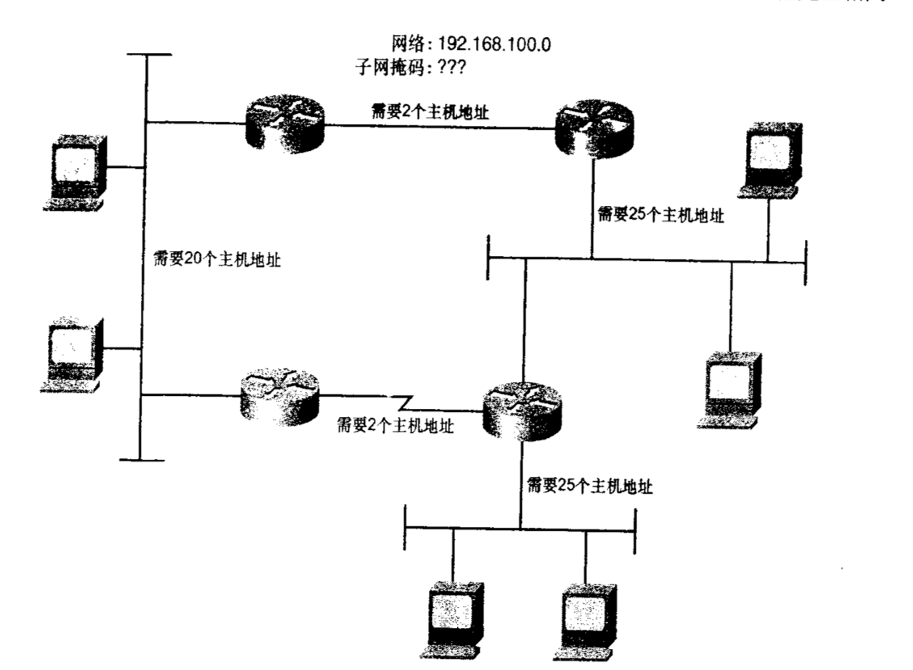

# IPv4地址概述

IPv4地址长度为32位。包括网络号和主机号。网络号和主机号就像人的姓名一样，人的名字分“姓”和“名”。姓是表明家族的字。姓最初代表有共同血缘、血统、血族关系的种族称号。是一种代表整体的概念。而名则代表这个整体中的某个个体。

<!----more---->

类似的，IPv4地址也有这种概念：网络号部分惟一地标识了一条物理链路或逻辑链路，对于与该链路相连的所有设备来说网络号是一样的，就像人的姓一样。一个家族的人都是相同的姓。而主机号部分惟一地标识了该链路上的具体设备。

有几种方式可以表示IP地址的32位。例如11000000.10101000.00000001.00000001。这个可以用十进制表示成19216811。由此可见，用二进制表示IP地址很麻烦。而全部用十进制表示的话计算起来又很耗时。所以给出一种较好的解决方法。

32位地址包含4个字节，每个字节都可以用0～255之间的十进制数表示。而每个十进制用点号分隔。这种写法叫点分十进制。如上所示。

但是要注意的是，路由器不是按照这种方式读取的。更多的时候是按照32位二进制串读取。且IP地址不像其他网络层地址（如Apple Talk和NetWare）那样，网络号和主机号是固定不变的。相反，IP地址的网络号和主机号可以在32位的界线内发生变化。因为TCP/IP从最初设计出来可以灵活地应用于任何网络，从很简单的几个功能发展成一个庞大的协议簇。TCP/IP这种适应性使得IP地址管理变得很困难。

# 首个八位组字节规则

对于大，中，小型网络。会有三种地址分类。分别是A.B.C三类地址。这三类的网络号和主机号是规定好了的。这种地址也叫做有类地址。

- A类地址—— 用于大型网络，第一个八位组是网络号，后三个八位组是主机号。8位的网络号最多可以有256个网络，而每个网络地址后面的主机号可以提供的主机数量为$2^{24}$（IP地址共32位，去掉8个网络位，得出主机位一共有24个）
- B类地址—— 用于中型网络。前2个八位组表示网络号，后2个八位组表示主机号。网络号和主机号地址都是$2^{16}$方个。
- C类地址—— 前3个8位表示网络号，最后一个8位表示主机号。跟A类地址正好相反。能提供256个主机。可以提供$2^{24}$个网络

那么对于ABC三类地址，需要用某一特定方法区分开来。人们规定，A类地址首个八位组的第一位总被设置为0。B类地址首个八位组第一，二位恒为10。C类地址首个八位组前三位恒为110。这么一来ABC三类地址的范围就如下所示

| 地址类 |   范围   |
| :----: | :------: |
|  A类   |  1～126  |
|  B类   | 128～191 |
|  C类   | 192～223 |

> 注：回环地址（典型的像127.0.0.1）向自己发送流量，发送到这个地址的数据将直接被送回给发送进程，不会离开设备。

# 地址掩码

表示整个链路的地址，非某台特定的主机。可以用IP地址的网络部分来表示。比方说李小狼，可以用李来表示这个人的姓。同样的。主机位部分全为0就可以用来表示整个链路。例如192.168.1.0。这是一个C类地址。主机位部分为最后四个八位组。全为0。如果分配给某个机构，那么这个机构有权决定后8位的使用。

每一台设备和接口都将被分配惟一的、主机号明确的地址。比方说192.168.1.1。不管是路由器还是主机。除了要确定自身的地址以外，还要知道自身所属的网络。例如上面提到的192.168.1.1。它属于192.168.1.0。

不过确认自己所属的网络由掩码来单独完成。掩码也是一个32位的字符串。和IP地址类似的。用点分十进制来表示，但是掩码并不是一种地址。人的姓名之所以能够很快的分辨出来是因为我们人为有规定了，第一个字或者头两个字是姓，后面的都是名。正因为这样我们才能够在对方报上姓名的时候很快分出姓氏和名字。但是IP地址不一样。没有这种规定，所以要依靠掩码来区分网络位（姓）和主机位（名）

对于有类地址来说，人们规定了三种掩码。

- A类地址的掩码为255.0.0.0

- B类地址的掩码为255.255.0.0

- C类地址的掩码为255.255.255.0

而对于每一位IPv4地址，设备会拿它与地址掩码的对应位进行布尔AND操作。或者叫逻辑与运算。逻辑运算是一种运算方式，跟加减乘除类似，加法得出的结果叫和，乘法得出的叫积。逻辑运算得出的都叫“真值”。对于与运算，真值表如下：

那么对于我们熟知的192.168.1.1来说，由上述可知C类地址的掩码为255.255.255.0。如果转换成二进制一一对应起来做与运算就可以算出网络地址。过程如下

11000000.10101000.00000001.00000001

11111111.11111111.11111111.00000000

与运算得

11000000.10101000.00000001.00000000结果为192.168.1.0.

所以为什么要用掩码？到目前为止好像使用首个八位组的规则要更简单一点，也不用进行如此复杂的计算。

# 子网和子网掩码

到目前为止的定义中，一个有类地址仅能使用在一个单一网络中；为了建立一个网络，每个数据链路都必须使用不同的地址，以便这些网络可以被惟一地标识。如果每个数据链路都是用一个单独的A，B或者C类地址，那么就算用尽所有的IPv4地址，也只能提供少于1700万个数据链路分配地址。这种方法显然是不切实际的。在之前的内容中，我们知道如果要充分地使用主机地址的空间，那么在数据链路172.21.0.0中设备数目可超过65000个。这显然过于庞大且不好管理，更主要的是在大多数情况下根本没有如此巨大的网络。

想让A，B，C类地址实用化的惟一方法是对网络地址进行划分。例如将172.21.0.0再进行划分，变成子网地址。由于IPv4地址的主机部分可以随意使用且IPv4地址的网络号由分配给接口的地址掩码确定，所以如上图所示。分配给网络的B类地址172.21.0.0由5个数据链路将主机和路由器连接起来，每个链路都需要一个网络地址。照目前的情况，172.21.0.0必须分配给其中的一个数据链路，则另外4个链路还需要4个地址。

可以注意到上图的掩码并不是标准的16位的B类地址的掩码。而是被扩展了8位，所以IP地址前24位都是网络位。也就是说，掩码使路由器和主机把读取到的前8位的主机地址作为网络地址的一部分。结果就变成了，主网络地址（172.21.0.0）用于整个网络，而每一个数据链路则变为一个子网（subnet）；一个子网总是属于A，B，C这三种地址空间。

所以现在我们知道，IPv4地址包括三个部分：网络部分，子网部分和主机部分。地址掩码现在变成了子网掩码。地址的前两个八位组仍然是172.21.但是第三个八位组的主机位已经由子网位替代。变化的范围是0～255。在上图的网络中有子网1、2、3、4、5。（172.21.1.0～172.21.5.0）。在单一的B类地址下最多可以有256个子网。对应的掩码也如上图所示。这就是通过向主机位借位用作子网位，子网掩码使得一个单一的网络第一可以用于多个数据链路。

子网掩码有三种写法：

- 点分十进制：255.255.255.0
- 位计数：172.21.0.0/24
- 十六进制：0xFFFFFF00

# 子网规划

网络设计人员需要根据地址空间与网络详细的匹配程度来选择最合理的子网划分方案。在规划子网和子网掩码时，可以使用相同的计算公式计算一个主网地址下可用的子网数以及每个子网内可用的主机数。公式为$2^n-2$。其中n代表子网位数。减2表示减去主机位全0的地址（网络地址。相当于一个人的名字中只有姓。这种地址是不可用的）和全1的地址（广播地址，向这个地址发送消息相当于给该网络中的所有人发送消息，也不可用）。例如。给定一个A类地址10.0.0.0，子网掩码为10.0.0.0/16。意味着有8位是子网空间，也就是可以产生$2^8-2=254$个子网。每个子网可以有$2^{16}-2=65534$个主机地址。要注意的是，如果以8位组为界限，就无法对C类地址进行划分了。

如图所示，如果分配C类地址，这里将无法进行划分所以我们要打破8位组界限。子网划分的核心思想是向主机位借位充当网络位。所以在这个网络中共有5条数据链路，所以至少要划分5个子网地址。图上还指明了每个子网需要分配的主机数。其中两个以太网最多需要25个主机地址。所以完整的子网划分最小需求是5个子网，每个子网至少要25个主机地址。

之后使用公式$2^n-2$ 可以计算出，3个子网位和5个主机位即可满足需求：$2^3-2=6$,$2^5-2=30$ 带有3位子网位的C类地址掩码可以用点分十进制表示为255.255.255.224.

这边直接给出比较简单的计算方式

- 你选择的子网掩码将会产生$2^x$个子网，x代表掩码位数。举个例子，192.168.1.1/24借2位。则x=2 会产生4个子网
- 每个子网有$2^y-2$个主机，y为主机位的长度。还是按照上面的例子。如果借两位，就变成了192.168.1.1/26.这样一来主机位的长度就是$32-26=6$位。则每个子网有$2^6-2=30$个主机。
- 有效子网，或者说每个网络的范围是256-10进制的子网掩码。得到的叫块大小(Block Size)。这个很奇妙。按照192.168.1.1/26来说，将掩码转换成十进制就是255.255.255.192.这样拿$256-192=64$.也就是说，每个网络的块大小是64。所以第一个网络的范围是192.168.1.0～192.168.1.63.第二个就是192.168.1.64～192.168.1.127。以此类推。

