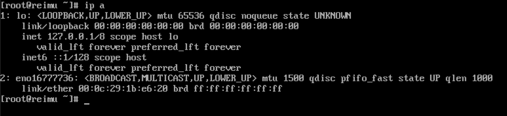
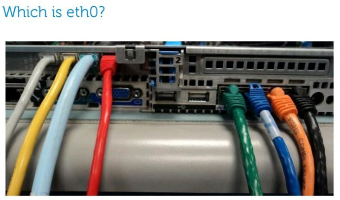
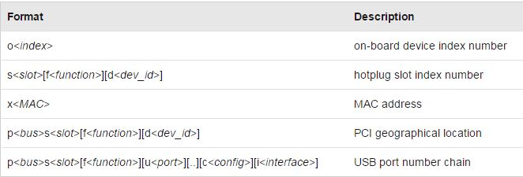

# 基础网络概念

我们自己搭建的环境一般是在虚拟机里搭建，现在也有很多环境都是使用虚拟机的。所以本文主要以虚拟机（VMware Workstation）的环境为主，会包含一些虚拟网络的知识。如果是真实服务器使用物理网卡相对会比较简单。不过命令都是相同的。接下来介绍一下基础网络概念。因为管理Linux一般是用Xshell，SecureCRT等终端软件连接进行操作，所以网络如果不通的话基本什么也做不了。还是很关键的。

<!----more--->

## 虚拟网卡

在使用VMware Workstation安装虚拟机时会让我们选择虚拟网卡。虚拟网卡有三种模式。**NAT**，**仅主机**和**桥接**。这三种模式各有不同的使用场景和工作方式，下面简单介绍一下

-   NAT

    这个顾名思义，会借用主机的IP地址和外部通信，与物理机共享IP地址。但是由于做了NAT，外部主机无法访问虚拟机。虚拟机可以访问外部设备。

-   仅主机

    做实验的话，这个模式用的最多，也是需要重点讲的。仅主机模式相当于在你的电脑上创建了一个虚拟交换机，这个虚拟交换机一般叫VMnet x x为数字。可以在虚拟网络编辑器里自行创建，VMWare Workstation自带了一张仅主机的虚拟网卡。默认情况下，仅主机模式的网卡只能和物理机以及同虚拟交换机的虚拟机通信。且他们的IP地址要在同一网段才能通信，后面会用实际例子来说明。

-   桥接

    这个往往是外部主机和虚拟机需要互通的时候会用到的模式，在这种模式下，如果桥接模式桥接物理网卡，则虚拟机可以和外部主机通信。在生产环境会用的比较多。

## Linux网卡命名

一般来说，在VMWare Workstation中，你的虚拟机加了几块网卡，在命令行中使用ip a命令就可以看到几块网卡。

上面是我刚装好的Linux，有一个仅主机模式的网卡，有一个lo0。lo0是本地环回网卡，跟平时做路由器实验的lo0一样，逻辑上的接口。自己访问自己的时候就是用的这块网卡。不用管他。

可以看到第二块网卡叫eno16777736。虽然不是很重要但是还是说明一下这种奇怪的命名方式。先摘抄一段话

>Network interface names
>Traditionally, network interfaces in Linux are enumerated as eth0, eth1, eth2, and so on. However, the mechanism which sets these names can cause changes to which interface gets which name as devices are added and removed. 
>The default naming behavior in Red Hat Enterprise Linux 7 is to assign fixed names based on firmware, device topology, and device type. 
>
>Interface names have the following characters:
>​    Ethernet interfaces begin with en, WLAN interfaces begin with wl, and WWAN 
>​    interfaces begin with ww.
>​    The next character(s) represents the type of adapter with an o for on-board, s for 
>​    hotplug slot, and p for PCI geographic location. 
>​	Not used by default but also available to administrators, an x is used to incorporate a 
>​	MAC address.
>​    Finally, a number N is used to represent an index, ID, or port.
>​    If the fixed name cannot be determined, the traditional names such as ethN will be 
>​    used. 
>
>For example, the first embedded network interface may be named eno1 and a PCI card network interface may be named enp2s0. 
>The new names make it easier to distinguish the relationship between a port and its name if the user knows both, but the trade off is that users cannot assume a system with one interface calls that interface eth0. 

简单来说就是

LAN用 en
WLAN用 wl
集成网卡：o
独立网卡：s
独立的不是热插拔的pci:p

wwan用的是mini PCI-E口，现在新的笔记本电脑上，这个口也可以接mSATA口的固态硬盘，但要主板支持，如thinkpad x220。不是所有的wwan口都支持mSATA。

在CentOS7中，有别于传统的eth0，eth1这样命名。7中采用了更科学的命名方式（也更长了）。掌握规律的话，还是很好理解的。

### 为什么需要这么复杂的命名方式？

服务器通常有多块网卡，有板载集成的，同时也有插在PCIe插槽的。
Linux系统的命名原来是eth0,eth1这样的形式，但是这个编号往往不一定准确对应网卡接口的物理顺序。
为解决这类问题，dell开发了biosdevname方案。
systemd v197版本中将dell的方案作了进一步的一般化拓展。
目前的Centos既支持dell的biosdevname，也支持systemd的方案。

可以看一下这张图，有板载网卡和PCI网卡的情况下，很难说清楚哪个是eth0

在CentOS7中，命名顺序如下：

1.  如果从BIOS中能够取到可用的，板载网卡的索引号，则使用这个索引号命名，例如:eno1，如不能则尝试2
2.  如果从BIOS中能够取到可以用的，网卡所在的PCI-E热插拔插槽的索引号，则使用这个索引号命名，例如:ens1，如不能则尝试3
3.  如果能拿到设备所连接的物理位置信息，则使用这个信息命名，例如:enp2s0，如不能则尝试4
4.  传统的kernel命名方法，例如:eth0，这种命名方法的结果不可预知的，即可能第二块网卡对应eth0，第一块网卡对应eth1。
5.  使用网卡的MAC地址来命名，这个方法一般不使用。

biosdevname和net.ifnames两种命名规范
net.ifnames的命名规范为:   设备类型+设备位置+数字
设备类型：
​    en 表示Ethernet
​    wl 表示WLAN
​    ww 表示无线广域网WWAN

设备位置如下：

实际的例子:
​    eno1 板载网卡
​    enp0s2 pci网卡
​    ens33  pci网卡
​    wlp3s0 PCI无线网卡
​    wwp0s29f7u2i2   4Gmodem
​    wlp0s2f1u4u1  连接在USB Hub上的无线网卡
​    enx78e7d1ea46da pci网卡

而biosdevname的命名规范为

实际的例子:
​    em1 板载网卡
​    p3p4 pci网卡
​    p3p4_1 虚拟网卡

那么我们的网卡到底是经过怎样的顺序才会是这么个名字呢。

来看看systemd中的实际执行顺序：
按照如下顺序执行udev的rule
1./usr/lib/udev/rules.d/60-net.rules
2./usr/lib/udev/rules.d/71-biosdevname.rules
3./lib/udev/rules.d/75-net-description.rules
4./usr/lib/udev/rules.d/80-net-name-slot.rules
60-net.rules 
​    使用/lib/udev/rename_device这个程序，去查询/etc/sysconfig/network-scripts/下所有以ifcfg-开头的文件
​    如果在ifcfg-xx中匹配到HWADDR=xx:xx:xx:xx:xx:xx参数的网卡接口
​    则选取DEVICE=yyyy中设置的名字作为网卡名称。
71-biosdevname.rules
​    如果系统中安装了biosdevname，且内核参数未指定biosdevname=0，且上一步没有重命名网卡，则按照biosdevname的命名规范，从BIOS中取相关信息来命名网卡。
​    主要是取SMBIOS中的type 9 (System Slot) 和 type 41 (Onboard DevicesExtended Information)
​    不过要求SMBIOS的版本要高于2.6，且系统中要安装biosdevname程序。
75-net-description.rules
​    udev通过检查网卡信息，填写如下这些udev的属性值 
​    ID_NET_NAME_ONBOARD
​    ID_NET_NAME_SLOT
​    ID_NET_NAME_PATH
​    ID_NET_NAME_MAC 
80-net-name-slot.rules
​    如果在60-net.rules，71-biosdevname.rules这两条规则中没有重命名网卡，且内核未指定net.ifnames=0参数则udev依次尝试使用以下属性值来命名网卡，如果这些属性值都没有，则网卡不会被重命名。
​    ID_NET_NAME_ONBOARD
​    ID_NET_NAME_SLOT
​    ID_NET_NAME_PATH
上边的71-biosdevname.rules 是实际执行biosdevname的policy75-net-description.rules和80-net-name-slot.rules实际执行Scheme 1,2,3
根据上述的过程，可见网卡命名受 biosdevname和net.ifnames这两个内核参数影响。这两个参数都可以在grub配置中提供。
biosdevname=0是系统默认值（dell服务器默认是1），net.ifnames=1是系统默认值:
​    vi /boot/grub/grub.conf
​    kernel /boot/ biosdevname=1
​    initrd /boot/initrd.img 

在上面Centos7中命名的策略顺序是系统默认的。
如系统BIOS符合要求，且系统中安装了biosdevname，且biosdevname=1启用，则biosdevname优先；
如果BIOS不符合biosdevname要求或biosdevname=0，则仍然是systemd的规则优先。
如果用户自己定义了udevrule来修改内核设备名字，则用户规则优先。

内核参数组合使用的时候，其结果如下：
​    默认内核参数(biosdevname=0，net.ifnames=1):  网卡名"enp5s2"
​    biosdevname=1，net.ifnames=0：网卡名 "em1"
​    biosdevname=0，net.ifnames=0：网卡名 "eth0" (最传统的方式,eth0 eth1傻傻分不清)

# 使用Network Manager管理Linux网络

Network Manager是Centos7推荐的网络管理命令。相比于使用配置文件来管理网络，Network Manager（以后简称NM）更灵活方便。

在Centos7中，即使是最小化安装，也能够使用NM命令来管理网络，所以我们不需要安装任何组件就可以使用下面提到的所有命令。

但是首先要知道两个概念

-   con

    连接，逻辑设置。指的是一套具体配置方案

-   device

      设备，物理设备。例如ens33,virbr0,team0

其中多个connection可以应用到同一个device，但同一时间只能启用其中一个connection。
这样的好处是针对一个网络接口，可以设置多个网络连接，比如静态IP和动态IP，再根据需要up相应的connection。

