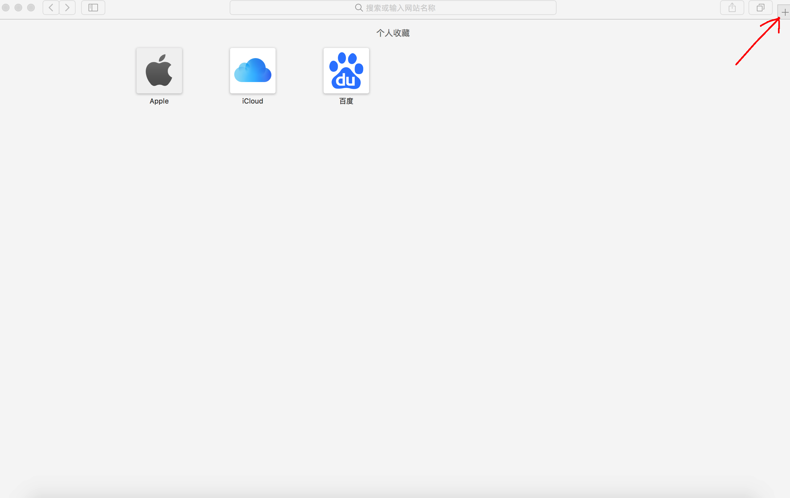
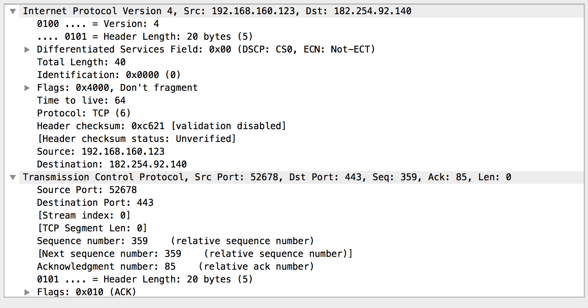

# OSI参考模型

## 为何会有OSI参考模型的提出

很久以前，各大硬件厂商如HP，IBM等都根据自己的协议生产了不同的软硬件，这就导致了设备间相互通讯非常困难。这是一个什么概念？


举个例子，以前的中国，阎锡山为了做山西土皇帝，山高皇帝远，在自己势力范围内建造窄轨铁路，蒋介石国军的火车无法进入山西境内，无法便利调动军队、物资，实现一人独大的军阀割据格局。以互联网的眼光看，如果标准轨道铁路网是一个互联网，那阎锡山的窄轨铁路就是一个自我封闭的局域网，为了打破这种非标准化的私有标准，需要制定一个大家都遵守的国际标准。

<!---more---->

于是，国际标准化组织(ISO)和国际电报电话咨询委员会(CCITT)联合开发了这个七层的参考模型。初衷是为了让各大厂商之间的设备遵循这个规定，生产出的设备可以畅通无阻地互相通信。模型层次结构如下：

|         名字          |          作用          |
| :-------------------: | :--------------------: |
|  Application(应用层)  | 应用程序接入网络的接口 |
| Presentation(表示层)  |       数据的表示       |
|    Session(会话层)    |     管理及区分会话     |
|   Transport(传输层)   |    提供端到端的连接    |
|    Network(网络层)    |       数据的分发       |
| Data Link(数据链路层) |        接入媒体        |
|   Physical(物理层)    |      二进制的传输      |


## 网络分层的目的以及每一层的作用

为了能把一个复杂的问题简单化，OSI参考模型讲数据的传输给分成了七层，每一层都有自己的任务。

以上的列表是官方的定义。那么按照我自己的理解再说一遍。


### 应用层

首先还是引用一段官方的定义

> Network Processes to Applications
>
> - Provides network services to application processes (such as electronic mail , file transfer, and terminal emulation)
> - Provides user authentication


这里说的是提供应用程序进程的网络接口。首先要理解接口的定义。这里的接口不是指路由器交换机这种设备的物理接口，而是指逻辑上的。举个例子。如果你使用浏览器，浏览器上会有标签页，刷新，收藏等按钮。如果你想打开一个新标签页，就可以点击加号。




这种叫UI(User Interface)用户接口。意思是用户和机器交互的接口。如果我想要做某个操作，我需要电脑能够给我提供操作的空间，例如我想打开新的标签页，我就需要浏览器这个程序上有个加号。同样的。我的应用程序想要通过网络传输一些数据，也是需要类似的“接口”的。这个接口由应用层提供。典型的例如HTTP就是应用层协议。它可以让网页的内容在服务器和客户端之间传输。


### 表示层

官方定义如下

> Data Representation
>
> - Ensures that data is readable by receiving system
> - Formats data
> - Negotiates data transfer syntax for application layer


这里表示层的主要作用是 协商数据传输时使用的编码。我们还是拿HTTP这种常用的协议来举例子。在浏览网页时，我们可以查看网页上的各种信息，像图片，文字，视频等。那么在传输时，浏览器是如何知道图片以及文字的表达形式呢，传过来的那么多信息，程序是如何知道传的是图片还是文字还是视频呢？这就依靠我们表示层给出的信息来识别。我们一起来看一下网页的源代码。随便找一个

```html

<!DOCTYPE html PUBLIC "-//W3C//DTD XHTML 1.0 Transitional//EN" "http://www.w3.org/TR/xhtml1/DTD/xhtml1-transitional.dtd">
<html xmlns="http://www.w3.org/1999/xhtml">
<head>
<meta http-equiv="Content-Type" content="text/html; charset=utf-8" />
<title>搭建Windows环境PS4直播服务器+支持OBS - PS4综合讨论区 - A9VG电玩部落论坛</title>
<link href="http://bbs.a9vg.com/thread-4199530-1-1.html" rel="canonical" />
<meta name="keywords" content="搭建Windows环境PS4直播服务器+支持OBS" />
<meta name="description" content=" 搭建Windows环境PS4直播服务器+支持OBS ,A9VG电玩部落论坛" />
<meta name="MSSmartTagsPreventParsing" content="True" />
<meta http-equiv="MSThemeCompatible" content="Yes" />
<base href="http://bbs.a9vg.com/" /><link rel="stylesheet" type="text/css" href="data/cache/style_2_common.css?7ru" /><link rel="stylesheet" type="text/css" href="data/cache/style_2_forum_viewthread.css?7ru" /><script type="text/javascript">var STYLEID = '2', STATICURL = 'static/', IMGDIR = 'static/image/common', VERHASH = '7ru', charset = 'utf-8', discuz_uid = '0', cookiepre = 'WxSS_a648_', cookiedomain = '.a9vg.com', cookiepath = '/', showusercard = '0', attackevasive = '0', disallowfloat = 'login|newthread', creditnotice = '', defaultstyle = '', REPORTURL = 'aHR0cDovL2Jicy5hOXZnLmNvbS90aHJlYWQtNDE5OTUzMC0xLTEuaHRtbA==', SITEURL = 'http://bbs.a9vg.com/', JSPATH = 'static/js/';</script>
```

后面的就省略了。毕竟我们不是学习HTML语言。


这边可以在第五行看到这样一段代码:`charset=utf-8`


简单介绍一下UTF-8。这是一种字符的编码方式，它支持英文，简中，繁重，日文韩文等不同国家的语言，使他们能够正常在网页中显示。所以浏览器才能正常显示中文信息。这都是表示层的功劳。


### 会话层

官方定义如下：

> Interhost Communication
>
> - Establishes,manages,ande terminates sessions between applications


会话层的作用很简单，在程序间建立，管理和结束会话。何为会话呢？我打开QQ和朋友聊天这是一种会话，聊天的同时我还在使用浏览器看视频，这是另一种会话。这两种会话的流量都是通过网络传输过来的，那么如何保证聊天的流量不会发送给浏览器，视频的流量又不会发给QQ呢？这一般是操作系统层面去实现的事情。每个应用程序都有属于自己的PID(进程号)这些号码在系统中是唯一的。所以系统根据进程号来区分不同的会话。


### 传输层

官方定义如下:

> End to End Connections
>
> - Provides reliability through fault detection and recovery information flow contorl
> - Ensures data transport reliability
> - Handles transportation issues between hosts
> - Establishes,maintains,and terminates virtual circuits


主要是提供端到端的通信。可靠的传输以及流控。上面的三层我们一般也统称应用层。因为都是应用程序或者操作系统帮我们完成的，跟网络没有什么太大的关系。而传输层起到一个承上启下的作用。


### 网络层

官方定义如下:

> Data Delivery
>
> - Routes data packets
> - Selects best path to deliver data
> - Provides logical addressing and path selection

网络层主要的作用是路由数据包，选择一条最佳的路径以及提供逻辑地址去选路。典型的像IP地址就是一种逻辑地址。是人为规定的。可以随意更改。


### 数据链路层 

官方定义如下:

> Access to Media
>
> - Defines how data is formatted for transmission and how access to network is controlled
> - Provides error detection

这里不太好理解 给出的定义是接入媒体，可以把这里的Media理解为硬件。接入硬件。需要提供一个接入硬件的方式。例如在以太网中，数据链路层使用MAC地址，而MAC地址是每个以太网设备在被制造出来时都会有的一个硬件地址。这便是接入硬件的意义。因为最终数据还是要发送到设备上的某个接口的。光靠三层的逻辑地址是不够的。


### 物理层

官方定义如下:

> Binary Transmission
>
> - Defines the electrical,mechanical,procedural,and functional specifications for activating,maintaing,and deactivating the physical link.

这里物理层主要是定义电器特性，比方说线速，电压等等物理特性。


## OSI参考模型总结

以上就是OSI参考模型的全部总结，总的来说它将网络通信这个复杂的过程通过分层给模块化了。每一层都有自己的任务。就像寄快递。


先将要寄的东西打包，这是应用层的数据。那么现在到了传输层，主要是提供一种传输方式。类似我们在寄快递的时候选择空运或者陆运。空运比较贵嘛，但是快，陆运便宜 但是慢。这边只是一个比喻，实际肯定没有这么简单。传输层主要会使用TCP和UDP两种协议。关于这个会在TCP/IP中详细谈到。那么在选择完了传输方式 例如决定使用TCP之后，就需要填写发件人（源地址）和收件人（目标地址）了。填写完毕以后交给快递公司，他们会把快递由一个转运中心发往另一个转运中心，并不是直接从源发往目标。这里的转运中心其实就到二层了。在传输过程中，二层地址，例如以太网中的MAC地址，是会不停变化的，就像一个快递由上海发往武汉，会先到上海的某个集散中心，然后发往武汉，然后又在武汉的集散中心转几圈，最后发往离目标最近的快递点，然后才开始配送，最终送到收件人手上。


# TCP/IP协议族

>1983年1月1日，在[因特网](https://zh.wikipedia.org/wiki/%E5%9B%A0%E7%89%B9%E7%BD%91)的前身（ARPA网）中，TCP/IP取代旧的[网络控制协议](https://zh.wikipedia.org/wiki/%E7%BD%91%E7%BB%9C%E6%8E%A7%E5%88%B6%E5%8D%8F%E8%AE%AE)（NCP，Network Control Protocol），从而成为今天的互联网的基石。最早的TCP/IP由[文顿·瑟夫](https://zh.wikipedia.org/wiki/%E6%96%87%E9%A1%BF%C2%B7%E7%91%9F%E5%A4%AB)和[罗伯特·卡恩](https://zh.wikipedia.org/wiki/%E7%BD%97%E4%BC%AF%E7%89%B9%C2%B7%E5%8D%A1%E6%81%A9)两位开发，慢慢地通过竞争战胜其他一些网络协议的方案，比如[国际标准化组织](https://zh.wikipedia.org/wiki/%E5%9B%BD%E9%99%85%E6%A0%87%E5%87%86%E5%8C%96%E7%BB%84%E7%BB%87)[ISO](https://zh.wikipedia.org/wiki/ISO)的[OSI模型](https://zh.wikipedia.org/wiki/OSI%E6%A8%A1%E5%9E%8B)。TCP/IP的蓬勃发展发生在1990年代中期。当时一些重要而可靠的工具的出世，例如页面描述语言[HTML](https://zh.wikipedia.org/wiki/HTML)和浏览器[Mosaic](https://zh.wikipedia.org/wiki/Mosaic)，促成了互联网应用的飞速发展。 随着互联网的发展，目前流行的[IPv4](https://zh.wikipedia.org/wiki/IPv4)协议（网际协议版本四）已经接近它的功能上限。IPv4最致命的两个缺陷在于：
>
>- 地址只有32位，[IP地址](https://zh.wikipedia.org/wiki/IP%E5%9C%B0%E5%9D%80)空间有限；
>
>- 不支持服务质量（[Quality of Service](https://zh.wikipedia.org/wiki/QoS)，QoS）的想法，无法管理带宽和优先级，故而不能很好的支持现今越来越多实时的语音和视频应用。因此[IPv6](https://zh.wikipedia.org/wiki/IPv6)（网际协议版本六）浮出水面，用以取代IPv4。
>
>- TCP/IP成功的另一个因素在于对为数众多的低层协议的支持。这些低层协议对应[OSI模型](https://zh.wikipedia.org/wiki/OSI%E6%A8%A1%E5%9E%8B)中的第一层（物理层）和第二层（数据链路层）。每层的所有协议几乎都有一半数量支持TCP/IP，例如：[以太网](https://zh.wikipedia.org/wiki/%E4%BB%A5%E5%A4%AA%E7%BD%91)（Ethernet）、[令牌环](https://zh.wikipedia.org/wiki/%E4%BB%A4%E7%89%8C%E7%8E%AF)（Token Ring）、[光纤数据分布接口](https://zh.wikipedia.org/wiki/%E5%85%89%E7%BA%A4%E5%88%86%E5%B8%83%E5%BC%8F%E6%95%B0%E6%8D%AE%E6%8E%A5%E5%8F%A3)（FDDI）、[点对点协议](https://zh.wikipedia.org/wiki/%E7%82%B9%E5%AF%B9%E7%82%B9%E5%8D%8F%E8%AE%AE)（PPP）、[X.25](https://zh.wikipedia.org/wiki/X.25)、[帧中继](https://zh.wikipedia.org/wiki/%E5%B8%A7%E4%B8%AD%E7%BB%A7)（Frame Relay）、[ATM](https://zh.wikipedia.org/wiki/%E5%BC%82%E6%AD%A5%E4%BC%A0%E8%BE%93%E6%A8%A1%E5%BC%8F)、[Sonet](https://zh.wikipedia.org/wiki/%E5%90%8C%E6%AD%A5%E5%85%89%E7%BD%91%E7%BB%9C)、[SDH](https://zh.wikipedia.org/wiki/SDH)等。
>
>  ​												——————摘抄自[维基百科TCP/IP协议族](https://zh.wikipedia.org/wiki/TCP/IP协议族)


TCP/IPv4协议族是现在互联网仍在使用的协议族，尽管IPv4的问题非常多，但是由于IPv6普及的进程较缓慢，所以IPv4现在仍是互联网主要使用的协议。其协议族模型如下：

|           名称            |     典型应用      |
| :-----------------------: | :---------------: |
| 应用层(Application Layer) |   HTTP,FTP,DNS    |
|  传输层(Transport Layer)  | TCP,UDP,RTP,SCTP  |
|  网络层(Internet Layer)   |        IP         |
|  网络接口层(Link Layer)   | 以太网,Wi-Fi,MPLS |


## 应用层

这一层包括所有和应用程序协同工作的且利用网络交换程序专用数据的协议。这一层的处理过程是特有的。就是数据从网络相关的程序以这种应用内部使用的格式进行传送，然后被编码成标准协议的格式。


一些特定的程序被认为是运行在这一层。它们提供的服务可以直接支持用户的应用，例如HTTP，DNS，FTP，SMTP等。一旦从应用程序来的数据被编码成一个标准的应用层协议，它将被传送到IP栈的下一层。


## 传输层

传输层协议能够解决端到端的可靠性问题，例如**“数据是否已经到达目的地?"**这样的问题和**“数据是否按正确的顺序到达？”**这样的问题。


- TCP（IP协议号6）是一种**可靠，面向连接**的传输协议。它提供一种可靠的字节流保证数据完整、无损并且按顺序到达。TCP尽量连续不断地测试网络的负载并且控制发送数据的速度以避免网络过载。另外，TCP试图将数据按照规定的顺序发送。这是它与UDP不同之处，这在实时数据流或者路由丢失率应用的时候可能成为一个缺陷。


-  UDP（IP协议号17）是一个无连接的数据报协议。它是一个“尽力传递”（best effort）或者说“不可靠”协议——不是因为它特别不可靠，而是因为它不检查数据包是否已经到达目的地，并且不保证它们按顺序到达。如果一个应用程序需要这些特性，那它必须自行检测和判断，或者使用TCP协议。 UDP的典型性应用是如流媒体（音频和视频等）这样按时到达比可靠性更重要的应用，或者如DNS查找这样的简单查询／响应应用，如果创建可靠的连结所作的额外工作将是不成比例地大。


### TCP

> TCP提供了一条看似点到点的连接，虽然实际上这条连接并不存在。TCP利用网络层可以提供无连接的，尽力而为转发的服务。这就像寄邮件，一叠信件一旦交给邮递员之后，谁也不能保证信件将按照原先叠放的顺序依次送达，也不能保证这些信件都能在同一天送到，甚至都不能保证全部送到。快递员只能承诺尽最大努力邮寄这些信件。
>
> 同样的，网络层不保证所有数据包都是使用相同的路径，因而也不保证数据包到达时仍旧保持发送时的顺序和间隔或者全部到达。
>
> ​						——————摘抄自TCP/IP协议卷一


想象一下我们平时的打电话这个操作，电话呼叫是一个面向连接的服务。电话铃响后如果接通了代表通信双方互相建立了连接，然后才会开始交谈，如果没有接通，则不会进行数据的传送。同样的。TCP首先要建立连接，然后是传送数据。当数据传输完毕后要断开连接（挂电话）。


那么在无连接的服务上，TCP使用了三种基础的机制实现面向连接的服务

- 使用序列号对数据包进行标记，以便TCP接受服务在向目的应用传递数据之前修正错序的数据包排序
- TCP使用确认，校验和定时器系统提供可靠性。当接收者按照顺序识别出来数据包未能到达（例如收到的序列号为13456，则序列为2的数据丢失）或发生错误时，接收者将通知发送者，或者接收者在特定的时间内没有发送确认信息，那么发送者就认为在发送结束后数据包没有到达接受的地方。在这两种情况下，发送者都会考虑重传数据包。
- TCP使用窗口机制调整数据包的流量；窗口机制可以减少因为接收方缓冲区满而造成的数据包丢失可能性。


TCP在应用层数据上附加了一个报头，报头里包含了刚才提到的序列号，确认号等能够保证面向连接机制的一些关键信息。大部分协议都是在下层数据前面添加报头实现自己的功能的。TCP报头被封装在IP数据包内。下图为TCP报头。


下图为实际抓包得出的数据包（部分）




其中IP层不是我们关心的。我们只用知道TCP在IP层的协议号为6就行。协议号用来标识上层使用的是哪种协议，此处是TCP。


IP层下面便是TCP的报头数据了。从简要信息里我们可以看到几个参数的名字，例如Src Port，Dst Port ，Seq，Ack等。那么接下来一个个解释每个参数的意义。


- 源端口(Source Port)和目标端口(Destination Port)

  

  字段长度各为16位。所以源端口和目标端口取值范围则是2的16次方=65536

  

  由0开始，所以端口号的范围是0～65535。端口号指定了源和目标应用程序。也就是说可以用端口号来区分同是使用TCP的两个不同应用程序间的流量。应用程序的端口号+应用程序所在的主机IP地址统称为套接字（socket）。在网络上套接字惟一地标识了每一个应用程序。

  

- 序列号(Sequence Number)

  

  字段长度为32位。序列号用来确定数据在数据流中所在的位置，就像刚才说的一叠信件，发出去的时候信件的摆放顺序是1234567。如何才能保证发出去的信件和收到的信件顺序一样呢？序列号就是用来实现这个功能的。例如。如果这封信的序列号是1，这封信一共有1000个字，那么下一封信的序列号则为`1+1000+1=1002`。


- 确认号(Acknowledgement Number)

  

  字段长度为32位。序列号用来确定发送方发送的数据在数据流中的位置。一叠信件被收到以后，使用确认号来确定收件人下次希望接收的信件的序列号。如果发件人收到的确认号与他下一次准备发送（或者已经发送）的序列号不一样。那么主机将收到丢失的数据包。


- 报头长度(Header Length)

  

  又叫数据偏移量，长度是4位，它指定了以32位字节为单位的报头长度。因为TCP中有些字段是可选的导致长度不一致。所以这一字段标记出数据的起点是很有必要的。


- 保留(Reserved)

  

  字段长度为6位 通常为0。保留用。没有什么特殊意义。


- 标记(Flags)

  

  包括8个1位的标记，用于流控和连接控制，它们从左到右分别是：

  拥塞窗口减少(Congestion Windows Reduced,简称CWR)、ECN-Echo(ECE)、紧急(URG)、确认(ACK)、弹出(PSH)、复位(RST)、同步(SYN)、结束(FIN)。如下图所示。

  

  至于每一位的作用这边不需要太过深究。

- 窗口大小(Window Size)

  

  窗口大小主要用于流控。即流量控制。不妨假设，发送方发送数据很快，而接收方接受数据很慢。在这种情况下，为了不保证数据丢失，就需要流量控制。协调好通信双方的工作节奏。所谓窗口，可以理解成接收端所能提供的缓冲区大小。TCP利用一个滑动的窗口来告诉发送端对它所发送的数据能提供多大的缓冲区。由于窗口由16位bit所定义，所以接收端TCP 能最大提供65535个字节的缓冲。由此，可以利用窗口大小和第一个数据的序列号计算出最大可接收的数据序列号。

  


​	如上图所示，其实TCP在整个发送过程中，也在度量当前的网络状态，目的是为了维持一				个健康稳定的发送过程。发送的数据可以分为以下几类：

- 已经发送的并且对端也确认了(Sent/ACKed)——发送窗外，缓冲区外
- 已经发送但是对端还未确认的(Unsent/Inside)——发送窗内 缓冲区内
- 要发送的但是还未发送的(Unsent/Inside)——发送窗内 缓冲区内
- 未发送且暂不发送的(Unsent/Outside)——发送窗外 缓冲区外


​	TCP窗口就是这样逐渐滑动，发送新的数据。滑动的依据便是发送数据已经收到ACK，确认对端收到，才继续滑动窗口发送新的数据。可以看出来窗口的大小对于吞吐量有着重要的影响。

- 校验和(Checksum)


​	字段长度为16位，它包括报头和被封装的数据。校验和可以做错误检测


- 紧急指针(Urgent Pointer)


​	这个字段仅当URG标记置位时（就是Flag中的URG=1的时候）才被使用。这个16位数倍添加到序列号上用于指明紧急数据的结束。


- 可选项(Options)


​	字段用于指明TCP的发送进程要求的选项。最常用的便是最大段长度。用于通知接收方，表明发送者愿意接受的最大段长度。为了保证报头的长度时32个八位组的整数倍，所以用0填充这个字段剩余的部分。


### UDP

​	UDP提供了一种无连接、尽力而为的数据包转发服务。UDP的优点是不用花时间建立连接。直接发送数据。用UDP代替TCP，可以使发送小数据量的应用取得更好的性能优势。UDP报头非常简单。如下图


抓包结果如下


