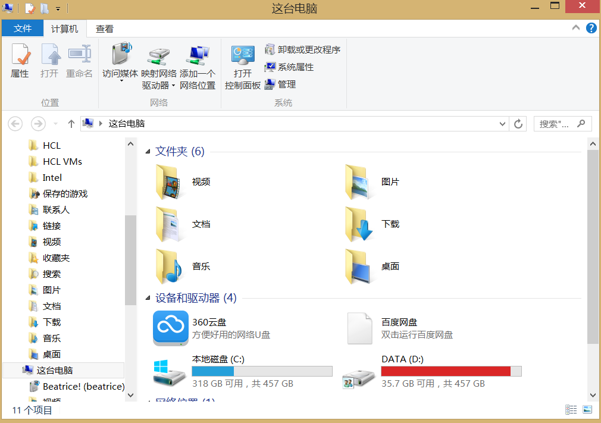

# 写在前面的话

个人所用的是虚拟机环境,使用的是**RHEL7**。大体上应该没有什么太大的关系。机器是两张网卡，一张VMNET10一张VMNET1都是仅主机模式。使用**SecureCRT**进行连接操作。环境的搭建就不写了。

# 必须掌握的几个Linux命令

## 我们为什么要学习Linux的命令？

初学者上手Linux系统会很懵。不管你是否安装了图形化界面，或者去网上找一些教程。或者一些Linux的应用 总会看到密密麻麻的命令。很难得看懂，直接导致一些人放弃学习。这边简单用Windows举个例子吧。

<!--more--->

​	例如在Windows中，我们总会打开**我的电脑**或者一些文件夹，能看到这样一种界面：



这是windows比较友好的地方。这整个叫做**图形化用户接口**，简称**GUI**。我们可以通过双击某个分区来浏览里面的数据 比方说到D盘的VIDEO里找到Charlotte文件夹,能够看到我下好的动漫 直接双击就可以观看了。


这整个过程可以理解为**“你”**在和**“电脑”**交互。你的鼠标双击告诉电脑要切换目录，于是电脑切换到该目录然后显示文件夹里的内容。


其实在Windows执行这些命令，也是一样的。我们来看一下。


打开CMD。一个黑乎乎的框框。在这里面我们可以输入命令 来达到同样的效果。


没有任何区别 只是通过文字的方法显示出来 让人难免感觉有些别扭。


直接输入文件名回车就可以运行了。在很久以前的DOS系统想要玩仙剑奇侠传1就是这么弄的。只不过后来逐渐有了图形化界面。


而Linux系统其实也有很多版本是有桌面环境的。像国产的DEEPIN。国外的UBUNTU。我所用的RHEL其实也可以有桌面环境。但是对于服务器系统来说，桌面环境毕竟还是比较消耗资源的。而且真正用起来，大部分时候命令行还是比图形化界面方便。（前提是你用的比较熟）所以掌握Linux中的命令就显得尤为重要了。就像我们第一次使用电脑的时候，会先学着**打开“我的电脑”** 然后是**安装软件**，**打开浏览器**，**下载软件** 等等等等。在我们初学Linux的时候也是要学习一些基本操作。而这些基本操作都是用命令去完成的。


接下来一起看一下Linux中一些常用的操作需要哪些命令来完成吧。


>   注意：
>
>   Linux里的每个命令有的必须带选项才能执行 有的可以不带选项执行。有的可以带多个选项。那么我们规定如下
>
>   -   **粗体字**表示实际需要输入的命令和关键字，在实际的配置示例和输出信息(不是一般的命令语法)中，粗体字表示你要手工输入的命令(比如**echo**命令)；
>   -   *斜体字* 表示需要用实际数值替换的参数
>   -   竖线(|)表示在几个选项中选择一项
>   -   方括号[]表示可选的参数;
>   -   大括号{}表示一个必需的选项
>   -   方括号里面带一个大括号[{}]表示在一个可选项中的必选项。

# 常用基本命令

## echo命令

echo命令用于在屏幕上输出字符串或者变量提取后的值，格式为

**echo** [*字符串*|$变量]


比方说想要在屏幕上显示你好。可以输入


```shell
[root@remilia ~]# echo hello
hello
[root@remilia ~]# 
```


如果想要提取一个变量SHELL。则可以输入

```shell
[root@remilia ~]# echo $SHELL
/bin/bash
[root@remilia ~]# 
```


我们可以暂时不用管这个SHELL是什么。看结果就可以。


在测试命令的时候我们尽量不要用中文吧。养成好习惯。


如果你输入**echo 你好** 可能会出现 **echo ??** 所以尽量使用英文


## date命令

如果你安装的是没有图形化界面的系统。你会注意到整个界面就像WINDOWS里的CMD一样。除了一个光标在不停闪烁可以说其他的什么都没有


如果想查看当前的系统时间怎么办呢。这个时候可以使用date命令。


格式为**date** "[选项] \[+指定的格式]"


只需要在date命令中输入以“+”开头的参数,就可以按照指定的格式来输出系统的时间。


date常用的参数格式和作用如下

| 参数 |      作用      |
| :--: | :------------: |
|  %t  |     tab键      |
|  %H  |   小时(0~23)   |
|  %I  |   小时(0-12)   |
|  %M  |   分钟(0-59)   |
|  %S  |    秒(0-59)    |
|  %j  | 今年中的第几天 |

比如按照默认的格式输出当前系统时间是这样的

```shell
[root@remilia ~]# date
Tue Apr 17 03:45:33 EDT 2018
[root@remilia ~]# 
```


按照"年-月-日 小时:分钟:秒"的格式查看系统当前时间是这样的

```shell
[root@remilia ~]# date "+%Y-%m-%d %H:%M:%S"
2018-04-17 03:47:16
[root@remilia ~]# 
```

这边要说明一下Linux中每个命令都不尽相同。而且大部分命令都区分大小写。甚至有的时候%M 和 %m的意义都不一样。这个时候怎么办呢。


## man命令

man命令会显示某个命令的手册(manual)里面会告诉你每个参数都是什么意义。但是全是英文的。不过稍微有点基础的人都能看懂。学这个要是很抗拒英文的话是学不好的。


man命令的常用格式如下:


**man** {*命令*}


如果直接输入man 则会显示

```shell
[root@remilia ~]# man
What manual page do you want?
```

他会直接问你想要获取什么的帮助手册。所以我认为直接man没有啥意义。


那么拿date来举例。如果想看date的每个参数都是什么意思的话，则输入以下命令

```shell
[root@remilia ~]# man date
DATE(1)                          User Commands                         DATE(1)

NAME
       date - print or set the system date and time

SYNOPSIS
       date [OPTION]... [+FORMAT]
       date [-u|--utc|--universal] [MMDDhhmm[[CC]YY][.ss]]

DESCRIPTION
       Display the current time in the given FORMAT, or set the system date.

       Mandatory  arguments  to  long  options are mandatory for short options
       too.

       -d, --date=STRING
              display time described by STRING, not 'now'

       -f, --file=DATEFILE
              like --date once for each line of DATEFILE

       -I[TIMESPEC], --iso-8601[=TIMESPEC]
              output date/time in ISO 8601 format.  TIMESPEC='date'  for  date
 Manual page date(1) line 1 (press h for help or q to quit)
```


这个手册内容太多了 一页显示不完。所以可以通过按下回车下翻一行，通过空格下翻一页。按q退出


稍微下翻一下以后会发现大量参数和说明。

```shell
  FORMAT controls the output.  Interpreted sequences are:

       %%     a literal %

       %a     locale's abbreviated weekday name (e.g., Sun)

       %A     locale's full weekday name (e.g., Sunday)

       %b     locale's abbreviated month name (e.g., Jan)

       %B     locale's full month name (e.g., January)

       %c     locale's date and time (e.g., Thu Mar  3 23:05:25 2005)

       %C     century; like %Y, except omit last two digits (e.g., 20)

       %d     day of month (e.g., 01)

       %D     date; same as %m/%d/%y

       %e     day of month, space padded; same as %_d
```


比方说这边有%d的解释 解释是 **“day of month”**翻译过来就算一个月的某一天。后面的**(e.g., 01)**其中的eg代表for example 也就是他给你的例子。比方说01


那么我们来试一下

```shell
[root@remilia ~]# date "+%d"
17
[root@remilia ~]# 
```


今天确实是17号。如果你稍微找一找就能发现`date "+%Y-%m-%d %H:%M:%S"`这个可以有如下解释

-    %Y     year

-   %m     month (01..12)

-    %d     day of month (e.g., 01)

-    %H     hour (00..23)

-    %M     minute (00..59)

-    %S     second (00..60)

    以及你会发现一些其他的。类似：

-   %F     full date; same as %Y-%m-%d

-   %T     time; same as %H:%M:%S

    虽然不太明白 但是这个意思好像是%F就等于%Y-%m-%d，然后%T就等于%H:%M:%S

    那么我们的`date "+%Y-%m-%d %H:%M:%S"`能不能写成`date "+%F %T"`呢。

    试一下。

    ```shell
    [root@remilia ~]# date "+%F %T"
    2018-04-17 04:07:19
    [root@remilia ~]# date "+%Y-%m-%d %H:%M:%S"
    2018-04-17 04:07:42
    [root@remilia ~]# 
    ```

    ​

    ​

就结果来看 确实是一样的。这里应该是给了简写的方法。所以遇到陌生的命令可以尝试使用man去了解命令的基本用法。


## reboot命令

reboot命令用于重启系统，其格式为**reboot**


由于重启计算机这种操作会涉及硬件资源的管理权限，因此默认只能使用root管理员来重启。


其命令如下:

```shell
[root@remilia ~]# reboot
```


回车之后就重启了。


## poweroff命令


poweroff命令用于关闭系统,其格式为**poweroff**


该命令与reboot命令相同，都会涉及硬件资源的管理权限，因此默认只有root管理员才可以关闭电脑，其命令如下：


```shell
[root@remilia ~]# poweroff
```


敲了就关机了


## wget命令


wget命令用于下载网络中的文件。格式为 **wget** [参数]  \{*下载地址*}


如果没有Linux系统的管理经验，当前只需了解一下wget命令的参数以及作用，然后看一下下面的演示实验即可，切记不要急于求成。后面章节将逐步讲解Linux系统的配置管理方法，可以等您掌握了网卡的配置方法后再来进行这个实验操作。下表所示为wget命令的参数以及参数的作用。


| 参数 |                作用                |
| :--: | :--------------------------------: |
|  -b  |            后台下载模式            |
|  -P  |           下载到指定目录           |
|  -t  |            最大尝试次数            |
|  -c  |              断点续传              |
|  -p  | 下载页面内所有资源，包括图片视频等 |
|  -r  |              递归下载              |

例如，尝试使用wget命令下载163镜像站中的某个RPM包。这个文件完整路径为


http://mirrors.163.com/centos/7/cloud/x86_64/openstack-queens/GitPython-1.0.1-5.el7.noarch.rpm


命令如下:


```shell
[root@remilia ~]# wget http://mirrors.163.com/centos/7/cloud/x86_64/openstack-queens/GitPython-1.0.1-5.el7.noarch.rpm
--2018-04-17 05:56:44--  http://mirrors.163.com/centos/7/cloud/x86_64/openstack-queens/GitPython-1.0.1-5.el7.noarch.rpm
Resolving mirrors.163.com (mirrors.163.com)... 59.111.0.251
Connecting to mirrors.163.com (mirrors.163.com)|59.111.0.251|:80... connected.
HTTP request sent, awaiting response... 200 OK
Length: 513076 (501K) [application/x-redhat-package-manager]
Saving to: ‘GitPython-1.0.1-5.el7.noarch.rpm’

100%[======================================>] 513,076     1.82MB/s   in 0.3s   

2018-04-17 05:56
```


接下来尝试用wget递归下载该镜像源力的某个文件夹里的所有数据，然后会保存在当前目录下mirros.163.com文件夹中。执行该操作的命令为

wget -r -p http://mirrors.163.com/centos/7/cloud/x86_64/openstack-queens/repodata/

```shell
[root@remilia ~]# wget -r -p http://mirrors.163.com/centos/7/cloud/x86_64/openstack-queens/repodata/
--2018-04-17 06:01:35--  http://mirrors.163.com/centos/7/cloud/x86_64/openstack-queens/repodata/
Resolving mirrors.163.com (mirrors.163.com)... 59.111.0.251
Connecting to mirrors.163.com (mirrors.163.com)|59.111.0.251|:80... connected.
HTTP request sent, awaiting response... 200 OK
省略下载过程
```


## ps命令


ps命令


ps命令用于查看系统中的进程状态，格式为**ps** [参数]


ps命令一般和管道符一起使用,用来抓取某个服务进程对应的PID值。在windows中可以使用`ctrl+shift+esc`呼出任务管理器。直接查看某个进程的PID。如图：


而Linux就需要通过命令来看了。常见的参数和作用如下表所示

| 参数 |            作用            |
| :--: | :------------------------: |
|  -a  | 显示所有进程(包括其他用户) |
|  -u  |     用户及其他详细信息     |
|  -x  |   显示没有终端控制的进程   |

Linux系统中时刻运行着许多进程，如果能够合理地管理它们，则可以优化系统的性能。在Linux系统中，有5种常见的进程状态，分别为运行、中断、不可中断、僵死与停止，其各自含义如下所示。


-   R(运行):进程正在运行或在运行队列中等待
-   S(中断):进程处于休眠。当某个条件形成后或者接收到信号的时候，则脱离休眠状态
-   D(不可中断):进程不响应系统异步信号,即使用kill也不能将其中断。
-   Z(僵死):进程已经终止,但进程描述符亦然存在，直到父进程调用wait4()系统函数后将进程释放
-   T(停止):进程收到停止信号后停止运行


在执行 ps -aux之后会看到如下结果


```shell
[root@remilia ~]# ps -aux
USER        PID %CPU %MEM    VSZ   RSS TTY      STAT START   TIME COMMAND
root          1  0.1  0.3  50796  7212 ?        Ss   02:45   0:01 /usr/lib/systemd/systemd --swi
root          2  0.0  0.0      0     0 ?        S    02:45   0:00 [kthreadd]
root          3  0.0  0.0      0     0 ?        S    02:45   0:00 [ksoftirqd/0]
root          5  0.0  0.0      0     0 ?        S<   02:45   0:00 [kworker/0:0H]
root          7  0.0  0.0      0     0 ?        S    02:45   0:00 [migration/0]
root          8  0.0  0.0      0     0 ?        S    02:45   0:00 [rcu_bh]
root          9  0.0  0.0      0     0 ?        S    02:45   0:00 [rcuob/0]
root         10  0.0  0.0      0     0 ?        S    02:45   0:00 [rcuob/1]
root         11  0.0  0.0      0     0 ?        S    02:45   0:00 [rcuob/2]
root         12  0.0  0.0      0     0 ?        S    02:45   0:00 [rcuob/3]
root         13  0.0  0.0      0     0 ?        S    02:45   0:00 [rcuob/4]
root         14  0.0  0.0      0     0 ?        S    02:45   0:00 [rcuob/5]
root         15  0.0  0.0      0     0 ?        S    02:45   0:00 [rcuob/6]
root         16  0.0  0.0      0     0 ?        S    02:45   0:00 [rcuob/7]
root         17  0.0  0.0      0     0 ?        S    02:45   0:00 [rcuob/8]
root         18  0.0  0.0      0     0 ?        S    02:45   0:00 [rcuob/9]
root         19  0.0  0.0      0     0 ?        S    02:45   0:00 [rcuob/10]
root         20  0.0  0.0      0     0 ?        S    02:45   0:00 [rcuob/11]
root         21  0.0  0.0      0     0 ?        S    02:45   0:00 [rcuob/12]
root         22  0.0  0.0      0     0 ?        S    02:45   0:00 [rcuob/13]
root         23  0.0  0.0      0     0 ?        S    02:45   0:00 [rcuob/14]
root         24  0.0  0.0      0     0 ?        S    02:45   0:00 [rcuob/15]
root         25  0.0  0.0      0     0 ?        S    02:45   0:00 [rcuob/16]
root         26  0.0  0.0      0     0 ?        S    02:45   0:00 [rcuob/17]
root         27  0.0  0.0      0     0 ?        S    02:45   0:00 [rcuob/18]
root         28  0.0  0.0      0     0 ?        S    02:45   0:00 [rcuob/19]
root         29  0.0  0.0      0     0 ?        S    02:45   0:00 [rcuob/20]
root         30  0.0  0.0      0     0 ?        S    02:45   0:00 [rcuob/21]
root         31  0.0  0.0      0     0 ?        S    02:45   0:00 [rcuob/22]
root         32  0.0  0.0      0     0 ?        S    02:45   0:00 [rcuob/23]
root         33  0.0  0.0      0     0 ?        S    02:45   0:00 [rcuob/24]
root         34  0.0  0.0      0     0 ?        S    02:45   0:00 [rcuob/25]
root         35  0.0  0.0      0     0 ?        S    02:45   0:00 [rcuob/26]
root         36  0.0  0.0      0     0 ?        S    02:45   0:00 [rcuob/27]
root         37  0.0  0.0      0     0 ?        S    02:45   0:00 [rcuob/28]
root         38  0.0  0.0      0     0 ?        S    02:45   0:00 [rcuob/29]
root         39  0.0  0.0      0     0 ?        S    02:45   0:00 [rcuob/30]
root         40  0.0  0.0      0     0 ?        S    02:45   0:00 [rcuob/31]
root         41  0.0  0.0      0     0 ?        S    02:45   0:00 [rcuob/32]
root         42  0.0  0.0      0     0 ?        S    02:45   0:00 [rcuob/33]
root         43  0.0  0.0      0     0 ?        S    02:45   0:00 [rcuob/34]
root         44  0.0  0.0      0     0 ?        S    02:45   0:00 [rcuob/35]
root         45  0.0  0.0      0     0 ?        S    02:45   0:00 [rcuob/36]
root         46  0.0  0.0      0     0 ?        S    02:45   0:00 [rcuob/37]
root         47  0.0  0.0      0     0 ?        S    02:45   0:00 [rcuob/38]
root         48  0.0  0.0      0     0 ?        S    02:45   0:00 [rcuob/39]
root         49  0.0  0.0      0     0 ?        S    02:45   0:00 [rcuob/40]
root         50  0.0  0.0      0     0 ?        S    02:45   0:00 [rcuob/41]
root         51  0.0  0.0      0     0 ?        S    02:45   0:00 [rcuob/42]
root         52  0.0  0.0      0     0 ?        S    02:45   0:00 [rcuob/43]
root         53  0.0  0.0      0     0 ?        S    02:45   0:00 [rcuob/44]
root         54  0.0  0.0      0     0 ?        S    02:45   0:00 [rcuob/45]
root         55  0.0  0.0      0     0 ?        S    02:45   0:00 [rcuob/46]
root         56  0.0  0.0      0     0 ?        S    02:45   0:00 [rcuob/47]
root         57  0.0  0.0      0     0 ?        S    02:45   0:00 [rcuob/48]
root         58  0.0  0.0      0     0 ?        S    02:45   0:00 [rcuob/49]
root         59  0.0  0.0      0     0 ?        S    02:45   0:00 [rcuob/50]
root         60  0.0  0.0      0     0 ?        S    02:45   0:00 [rcuob/51]
root         61  0.0  0.0      0     0 ?        S    02:45   0:00 [rcuob/52]
root         62  0.0  0.0      0     0 ?        S    02:45   0:00 [rcuob/53]
root         63  0.0  0.0      0     0 ?        S    02:45   0:00 [rcuob/54]
root         64  0.0  0.0      0     0 ?        S    02:45   0:00 [rcuob/55]
root         65  0.0  0.0      0     0 ?        S    02:45   0:00 [rcuob/56]
root         66  0.0  0.0      0     0 ?        S    02:45   0:00 [rcuob/57]
root         67  0.0  0.0      0     0 ?        S    02:45   0:00 [rcuob/58]
root         68  0.0  0.0      0     0 ?        S    02:45   0:00 [rcuob/59]
root         69  0.0  0.0      0     0 ?        S    02:45   0:00 [rcuob/60]
root         70  0.0  0.0      0     0 ?        S    02:45   0:00 [rcuob/61]
root         71  0.0  0.0      0     0 ?        S    02:45   0:00 [rcuob/62]
root         72  0.0  0.0      0     0 ?        S    02:45   0:00 [rcuob/63]
root         73  0.0  0.0      0     0 ?        S    02:45   0:00 [rcuob/64]
root         74  0.0  0.0      0     0 ?        S    02:45   0:00 [rcuob/65]
root         75  0.0  0.0      0     0 ?        S    02:45   0:00 [rcuob/66]
root         76  0.0  0.0      0     0 ?        S    02:45   0:00 [rcuob/67]
root         77  0.0  0.0      0     0 ?        S    02:45   0:00 [rcuob/68]
root         78  0.0  0.0      0     0 ?        S    02:45   0:00 [rcuob/69]
root         79  0.0  0.0      0     0 ?        S    02:45   0:00 [rcuob/70]
root         80  0.0  0.0      0     0 ?        S    02:45   0:00 [rcuob/71]
root         81  0.0  0.0      0     0 ?        S    02:45   0:00 [rcuob/72]
root         82  0.0  0.0      0     0 ?        S    02:45   0:00 [rcuob/73]
root         83  0.0  0.0      0     0 ?        S    02:45   0:00 [rcuob/74]
root         84  0.0  0.0      0     0 ?        S    02:45   0:00 [rcuob/75]
root         85  0.0  0.0      0     0 ?        S    02:45   0:00 [rcuob/76]
root         86  0.0  0.0      0     0 ?        S    02:45   0:00 [rcuob/77]
root         87  0.0  0.0      0     0 ?        S    02:45   0:00 [rcuob/78]
root         88  0.0  0.0      0     0 ?        S    02:45   0:00 [rcuob/79]
root         89  0.0  0.0      0     0 ?        S    02:45   0:00 [rcuob/80]
root         90  0.0  0.0      0     0 ?        S    02:45   0:00 [rcuob/81]
root         91  0.0  0.0      0     0 ?        S    02:45   0:00 [rcuob/82]
root         92  0.0  0.0      0     0 ?        S    02:45   0:00 [rcuob/83]
root         93  0.0  0.0      0     0 ?        S    02:45   0:00 [rcuob/84]
root         94  0.0  0.0      0     0 ?        S    02:45   0:00 [rcuob/85]
root         95  0.0  0.0      0     0 ?        S    02:45   0:00 [rcuob/86]
root         96  0.0  0.0      0     0 ?        S    02:45   0:00 [rcuob/87]
root         97  0.0  0.0      0     0 ?        S    02:45   0:00 [rcuob/88]
root         98  0.0  0.0      0     0 ?        S    02:45   0:00 [rcuob/89]
root         99  0.0  0.0      0     0 ?        S    02:45   0:00 [rcuob/90]
root        100  0.0  0.0      0     0 ?        S    02:45   0:00 [rcuob/91]
root        101  0.0  0.0      0     0 ?        S    02:45   0:00 [rcuob/92]
root        102  0.0  0.0      0     0 ?        S    02:45   0:00 [rcuob/93]
root        103  0.0  0.0      0     0 ?        S    02:45   0:00 [rcuob/94]
root        104  0.0  0.0      0     0 ?        S    02:45   0:00 [rcuob/95]
root        105  0.0  0.0      0     0 ?        S    02:45   0:00 [rcuob/96]
root        106  0.0  0.0      0     0 ?        S    02:45   0:00 [rcuob/97]
root        107  0.0  0.0      0     0 ?        S    02:45   0:00 [rcuob/98]
root        108  0.0  0.0      0     0 ?        S    02:45   0:00 [rcuob/99]
root        109  0.0  0.0      0     0 ?        S    02:45   0:00 [rcuob/100]
root        110  0.0  0.0      0     0 ?        S    02:45   0:00 [rcuob/101]
root        111  0.0  0.0      0     0 ?        S    02:45   0:00 [rcuob/102]
root        112  0.0  0.0      0     0 ?        S    02:45   0:00 [rcuob/103]
root        113  0.0  0.0      0     0 ?        S    02:45   0:00 [rcuob/104]
root        114  0.0  0.0      0     0 ?        S    02:45   0:00 [rcuob/105]
root        115  0.0  0.0      0     0 ?        S    02:45   0:00 [rcuob/106]
root        116  0.0  0.0      0     0 ?        S    02:45   0:00 [rcuob/107]
root        117  0.0  0.0      0     0 ?        S    02:45   0:00 [rcuob/108]
root        118  0.0  0.0      0     0 ?        S    02:45   0:00 [rcuob/109]
root        119  0.0  0.0      0     0 ?        S    02:45   0:00 [rcuob/110]
root        120  0.0  0.0      0     0 ?        S    02:45   0:00 [rcuob/111]
root        121  0.0  0.0      0     0 ?        S    02:45   0:00 [rcuob/112]
root        122  0.0  0.0      0     0 ?        S    02:45   0:00 [rcuob/113]
root        123  0.0  0.0      0     0 ?        S    02:45   0:00 [rcuob/114]
root        124  0.0  0.0      0     0 ?        S    02:45   0:00 [rcuob/115]
root        125  0.0  0.0      0     0 ?        S    02:45   0:00 [rcuob/116]
root        126  0.0  0.0      0     0 ?        S    02:45   0:00 [rcuob/117]
root        127  0.0  0.0      0     0 ?        S    02:45   0:00 [rcuob/118]
root        128  0.0  0.0      0     0 ?        S    02:45   0:00 [rcuob/119]
root        129  0.0  0.0      0     0 ?        S    02:45   0:00 [rcuob/120]
root        130  0.0  0.0      0     0 ?        S    02:45   0:00 [rcuob/121]
root        131  0.0  0.0      0     0 ?        S    02:45   0:00 [rcuob/122]
root        132  0.0  0.0      0     0 ?        S    02:45   0:00 [rcuob/123]
root        133  0.0  0.0      0     0 ?        S    02:45   0:00 [rcuob/124]
root        134  0.0  0.0      0     0 ?        S    02:45   0:00 [rcuob/125]
root        135  0.0  0.0      0     0 ?        S    02:45   0:00 [rcuob/126]
root        136  0.0  0.0      0     0 ?        S    02:45   0:00 [rcuob/127]
root        137  0.0  0.0      0     0 ?        R    02:45   0:00 [rcu_sched]
root        138  0.0  0.0      0     0 ?        S    02:45   0:00 [rcuos/0]
root        139  0.0  0.0      0     0 ?        S    02:45   0:00 [rcuos/1]
root        140  0.0  0.0      0     0 ?        S    02:45   0:00 [rcuos/2]
root        141  0.0  0.0      0     0 ?        S    02:45   0:00 [rcuos/3]
root        142  0.0  0.0      0     0 ?        S    02:45   0:00 [rcuos/4]
root        143  0.0  0.0      0     0 ?        S    02:45   0:00 [rcuos/5]
root        144  0.0  0.0      0     0 ?        S    02:45   0:00 [rcuos/6]
root        145  0.0  0.0      0     0 ?        S    02:45   0:00 [rcuos/7]
root        146  0.0  0.0      0     0 ?        S    02:45   0:00 [rcuos/8]
root        147  0.0  0.0      0     0 ?        S    02:45   0:00 [rcuos/9]
root        148  0.0  0.0      0     0 ?        S    02:45   0:00 [rcuos/10]
root        149  0.0  0.0      0     0 ?        S    02:45   0:00 [rcuos/11]
root        150  0.0  0.0      0     0 ?        S    02:45   0:00 [rcuos/12]
root        151  0.0  0.0      0     0 ?        S    02:45   0:00 [rcuos/13]
root        152  0.0  0.0      0     0 ?        S    02:45   0:00 [rcuos/14]
root        153  0.0  0.0      0     0 ?        S    02:45   0:00 [rcuos/15]
root        154  0.0  0.0      0     0 ?        S    02:45   0:00 [rcuos/16]
root        155  0.0  0.0      0     0 ?        S    02:45   0:00 [rcuos/17]
省略部分输出...
```


其中的一些参数意义如下表格

| **USER**     | **PID**  | **%CPU**     | **%MEM**   | **VSZ**                    | **RSS**                      | **TTY**  | **STAT**   | **START**      | **TIME**            | **COMMAND**    |
| ------------ | -------- | ------------ | ---------- | -------------------------- | ---------------------------- | -------- | ---------- | -------------- | ------------------- | -------------- |
| 进程的所有者 | 进程ID号 | 运算器占用率 | 内存占用率 | 虚拟内存使用量（单位是KB） | 占用的固定内存量（单位是KB） | 所在终端 | 进程  状态 | 被启动  的时间 | 实际使用  CPU的时间 | 命令名称与参数 |


## top命令

top命令用于动态地监视进程活动与系统负载信息等。其格式为**top**


top命令非常强大。可以看作是Linux中的任务管理器。由于运行了top之后其中的数据会不断变换，这里只截取一次，实际是不停变化的。按q可退出。结果如下:

```shell
[root@remilia ~]# top
top - 03:02:24 up 16 min,  1 user,  load average: 0.00, 0.01, 0.05
Tasks: 418 total,   1 running, 417 sleeping,   0 stopped,   0 zombie
%Cpu(s):  0.0 us,  0.2 sy,  0.0 ni, 99.8 id,  0.0 wa,  0.0 hi,  0.0 si,  0.0 st
KiB Mem:   1870784 total,   285556 used,  1585228 free,      784 buffers
KiB Swap:  2097148 total,        0 used,  2097148 free.    91104 cached Mem

   PID USER      PR  NI    VIRT    RES    SHR S  %CPU %MEM     TIME+ COMMAND                    
   714 root      20   0       0      0      0 S   0.3  0.0   0:00.06 xfsaild/dm-0               
     1 root      20   0   50796   7220   2484 S   0.0  0.4   0:01.42 systemd                    
     2 root      20   0       0      0      0 S   0.0  0.0   0:00.02 kthreadd                   
     3 root      20   0       0      0      0 S   0.0  0.0   0:00.00 ksoftirqd/0                
     5 root       0 -20       0      0      0 S   0.0  0.0   0:00.00 kworker/0:0H               
     7 root      rt   0       0      0      0 S   0.0  0.0   0:00.34 migration/0                
     8 root      20   0       0      0      0 S   0.0  0.0   0:00.00 rcu_bh      
```


在如上的结果中，前5行为系统整体的统计信息。其所代表的含义如下

-   第1行：系统时间、运行时间、登录终端数、系统负载（三个数值分别为1分钟、5分钟、15分钟内的平均值，数值越小意味着负载越低）。
-   第2行：进程总数、运行中的进程数、睡眠中的进程数、停止的进程数、僵死的进程数。
-   第3行：用户占用资源百分比、系统内核占用资源百分比、改变过优先级的进程资源百分比、空闲的资源百分比等。

>   注:第3行中的数据均为CPU数据并以百分比格式显示，例如“97.1 id”意味着有97.1%的CPU处理器资源处于空闲。

-   第4行：物理内存总量、内存使用量、内存空闲量、作为内核缓存的内存量。

-   第5行：虚拟内存总量、虚拟内存使用量、虚拟内存空闲量、已被提前加载的内存量。


## pidof命令

pidof命令用于查询某个指定服务进程的PID值，格式为“**pidof** {[参数]\[*服务名称*]}”。
每个进程的进程号码值（PID）是唯一的，因此可以通过PID来区分不同的进程。例如，可以使用如下命令来查询本机上sshd服务程序的PID：
```shell
[root@remilia ~]# pidof sshd
2156
```

## kill命令

kill命令用于终止某个指定PID的服务进程，格式为“**kill** [参数]\[*进程PID*]”。
接下来，我们使用kill命令把上面用pidof命令查询到的PID所代表的进程终止掉，其命令如下所示。这种操作的效果等同于强制停止sshd服务。
```shell
[root@remilia ~]# kill 2156
```

## killall命令

killall命令用于终止某个指定名称的服务所对应的全部进程，格式为：“**killall** [参数]\[*进程名称*]”。
通常来讲，复杂软件的服务程序会有多个进程协同为用户提供服务，如果逐个去结束这些进程会比较麻烦，此时可以使用killall命令来批量结束某个服务程序带有的全部进程。下面以httpd服务程序为例，来结束其全部进程。由于RHEL7系统默认没有安装httpd服务程序，因此此时只需看操作过程和输出结果即可。

```shell
[root@remilia ~]# pidof httpd
13581 13580 13579 13578 13577 13576
[root@remilia ~]# killall httpd
[root@remilia ~]# pidof httpd
[root@remilia ~]# 
```


>   注：	
>
>   如果我们在系统终端中执行一个命令后想立即停止它，可以同时按下Ctrl + C组合键（生产环境中比较常用的一个快捷键），这样将立即终止该命令的进程。或者，如果有些命令在执行时不断地在屏幕上输出信息，影响到后续命令的输入，则可以在执行命令时在末尾添加上一个&符号，这样命令将进入系统后台来执行。

# 系统状态检测命令

作为一名合格的运维人员，想要更快、更好地了解Linux服务器，必须具备快速查看Linux系统运行状态的能力，因此接下来会逐个说明与网卡网络、系统内核、系统负载、内存使用情况、当前启用终端数量、历史登录记录、命令执行记录以及救援诊断等相关命令的使用方法。这些命令都超级实用。是必须掌握的命令。

## ifconfig命令

ifconfig命令用于获取网卡配置与网络状态等信息，格式为“**ifconfig** [网络设备]\[参数]”。

使用ifconfig命令来查看本机当前的网卡配置与网络状态等信息时，其实主要查看的就是网卡名称、inet参数后面的IP地址、ether参数后面的网卡物理地址（又称为MAC地址），以及RX、TX的接收数据包与发送数据包的个数及累计流量：


```shell
[root@remilia ~]# ifconfig

eno16777728: flags=4163<UP,BROADCAST,RUNNING,MULTICAST>  mtu 1500

        inet 192.168.10.10  netmask 255.255.255.0  broadcast 192.168.10.255

        inet6 fe80::20c:29ff:fec4:a409  prefixlen 64  scopeid 0x20<link>

        ether 00:0c:29:c4:a4:09  txqueuelen 1000  (Ethernet)

        RX packets 36  bytes 3176 (3.1 KiB)

        RX errors 0  dropped 0  overruns 0  frame 0

        TX packets 38  bytes 4757 (4.6 KiB)

        TX errors 0  dropped 0 overruns 0  carrier 0  collisions 0

 

lo: flags=73<UP,LOOPBACK,RUNNING>  mtu 65536

        inet 127.0.0.1  netmask 255.0.0.0

        inet6 ::1  prefixlen 128  scopeid 0x10<host>

        loop  txqueuelen 0  (Local Loopback)

        RX packets 386  bytes 32780 (32.0 KiB)

        RX errors 0  dropped 0  overruns 0  frame 0

        TX packets 386  bytes 32780 (32.0 KiB)

        TX errors 0  dropped 0 overruns 0  carrier 0  collisions 0

```


## uname命令

uname命令用于查看系统内核与系统版本等信息，格式为“**uname** [-a]”。

在使用uname命令时，一般会固定搭配上-a参数来完整地查看当前系统的内核名称、主机名、内核发行版本、节点名、系统时间、硬件名称、硬件平台、处理器类型以及操作系统名称等信息。

 

 ```shell
[root@remilia ~]# uname -a
Linux remilia.com 3.10.0-123.el7.x86_64 #1 SMP Mon May 5 11:16:57 EDT 2017 
x86_64 x86_64 x86_64 GNU/Linux
 ```


顺带一提，如果要查看当前系统版本的详细信息，则需要查看redhat-release文件，其命令以及相应的结果如下：

```shell 
[root@remilia ~]# cat /etc/redhat-release
Red Hat Enterprise Linux Server release 7.0 (Maipo)
```

## free命令

free用于显示当前系统中内存的使用量信息，格式为“**free** [-h]”。

为了保证Linux系统不会因资源耗尽而突然宕机，运维人员需要时刻关注内存的使用量。在使用free命令时，可以结合使用-h参数以更人性化的方式输出当前内存的实时使用量信息。表2-8所示为在的电脑上执行free -h命令之后的输出信息。需要注意的是，输出信息中的中文注释是额外添加的内容，实际输出时没有相应的参数解释。

|                   | 内存总量 | 已用量 | 可用量 | 进程共享的内存量 | 磁盘缓存的内存量 | 缓存的  内存量 |
| ----------------- | -------- | ------ | ------ | ---------------- | ---------------- | -------------- |
|                   | total    | used   | free   | shared           | buffers          | cached         |
| Mem               | 1.8GB    | 1.3GB  | 542MB  | 9.8MB            | 1.6MB            | 413MB          |
| -/+ buffers/cache |          | 869MB  | 957MB  |                  |                  |                |
| Swap              | 2.0GB    | 0      | 2.0GB  |                  |                  |                |

## who命令

who用于查看当前登入主机的用户终端信息，格式为“**who** [参数]”。

这三个简单的字母可以快速显示出所有正在登录本机的用户的名称以及他们正在开启的终端信息。

```shell
[root@remilia ~]# who
```


​                                                     执行who命令的结果

| 登录的用户名 | 终端设备 | 登录到系统的时间       |
| ------------ | -------- | ---------------------- |
| root         | :0       | 2018-04-24 17:52  (:0) |
| root         | pts/0    | 2018-04-24 17:52  (:0) |

## last命令

last命令用于查看所有系统的登录记录，格式为“**last** [参数]”。

使用last命令可以查看本机的登录记录。但是，由于这些信息都是以日志文件的形式保存在系统中，因此入侵者可以很容易地对内容进行篡改。千万不要单纯以该命令的输出信息而判断系统有无被恶意入侵！


```shell
[root@remilia ~]# last
root       pts/0       :0               Mon Aug  24 17:52   still  logged in
root       :0          :0               Mon Aug  24 17:52   still  logged in
(unknown   :0          :0               Mon Aug  24 17:50 - 17:52   (00:02)
reboot     system boot 3.10.0-123.el7.x Tue Aug  25 01:49 - 18:17   (-7:-32)
root       pts/0       :0               Mon Aug  24 15:40 - 08:54   (7+17:14)
root       pts/0       :0               Fri Jul  10 10:49 - 15:37   (45+04:47)
………………省略部分登录信息………………

```

## history命令

history命令用于显示历史执行过的命令，格式为“**history** [-c]”。

执行history命令能显示出当前用户在本地计算机中执行过的最近1000条命令记录。如果觉得1000不够用，还可以自定义/etc/profile文件中的HISTSIZE变量值。在使用history命令时，如果使用-c参数则会清空所有的命令历史记录。还可以使用“!编码数字”的方式来重复执行某一次的命令。


```shell
[root@remilia ~]# history
1 tar xzvf VMwareTools-9.9.0-2304977.tar.gz
2 cd vmware-tools-distrib/
3 ls
4 ./vmware-install.pl -d
5 reboot
6 df -h
7 cd /run/media/
8 ls
9 cd root/
10 ls
11 cd VMware\ Tools/
12 ls
13 cp VMwareTools-9.9.0-2304977.tar.gz /home
14 cd /home
15 ls
16 tar xzvf VMwareTools-9.9.0-2304977.tar.gz
17 cd vmware-tools-distrib/
18 ls
19 ./vmware-install.pl -d
20 reboot
21 history
[root@remilia ~]# !15
anaconda-ks.cfg  Documents  initial-setup-ks.cfg  Pictures  Templates
Desktop          Downloads  Music                 Public    Videos
```

历史命令会被保存到用户家目录中的.bash_history文件中。Linux系统中以点（.）开头的文件均代表隐藏文件，这些文件大多数为系统服务文件，可以用cat命令查看其文件内容。

```shell
[root@remilia ~]# cat ~/.bash_history
```

要清空当前用户在本机上执行的Linux命令历史记录信息，可执行如下命令：

```shell
[root@remilia ~]# history -c	
```

## sosreport命令

sosreport命令用于收集系统配置及架构信息并输出诊断文档，格式为sosreport。

当Linux系统出现故障需要联系技术支持人员时，大多数时候都要先使用这个命令来简单收集系统的运行状态和服务配置信息，以便让技术支持人员能够远程解决一些小问题，亦或让他们能提前了解某些复杂问题。在下面的输出信息中，加粗的部分是收集好的资料压缩文件以及校验码，将其发送给技术支持人员即可：

```shell
[root@remilia ~]# sosreport
sosreport (version 3.0)
This command will collect diagnostic and configuration information from
this Red Hat Enterprise Linux system and installed applications.

An archive containing the collected information will be generated in
/var/tmp and may be provided to a Red Hat support representative.
Any information provided to Red Hat will be treated in accordance with
the published support policies at:
https://access.redhat.com/support/
The generated archive may contain data considered sensitive and its
content should be reviewed by the originating organization before being
passed to any third party.

No changes will be made to system configuration.
Press ENTER to continue, or CTRL-C to quit. 此处敲击回车来确认收集信息

Please enter your first initial and last name [remilia.com]: 此处敲击回车来确认主机编号
Please enter the case number that you are generating this report for: 此处敲击回车来确认主机编号

Running plugins. Please wait ...
Running 70/70: yum...
Creating compressed archive...
Your sosreport has been generated and saved in:

/var/tmp/sosreport-remilia.com-20170905230631.tar.xz
The checksum is: 79436cdf791327040efde48c452c6322
Please send this file to your support representative.

```

# 工作目录切换命令

工作目录指的是用户当前在系统中所处的位置。由于工作目录会牵涉系统存储结构相关的知识，因此后面将详细讲解这部分内容。现在只需简单了解一下这里的操作实验即可，如果不能完全掌握也没有关系，毕竟Linux系统的知识体系太过庞大，每一位初学人员都需要经历这么一段时期。


## pwd命令

pwd命令用于显示用户当前所处的工作目录，格式为“**pwd** [选项]”。


```shell
[root@remilia etc]# pwd
/etc
```

## cd命令

cd命令用于切换工作路径，格式为**cd** \[目录名称]


这个命令应该是最常用的一个Linux命令了。可以通过cd命令迅速、灵活地切换到不同的工作目录。除了常见的切换目录方式，还可以使用“cd -”命令返回到上一次所处的目录，使用“cd..”命令进入上级目录，以及使用“cd ~”命令切换到当前用户的家目录，亦或使用“cd ~username”切换到其他用户的家目录。例如，可以使用“cd 路径”的方式切换进**/etc**目录中和**/bin**目录中,如果想返回上次切换的目录还可以通过**“cd -”**来实现。若想快速切换到当前用户家目录 可以通过**cd ~**实现

```shell
[root@remilia bin]# cd /etc/
[root@remilia etc]# cd /bin
[root@remilia bin]# cd -
/etc
[root@remilia etc]# cd ~
[root@remilia ~]# 
```

## ls命令

ls命令用于显示目录中的文件信息，格式为**"ls [选项] \[文件] "**

所处的工作目录不同，当前工作目录的文件也不同。使用**-a**参数可以看到所有文件（包括隐藏的文件）。使用**"-l"**参数可以查看文件属性，大小等详细信息。将这两个结合起来就像这样

```shell
[root@remilia ~]# ls -al
total 556
dr-xr-x---.  3 root root   4096 May  2 03:09 .
drwxr-xr-x. 19 root root   4096 May  2 03:05 ..
-rw-------.  1 root root    871 Mar  1 19:49 anaconda-ks.cfg
-rw-------.  1 root root   7158 May  2 03:56 .bash_history
-rw-r--r--.  1 root root     18 Dec 28  2013 .bash_logout
-rw-r--r--.  1 root root    176 Dec 28  2013 .bash_profile
-rw-r--r--.  1 root root    176 Dec 28  2013 .bashrc
-rw-r--r--.  1 root root    100 Dec 28  2013 .cshrc
-rwxr--r--.  1 root root     60 May  2 03:09 example.sh
-rw-r--r--.  1 root root 513076 Feb 28 04:36 GitPython-1.0.1-5.el7.noarch.rpm
-rw-------.  1 root root     46 Mar  1 21:07 .lesshst
drwxr-xr-x.  3 root root     36 Apr 17 06:01 mirrors.163.com
-rw-r--r--.  1 root root    129 Dec 28  2013 .tcshrc
-rw-------.  1 root root    808 Mar  1 21:24 .viminfo
```

如果想查看某个目录的属性信息。就要加上-d参数。例如查看/etc的目录权限和属性信息:

```shell
[root@remilia ~]# ls -ld /etc/
drwxr-xr-x. 77 root root 8192 May  2 03:05 /etc/
```

# 文件文本编辑命令

在Linux中，有着著名的**"一切皆文件"**的说法。而对服务程序进行配置自然也就是编辑程序的配置文件。本节将讲解几条用于查看文本文件内容的命令。至于编辑器使用起来比较复杂，因此将放到第4章与Shell脚本内容一起讲解。

## cat命令

cat命令用于查看纯文本文件（内容较少的），格式为“**cat** \[选项] {文件}”。

Linux系统中有多个用于查看文本内容的命令，每个命令都有自己的特点，比如这个cat命令就是用于查看内容较少的纯文本文件的。


如果在查看文本的时候顺便还想显示行号的话。可以加上-n参数

```shell
[root@remilia ~]# cat -n anaconda-ks.cfg 
     1  #version=RHEL7
     2  # System authorization information
     3  auth --enableshadow --passalgo=sha512
     4
     5  # Use CDROM installation media
     6  cdrom
     7  # Run the Setup Agent on first boot
     8  firstboot --enable
     9  ignoredisk --only-use=sda
    10  # Keyboard layouts
    11  keyboard --vckeymap=us --xlayouts='us'
    12  # System language
    13  lang en_US.UTF-8
    14
    15  # Network information
    16  network  --bootproto=dhcp --device=eno16777736 --ipv6=auto --activate
    17  network  --bootproto=dhcp --device=eno33554960 --onboot=off --ipv6=auto
    18  network  --hostname=remilia
    19  # Root password
    20  rootpw --iscrypted $6$4nqD7ZOlxIeZbUyb$K6./B9FtCU4481YL713K50c40xuHJlglpsv2zFfF7YKY6dXYMoYiDr4blyjNl0Kqekxa6rkonWIT7MxFYPxJL.
    21  # System timezone
    22  timezone America/New_York --isUtc
    23  # System bootloader configuration
    24  bootloader --location=mbr --boot-drive=sda
    25  autopart --type=lvm
    26  # Partition clearing information
    27  clearpart --none --initlabel 
    28
    29  %packages
    30  @core
    31
    32  %end
    33
```

## more命令

more命令用于查看纯文本文件（内容较多的），格式为“**more** [选项] {文件}”。

如果需要阅读长篇小说或者非常长的配置文件，那么cat就真的不适合了。因为一旦使用cat命令阅读长篇的文本内容，信息就会在屏幕上快速翻滚，导致自己还没有来得及看到，内容就已经翻篇了。因此对于长篇的文本内容，推荐使用more命令来查看。more命令会在最下面使用百分比的形式来提示你已经阅读了多少内容。你还可以使用空格键或回车键向下翻页：

```shell
[root@remilia ~]# more anaconda-ks.cfg 
#version=RHEL7
# System authorization information
auth --enableshadow --passalgo=sha512

# Use CDROM installation media
cdrom
# Run the Setup Agent on first boot
firstboot --enable
ignoredisk --only-use=sda
# Keyboard layouts
keyboard --vckeymap=us --xlayouts='us'
# System language
lang en_US.UTF-8
--More--(34%)
```

## head命令

head命令用于查看格式为“**head**[选项] \{文件}。

在阅读文本内容时，谁也难以保证会按照从头到尾的顺序往下看完整个文件。如果只想查看文本中前5行的内容，该怎么办呢？head命令可以派上用场了：

```shell
[root@remilia ~]# head -n 5 anaconda-ks.cfg 
#version=RHEL7
# System authorization information
auth --enableshadow --passalgo=sha512

# Use CDROM installation media
```


## tail命令

tail命令用于查看纯文本文档的后N行或持续刷新内容，格式为“**tai**l [选项] \{文件}”。

我们可能还会遇到另外一种情况，比如需要查看文本内容的最后20行，这时就需要用到tail命令了。tail命令的操作方法与head命令非常相似，只需要执行“tail -n 20 文件名”命令就可以达到这样的效果。tail命令最强悍的功能是可以持续刷新一个文件的内容，当想要实时查看最新日志文件时，这特别有用，此时的命令格式为“**tail** -f {文件名}”：

```shell
[root@Remilia ~]# tail -f /var/log/messages 
May 15 09:34:30 Remilia chronyd[969]: System clock wrong by 0.777201 seconds, adjustment started
May 15 09:34:30 Remilia chronyd[969]: Out of order sample detected, discarding history for 5.79.108.34
May 15 09:34:30 Remilia chronyd[969]: Can't synchronise: no reachable sources
May 15 09:34:30 Remilia chronyd[969]: Selected source 85.199.214.101
May 15 09:34:30 Remilia chronyd[969]: Out of order sample detected, discarding history for 85.199.214.101
May 15 09:34:30 Remilia chronyd[969]: Can't synchronise: no reachable sources
May 15 09:34:33 Remilia chronyd[969]: Selected source 108.59.2.24
May 15 09:34:42 Remilia systemd-logind: New session 2 of user root.
May 15 09:34:42 Remilia systemd: Starting Session 2 of user root.
May 15 09:34:42 Remilia systemd: Started Session 2 of user root.
```

## tr命令


tr命令用于替换文本文件中的字符，格式为“**tr** {原始字符} \{目标字符}”。

在很多时候，我们想要快速地替换文本中的一些词汇，又或者把整个文本内容都进行替换，如果进行手工替换，难免工作量太大，尤其是需要处理大批量的内容时，进行手工替换更是不现实。这时，就可以先使用cat命令读取待处理的文本，然后通过管道符把这些文本内容传递给tr命令进行替换操作即可。例如，把某个文本内容中的英文全部替换为大写：

```shell
[root@Remilia ~]# cat anaconda-ks.cfg | tr [a-z] [A-Z]
#VERSION=RHEL7
# SYSTEM AUTHORIZATION INFORMATION
AUTH --ENABLESHADOW --PASSALGO=SHA512

# USE CDROM INSTALLATION MEDIA
CDROM
# RUN THE SETUP AGENT ON FIRST BOOT
FIRSTBOOT --ENABLE
IGNOREDISK --ONLY-USE=SDA
# KEYBOARD LAYOUTS
KEYBOARD --VCKEYMAP=US --XLAYOUTS='US'
# SYSTEM LANGUAGE
LANG EN_US.UTF-8

# NETWORK INFORMATION
NETWORK --BOOTPROTO=DHCP --DEVICE=ENO16777728 --ONBOOT=OFF --IPV6=AUTO
NETWORK --HOSTNAME=LOCALHOST.LOCALDOMAIN
# ROOT PASSWORD
ROOTPW --ISCRYPTED $6$PDJJF42G8C6PL069$II.PX/YFAQPO0ENW2PA7MOMKJLYOAE2ZJMZ2UZJ7
BH3UO4OWTR1.WK/HXZ3XIGMZGJPCS/MGPYSSOI8HPCT8B/
# SYSTEM TIMEZONE
TIMEZONE AMERICA/NEW_YORK --ISUTC
USER --NAME=LINUXPROBE --PASSWORD=$6$A9V3INSTNBWEIR7D$JEGFYWBCDOOOKJ9SODECCDO.
ZLF4OSH2AZ2SS2R05B6LZ2A0V2K.RJWSBALL2FEKQVGF640OA/TOK6J.7GUTO/ --ISCRYPTED --
GECOS="LINUXPROBE"
# X WINDOW SYSTEM CONFIGURATION INFORMATION
XCONFIG --STARTXONBOOT
# SYSTEM BOOTLOADER CONFIGURATION
BOOTLOADER --LOCATION=MBR --BOOT-DRIVE=SDA
AUTOPART --TYPE=LVM
# PARTITION CLEARING INFORMATION
CLEARPART --NONE --INITLABEL 

%PACKAGES
@BASE
@CORE
@DESKTOP-DEBUGGING
@DIAL-UP
@FONTS
@GNOME-DESKTOP
@GUEST-AGENTS
@GUEST-DESKTOP-AGENTS
@INPUT-METHODS
@INTERNET-BROWSER
@MULTIMEDIA
@PRINT-CLIENT
@X11

%END

```

## wc命令

wc命令用于统计指定文本的行数、字数、字节数，格式为“**wc** [参数] {文本}”。

wc的参数以及作用:

| 参数 | 作用         |
| ---- | ------------ |
| -l   | 只显示行数   |
| -w   | 只显示单词数 |
| -c   | 只显示字节数 |

在Linux系统中，passwd是用于保存系统账户信息的文件，要统计当前系统中有多少个用户，可以使用下面的命令来进行查询

```shell
[root@Remilia ~]# wc -l /etc/passwd
38 /etc/passwd

```


## stat命令


stat命令用于查看文件的具体存储信息和时间等信息，格式为“**stat** {文件名称}”。

stat命令可以用于查看文件的存储信息和时间等信息，命令`stat anaconda-ks.cfg`会显示出文件的三种时间状态：Access、Modify、Change。这三种时间的区别将在下面的touch命令中详细详解：

```shell
[root@Remilia ~]# stat anaconda-ks.cfg 
  File: ‘anaconda-ks.cfg’
  Size: 922             Blocks: 8          IO Block: 4096   regular file
Device: fd00h/64768d    Inode: 67919995    Links: 1
Access: (0600/-rw-------)  Uid: (    0/    root)   Gid: (    0/    root)
Context: system_u:object_r:admin_home_t:s0
Access: 2018-02-27 09:06:00.730409939 +0800
Modify: 2018-02-27 09:06:00.731424138 +0800
Change: 2018-02-27 09:06:00.732438336 +0800
 Birth: -
[root@Remilia ~]# 
```

## cut命令

cut命令用于按“列”提取文本字符，格式为“**cut** [参数] {文本}”。

在Linux系统中，如何准确地提取出最想要的数据，这也是我们应该重点学习的内容。一般而言，按基于**“行”**的方式来提取数据是比较简单的，只需要设置好要搜索的关键词即可。但是如果按列搜索，不仅要使用**-f**参数来设置需要看的列数，还需要使用**-d**参数来设置间隔符号。passwd在保存用户数据信息时，用户信息的每一项值之间是采用冒号来间隔的，接下来我们使用下述命令尝试提取出passwd文件中的用户名信息，即提取以冒号（：）为间隔符号的第一列内容：


```shell
[root@Remilia ~]# cut -d: -f1 /etc/passwd
root
bin
daemon
adm
lp
sync
shutdown
halt
mail
operator
games
ftp
nobody
dbus
polkitd
avahi
avahi-autoipd
postfix
sshd
chrony
[root@Remilia ~]# 
```

## diff命令

diff命令用于比较多个文本文件的差异，格式为“**diff** [参数] {文件}”。

在使用diff命令时，不仅可以使用**--brief**参数来确认两个文件是否不同，还可以使用**-c**参数来详细比较出多个文件的差异之处，这绝对是判断文件是否被篡改的有力神器。例如，先使用cat命令分别查看diffa和diffb文件的内容，然后进行比较：

```shell
[root@Remilia ~]# echo welcom > diffa
[root@Remilia ~]# echo welcome > diffb

[root@Remilia ~]# cat diffa
welcom
[root@Remilia ~]# cat diffb
welcome
[root@Remilia ~]# 
```

接下来使用diff --brief命令显示比较后的结果，判断文件是否相同： 

```shell
[root@Remilia ~]# diff --brief diffa diffb
Files diffa and diffb differ
```

最后使用带有-c参数的diff命令来描述文件内容具体的不同： 

```shell
[root@Remilia ~]# diff -c diffa diffb
*** diffa       2018-05-15 09:44:14.941323235 +0800
--- diffb       2018-05-15 09:44:29.308260323 +0800
***************
*** 1 ****
! welcom
--- 1 ----
! welcome
[root@Remilia ~]# 
```

# 文件目录管理命令

在Linux系统的日常运维工作中，还需要掌握对文件的创建、修改、复制、剪切、更名与删除等操作。 


## touch命令

touch命令用于创建空白文件或设置文件的时间，格式为“**touch** [选项] \{文件}”。
在创建空白的文本文件方面，这个touch命令相当简捷，简捷到没有必要特别去研究。比如，touch test命令可以创建出一个名为test的空白文本文件。对touch命令来讲，有难度的操作主要是体现在设置文件内容的修改时间（mtime）、文件权限或属性的更改时间（ctime）与文件的读取时间（atime）上面。touch命令的参数及其作用如下

| 参数 | 作用                      |
| ---- | ------------------------- |
| -a   | 仅修改“读取时间”（atime） |
| -m   | 仅修改“修改时间”（mtime） |
| -d   | 同时修改atime与mtime      |

接下来，我们先使用ls命令查看一个文件的修改时间，然后修改这个文件，最后再通过touch命令把修改后的文件时间设置成修改之前的时间 :

```shell
[root@Remilia ~]# ls -l anaconda-ks.cfg 
-rw-------. 1 root root 922 Feb 27 09:06 anaconda-ks.cfg
[root@Remilia ~]# echo `test` >> anaconda-ks.cfg 
[root@Remilia ~]# ls -l anaconda-ks.cfg 
-rw-------. 1 root root 923 May 15 09:49 anaconda-ks.cfg
[root@Remilia ~]# touch -d "2012-05-15 9:50" anaconda-ks.cfg 
[root@Remilia ~]# ls -l anaconda-ks.cfg 
-rw-------. 1 root root 923 May 15  2012 anaconda-ks.cfg
```

## mkdir命令

mkdir命令用于创建空白的目录，格式为“**mkdir** [选项] {目录}”。

在Linux系统中，文件夹是最常见的文件类型之一。除了能创建单个空白目录外，mkdir命令还可以结合**-p**参数来递归创建出具有嵌套叠层关系的文件目录。


```shell
[root@Remilia ~]# mkdir -p a/b/c/d
[root@Remilia ~]# cd a
[root@Remilia a]# cd b
[root@Remilia b]# cd c
[root@Remilia c]# cd d
[root@Remilia d]# pwd
/root/a/b/c/d
[root@Remilia d]# 
```

## cp命令

cp命令用于复制文件或目录，格式为“**cp** [选项] {源文件} {目标文件}”。

大家对文件复制操作应该不陌生，在Linux系统中，复制操作具体分为3种情况：

- 如果目标文件是目录，则会把源文件复制到该目录中；

- 如果目标文件也是普通文件，则会询问是否要覆盖它；

- 如果目标文件不存在，则执行正常的复制操作。

   cp命令常用参数如下:


| 参数 | 作用                                         |
| ---- | -------------------------------------------- |
| -p   | 保留原始文件的属性                           |
| -d   | 若对象为“链接文件”，则保留该“链接文件”的属性 |
| -r   | 递归持续复制（用于目录）                     |
| -i   | 若目标文件存在则询问是否覆盖                 |
| -a   | 相当于-pdr（p、d、r为上述参数）              |

