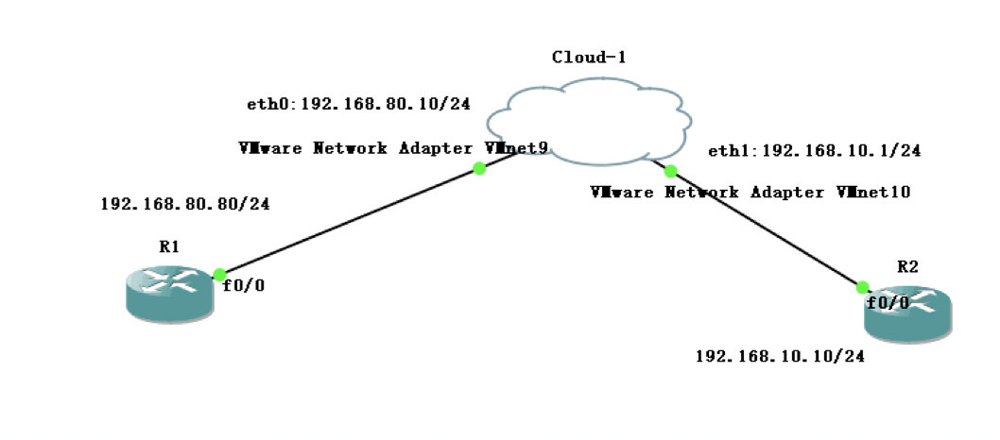

# Linux包过滤防火墙概述

- netfilter
    - 位于Linux内核中的包过滤功能体系
    - 这个叫Linux防火墙的“内核态”
- iptables
    - 位于/sbin/iptables，用来管理防火墙规则的工具
    - 这个叫“用户态”

Linux中的防火墙主要针对于网络层以及IP数据包，可以处理IP地址，端口等信息


当然在更新到7版本后，出现了firewalld。其实跟iptables是类似的。它们只是一种服务。iptables服务会把配置好的防火墙策略交由内核层面的netfilter网络过滤器来处理，而firewalld服务则是把配置好的防火墙策略交由内核层面的nftables包过滤框架来处理。这边先介绍iptables。


<!----more---->


# iptables中的表、链结构

- 规则链
    - 规则：可以对数据包进行过滤或处理
    - 链：容纳各种规则
    - 链的分类：根据处理包的不同时机有不同的链分类
- 默认的5种规则链
    - INPUT：入站数据包
    - OUTPUT：出站数据包
    - FORWARD：处理转发数据包
    - POSTROUTING：路由选择后的包
    - PREROUTING：路由选择前的包

当然用户还可以自定义链。这个放在后面再说。如果文字看的不太明白 可以看下图


- 规则表
    - 表：表用来容纳各种规则链
- 默认有4种规则表
    - raw表：是否对该数据包进行状态追踪
    - mangle表：为数据包设置标记
    - nat表：修改数据包中的源、目IP地址或端口
    - filter表：确定是否放行该数据包

规则表之间以 **raw mangle nat filter**的顺序进行匹配

以下是默认表、链结构示意图：


规则链内会进行顺序匹配，有匹配到则停止，若没有匹配上，就会按默认规则处理。

# iptables基本语法

- 语法构成
    - `iptables [-t 表名] 选项 [链名] [条件] [-j 控制类型]`

## 使用REJECT拒绝ICMP

下面简单做个实验来体验一下iptables。先看一下拓扑图。




图中的cloud-1就是centos7主机。有两块网卡，eth0和eth1，IP如图所示。R1和R2分别用两台cisco 3725模拟主机。R1和R2都配置了默认路由指向Linux主机。那么先来做一下测试吧。

> 注意，如果要让Linux主机能够有数据包的转发功能，要修改一个配置文件，在/etc/sysctl.conf中将net.ipv4.ip_forward的值修改为1.如下所示，顺便再清空一下iptables，完毕以后可以使用iptables -L查看

```shell
[root@remilia ~]# vi /etc/sysctl.conf 
net.ipv4.ip_forward = 1
[root@remilia ~]# iptables -F \\删除所有链中的规则
[root@remilia ~]# iptables -X \\删除所有用户自定义链
[root@remilia ~]# iptables -Z \\把所有链的计数器清空（归归归归零）
```

完毕以后我们来看一下R1和R2 以及R1与Linux主机，R2与Linux主机之间能否互通吧。

```shell
R1(config)#do ping 192.168.80.10 \\R1 ping Linux主机

Type escape sequence to abort.
Sending 5, 100-byte ICMP Echos to 192.168.80.10, timeout is 2 seconds:
!!!!!
Success rate is 100 percent (5/5), round-trip min/avg/max = 8/12/24 ms
R1(config)#do ping 192.168.10.10 \\R1 ping R2

Type escape sequence to abort.
Sending 5, 100-byte ICMP Echos to 192.168.10.10, timeout is 2 seconds:
!!!!!
Success rate is 100 percent (5/5), round-trip min/avg/max = 16/22/28 ms
```


现在图中应该是网络全通的。那么我们先写一个规则，让R1 ping不通Linux主机。


现在先来分析一下，R1如果要Ping Linux主机，使用的是ICMP，以及这算是入站，所以应该是input，然后如果不想让这个包通过，应该是属于filter表。那么命令就出来了

```shell
[root@remilia ~]# iptables -t filter -I INPUT -p icmp -j REJECT
[root@remilia ~]# iptables -L -t filter
Chain INPUT (policy ACCEPT)
target     prot opt source               destination         
REJECT     icmp --  anywhere             anywhere             reject-with icmp-port-unreachable

Chain FORWARD (policy ACCEPT)
target     prot opt source               destination         

Chain OUTPUT (policy ACCEPT)
target     prot opt source               destination     
```

其中 -I 代表 insert 插入 这条规则默认会在规则链的最上面添加,也可以使用 -I 后面跟序列号指定序号。-A则是在末尾添加。

> 注意，reject和drop的区别在于，reject会有明确的错误提示，而drop只是丢弃，对于icmp来说，就会显示超时。


来看看这么写会有什么效果

```shell
R1(config)#do ping 192.168.80.10

Type escape sequence to abort.
Sending 5, 100-byte ICMP Echos to 192.168.80.10, timeout is 2 seconds:
UUUUU
Success rate is 0 percent (0/5)
```

很明显，这里出现U代表不可达，而且出现的很快 明显看得出来是被拒绝了。


## 使用DROP拒绝ICMP

那么如果使用drop呢,我们可以先用删除命令把刚才写的规则删掉写一个新的，或者使用-I添加在最前面。我这边就先把之前写的删除再添加吧。


```shell
[root@remilia ~]# iptables -D INPUT 1
[root@remilia ~]# iptables -L
Chain INPUT (policy ACCEPT)
target     prot opt source               destination         

Chain FORWARD (policy ACCEPT)
target     prot opt source               destination         

Chain OUTPUT (policy ACCEPT)
target     prot opt source               destination         
```

可以看到之前的规则已经被清空了。

接下来看看用DROP会有什么不同


```shell
[root@remilia ~]# iptables -t filter -I INPUT -p icmp -j DROP
[root@remilia ~]# iptables -L
Chain INPUT (policy ACCEPT)
target     prot opt source               destination         
DROP       icmp --  anywhere             anywhere            

Chain FORWARD (policy ACCEPT)
target     prot opt source               destination         

Chain OUTPUT (policy ACCEPT)
target     prot opt source               destination 
```


规则写好了 接下来用R1来测试一下

```shell
R1(config)#do ping 192.168.80.10

Type escape sequence to abort.
Sending 5, 100-byte ICMP Echos to 192.168.80.10, timeout is 2 seconds:
.....
Success rate is 0 percent (0/5)
```


可以看到这边由于linux主机那边的操作是**DROP**而非**REJECT**导致R1发出去的包根本没有任何提示。直接被丢弃了。而R1并不知道，还在等待对方回复，思科路由器默认超过两秒以后就属于超时，所以出现的是**"....."**代表超时

当然 还可以使用`iptables -t filter -P `来设置默认策略 例如`iptables -t filter -P FORWARD DROP`代表将FORWARD的默认策略设置为丢弃。这边就不再演示了。在上面的命令中，每次iptables -L显示出来的内容中的（policy ）中的内容就代表默认策略。

## 使用SNAT和DNAT做地址转换

iptables中还有一个很重要的内容是地址转换。跟网络中的NAT有点类似。还是刚才的拓扑图，我将在Linux主机上做SNAT（源地址网络地址转换）把R1 Ping向R2的包 源地址变为200.1.1.1 。那么R2会认为是200.1.1.1给他发了ICMP echo request 他需要回复 ICMP echo reply，那么回包就变成了 SIP R2的IP DIP 200.1.1.1 这个时候查表转发，有一条默认路由 指向Linux主机 那么Linux主机便会收到这个包，这个时候再做一个DNAT（目标网络地址转换）。将 DIP 200.1.1.1 变为R1的IP 这样就能够实现ping通了。同时我会在 R2上开启 debug 。当然 要先在Linux主机上做两次NAT。


照惯例会先清空iptables，这边就不再演示了。


```shell
[root@remilia ~]# iptables -t nat -I POSTROUTING -s 192.168.80.0/24 -o eth1 -j SNAT --to-source 200.1.1.1
[root@remilia ~]# iptables -L -t nat 
Chain PREROUTING (policy ACCEPT)
target     prot opt source               destination         

Chain INPUT (policy ACCEPT)
target     prot opt source               destination         

Chain OUTPUT (policy ACCEPT)
target     prot opt source               destination         

Chain POSTROUTING (policy ACCEPT)
target     prot opt source               destination         
SNAT       all  --  192.168.80.0/24      anywhere             to:200.1.1.1

```

这边解释一下命令-s代表源地址 相当于我们在路由交换中做NAT的时候的那个ACL,-o是 out interface 就是出接口的意思。那么源地址转换做好了。按照刚才的分析 我们还需要做目标地址转换。


```shell
[root@remilia ~]# iptables -t nat -I PREROUTING -i eth1 -d 200.1.1.1 -p icmp -j DNAT --to-destination 192.168.80.80
[root@remilia ~]# iptables -L -t nat
Chain PREROUTING (policy ACCEPT)
target     prot opt source               destination         
DNAT       icmp --  anywhere             200.1.1.1            to:192.168.80.80

Chain INPUT (policy ACCEPT)
target     prot opt source               destination         

Chain OUTPUT (policy ACCEPT)
target     prot opt source               destination         

Chain POSTROUTING (policy ACCEPT)
target     prot opt source               destination         
SNAT       all  --  192.168.80.0/24      anywhere             to:200.1.1.1
```


这个就比较简单了 解释一下 -i 代表 接受包的接口 

>  参考自iptables的man手册:-i :Name of an interface via which a packet was received (only for packets entering the INPUT, FORWARD and  PREROUTING  chains).


那么来看一下效果吧


```shell
R1(config)#do ping 192.168.10.10 \\在R1上ping R2 能通

Type escape sequence to abort.
Sending 5, 100-byte ICMP Echos to 192.168.10.10, timeout is 2 seconds:
!!!!!
Success rate is 100 percent (5/5), round-trip min/avg/max = 20/21/24 ms

R2#debug ip icmp 
ICMP packet debugging is on
R2#
*Mar  1 04:04:15.698: ICMP: echo reply sent, src 192.168.10.10, dst 200.1.1.1
*Mar  1 04:04:15.734: ICMP: echo reply sent, src 192.168.10.10, dst 200.1.1.1
*Mar  1 04:04:15.754: ICMP: echo reply sent, src 192.168.10.10, dst 200.1.1.1
*Mar  1 04:04:15.778: ICMP: echo reply sent, src 192.168.10.10, dst 200.1.1.1
*Mar  1 04:04:15.798: ICMP: echo reply sent, src 192.168.10.10, dst 200.1.1.1
R2#

\\此时可以看出R2认为是200.1.1.1在ping他。
```

