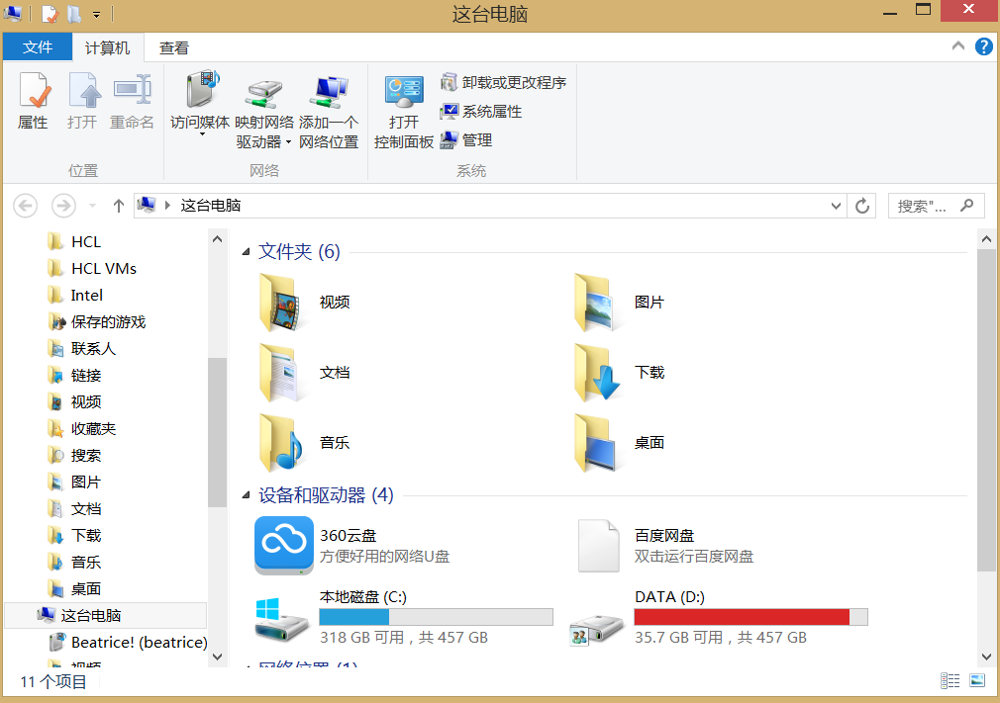
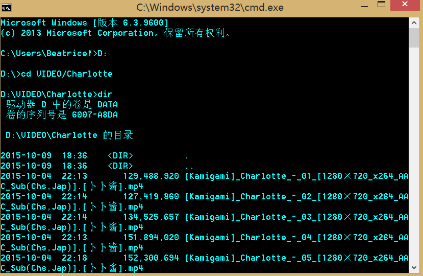
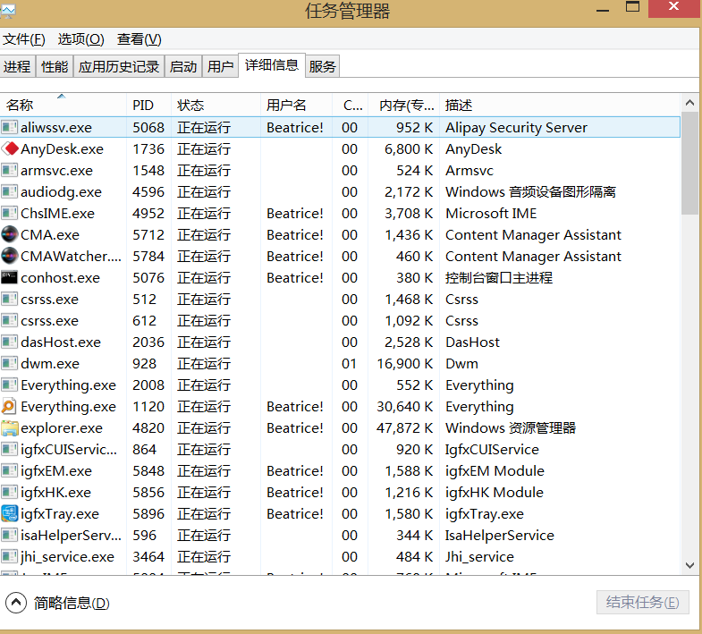

# 写在前面的话

个人所用的是虚拟机环境,使用的是**RHEL7**。大体上应该没有什么太大的关系。机器是两张网卡，一张VMNET10一张VMNET1都是仅主机模式。使用**SecureCRT**进行连接操作。环境的搭建就不写了。

# 必须掌握的几个Linux命令

## 我们为什么要学习Linux的命令？

初学者上手Linux系统会很懵。不管你是否安装了图形化界面，或者去网上找一些教程。或者一些Linux的应用 总会看到密密麻麻的命令。很难得看懂，直接导致一些人放弃学习。这边简单用Windows举个例子吧。

<!--more--->

​	例如在Windows中，我们总会打开**我的电脑**或者一些文件夹，能看到这样一种界面：



这是windows比较友好的地方。这整个叫做**图形化用户接口**，简称**GUI**。我们可以通过双击某个分区来浏览里面的数据 比方说到D盘的VIDEO里找到Charlotte文件夹,能够看到我下好的动漫 直接双击就可以观看了。


这整过过程可以理解为**“你”**在和**“电脑”**交互。你的鼠标双击告诉电脑要切换目录，于是电脑切换到该目录然后显示文件夹里的内容。


其实在Windows执行这些命令，也是一样的。我们来看一下。


打开CMD。一个黑乎乎的框框。在这里面我们可以输入命令 来达到同样的效果。




没有任何区别 只是通过文字的方法显示出来 让人难免感觉有些别扭。


直接输入文件名回车就可以运行了。在很久以前的DOS系统想要玩仙剑奇侠传1就是这么弄的。只不过后来逐渐有了图形化界面。


而Linux系统其实也有很多版本是有桌面环境的。像国产的DEEPIN。国外的UBUNTU。我所用的RHEL其实也可以有桌面环境。但是对于服务器系统来说，桌面环境毕竟还是比较消耗资源的。而且真正用起来，大部分时候命令行还是比图形化界面方便。（前提是你用的比较熟）所以掌握Linux中的命令就显得尤为重要了。就像我们第一次使用电脑的时候，会先学着**打开“我的电脑”** 然后是**安装软件**，**打开浏览器**，**下载软件** 等等等等。在我们初学Linux的时候也是要学习一些基本操作。而这些基本操作都是用命令去完成的。


接下来一起看一下Linux中一些常用的操作需要哪些命令来完成吧。


>   注意：
>
>   Linux里的每个命令有的必须带选项才能执行 有的可以不带选项执行。有的可以带多个选项。那么我们规定如下
>
>   -   **粗体字**表示实际需要输入的命令和关键字，在实际的配置示例和输出信息(不是一般的命令语法)中，粗体字表示你要手工输入的命令(比如**echo**命令)；
>   -   *斜体字* 表示需要用实际数值替换的参数
>   -   竖线(|)表示在几个选项中选择一项
>   -   方括号[]表示可选的参数;
>   -   大括号{}表示一个必需的选项
>   -   方括号里面带一个大括号[{}]表示在一个可选项中的必选项。

#常用基本命令

##echo命令

echo命令用于在屏幕上输出字符串或者变量提取后的值，格式为

**echo** [*字符串*|$变量]


比方说想要在屏幕上显示你好。可以输入


```bash
[root@remilia ~]# echo hello
hello
[root@remilia ~]# 
```


如果想要提取一个变量SHELL。则可以输入

```bash
[root@remilia ~]# echo $SHELL
/bin/bash
[root@remilia ~]# 
```


我们可以暂时不用管这个SHELL是什么。看结果就可以。


在测试命令的时候我们尽量不要用中文吧。养成好习惯。


如果你输入**echo 你好** 可能会出现 **echo ??** 所以尽量使用英文


## date命令

如果你安装的是没有图形化界面的系统。你会注意到整个界面就像WINDOWS里的CMD一样。除了一个光标在不停闪烁可以说其他的什么都没有


如果想查看当前的系统时间怎么办呢。这个时候可以使用date命令。


格式为**date** "[选项] \[+指定的格式]"


只需要在date命令中输入以“+”开头的参数,就可以按照指定的格式来输出系统的时间。


date常用的参数格式和作用如下

| 参数 |      作用      |
| :--: | :------------: |
|  %t  |     tab键      |
|  %H  |   小时(0~23)   |
|  %I  |   小时(0-12)   |
|  %M  |   分钟(0-59)   |
|  %S  |    秒(0-59)    |
|  %j  | 今年中的第几天 |

比如按照默认的格式输出当前系统时间是这样的

```bash
[root@remilia ~]# date
Tue Apr 17 03:45:33 EDT 2018
[root@remilia ~]# 
```


按照"年-月-日 小时:分钟:秒"的格式查看系统当前时间是这样的

```bash
[root@remilia ~]# date "+%Y-%m-%d %H:%M:%S"
2018-04-17 03:47:16
[root@remilia ~]# 
```

这边要说明一下Linux中每个命令都不尽相同。而且大部分命令都区分大小写。甚至有的时候%M 和 %m的意义都不一样。这个时候怎么办呢。


## man命令

man命令会显示某个命令的手册(manual)里面会告诉你每个参数都是什么意义。但是全是英文的。不过稍微有点基础的人都能看懂。学这个要是很抗拒英文的话是学不好的。


man命令的常用格式如下:


**man** {*命令*}


如果直接输入man 则会显示

```bash
[root@remilia ~]# man
What manual page do you want?
```

他会直接问你想要获取什么的帮助手册。所以我认为直接man没有啥意义。


那么拿date来举例。如果想看date的每个参数都是什么意思的话，则输入以下命令

```bash
[root@remilia ~]# man date
DATE(1)                          User Commands                         DATE(1)

NAME
       date - print or set the system date and time

SYNOPSIS
       date [OPTION]... [+FORMAT]
       date [-u|--utc|--universal] [MMDDhhmm[[CC]YY][.ss]]

DESCRIPTION
       Display the current time in the given FORMAT, or set the system date.

       Mandatory  arguments  to  long  options are mandatory for short options
       too.

       -d, --date=STRING
              display time described by STRING, not 'now'

       -f, --file=DATEFILE
              like --date once for each line of DATEFILE

       -I[TIMESPEC], --iso-8601[=TIMESPEC]
              output date/time in ISO 8601 format.  TIMESPEC='date'  for  date
 Manual page date(1) line 1 (press h for help or q to quit)
```


这个手册内容太多了 一页显示不完。所以可以通过按下回车下翻一行，通过空格下翻一页。按q退出


稍微下翻一下以后会发现大量参数和说明。

```bash
  FORMAT controls the output.  Interpreted sequences are:

       %%     a literal %

       %a     locale's abbreviated weekday name (e.g., Sun)

       %A     locale's full weekday name (e.g., Sunday)

       %b     locale's abbreviated month name (e.g., Jan)

       %B     locale's full month name (e.g., January)

       %c     locale's date and time (e.g., Thu Mar  3 23:05:25 2005)

       %C     century; like %Y, except omit last two digits (e.g., 20)

       %d     day of month (e.g., 01)

       %D     date; same as %m/%d/%y

       %e     day of month, space padded; same as %_d
```


比方说这边有%d的解释 解释是 **“day of month”**翻译过来就算一个月的某一天。后面的**(e.g., 01)**其中的eg代表for example 也就是他给你的例子。比方说01


那么我们来试一下

```bash
[root@remilia ~]# date "+%d"
17
[root@remilia ~]# 
```


今天确实是17号。如果你稍微找一找就能发现`date "+%Y-%m-%d %H:%M:%S"`这个可以有如下解释

-    %Y     year

-   %m     month (01..12)

-    %d     day of month (e.g., 01)

-    %H     hour (00..23)

-    %M     minute (00..59)

-    %S     second (00..60)

    以及你会发现一些其他的。类似：

-   %F     full date; same as %Y-%m-%d

-   %T     time; same as %H:%M:%S

    虽然不太明白 但是这个意思好像是%F就等于%Y-%m-%d，然后%T就等于%H:%M:%S

    那么我们的`date "+%Y-%m-%d %H:%M:%S"`能不能写成`date "+%F %T"`呢。

    试一下。

    ```bash
    [root@remilia ~]# date "+%F %T"
    2018-04-17 04:07:19
    [root@remilia ~]# date "+%Y-%m-%d %H:%M:%S"
    2018-04-17 04:07:42
    [root@remilia ~]# 
    ```

    ​

    ​

就结果来看 确实是一样的。这里应该是给了简写的方法。所以遇到陌生的命令可以尝试使用man去了解命令的基本用法。


## reboot命令

reboot命令用于重启系统，其格式为**reboot**


由于重启计算机这种操作会涉及硬件资源的管理权限，因此默认只能使用root管理员来重启。


其命令如下:

```bash
[root@remilia ~]# reboot
```


回车之后就重启了。


## poweroff命令


poweroff命令用于关闭系统,其格式为**poweroff**


该命令与reboot命令相同，都会涉及硬件资源的管理权限，因此默认只有root管理员才可以关闭电脑，其命令如下：


```bash
[root@remilia ~]# poweroff
```


敲了就关机了


## wget命令


wget命令用于下载网络中的文件。格式为 **wget** [参数]  \{*下载地址*}


如果没有Linux系统的管理经验，当前只需了解一下wget命令的参数以及作用，然后看一下下面的演示实验即可，切记不要急于求成。后面章节将逐步讲解Linux系统的配置管理方法，可以等您掌握了网卡的配置方法后再来进行这个实验操作。下表所示为wget命令的参数以及参数的作用。


| 参数 |                作用                |
| :--: | :--------------------------------: |
|  -b  |            后台下载模式            |
|  -P  |           下载到指定目录           |
|  -t  |            最大尝试次数            |
|  -c  |              断点续传              |
|  -p  | 下载页面内所有资源，包括图片视频等 |
|  -r  |              递归下载              |

例如，尝试使用wget命令下载163镜像站中的某个RPM包。这个文件完整路径为


http://mirrors.163.com/centos/7/cloud/x86_64/openstack-queens/GitPython-1.0.1-5.el7.noarch.rpm


命令如下:


```bash
[root@remilia ~]# wget http://mirrors.163.com/centos/7/cloud/x86_64/openstack-queens/GitPython-1.0.1-5.el7.noarch.rpm
--2018-04-17 05:56:44--  http://mirrors.163.com/centos/7/cloud/x86_64/openstack-queens/GitPython-1.0.1-5.el7.noarch.rpm
Resolving mirrors.163.com (mirrors.163.com)... 59.111.0.251
Connecting to mirrors.163.com (mirrors.163.com)|59.111.0.251|:80... connected.
HTTP request sent, awaiting response... 200 OK
Length: 513076 (501K) [application/x-redhat-package-manager]
Saving to: ‘GitPython-1.0.1-5.el7.noarch.rpm’

100%[======================================>] 513,076     1.82MB/s   in 0.3s   

2018-04-17 05:56
```


接下来尝试用wget递归下载该镜像源力的某个文件夹里的所有数据，然后会保存在当前目录下mirros.163.com文件夹中。执行该操作的命令为

wget -r -p http://mirrors.163.com/centos/7/cloud/x86_64/openstack-queens/repodata/

```bash
[root@remilia ~]# wget -r -p http://mirrors.163.com/centos/7/cloud/x86_64/openstack-queens/repodata/
--2018-04-17 06:01:35--  http://mirrors.163.com/centos/7/cloud/x86_64/openstack-queens/repodata/
Resolving mirrors.163.com (mirrors.163.com)... 59.111.0.251
Connecting to mirrors.163.com (mirrors.163.com)|59.111.0.251|:80... connected.
HTTP request sent, awaiting response... 200 OK
省略下载过程
```


## ps命令


ps命令


ps命令用于查看系统中的进程状态，格式为**ps** [参数]


ps命令一般和管道符一起使用,用来抓取某个服务进程对应的PID值。在windows中可以使用`ctrl+shift+esc`呼出任务管理器。直接查看某个进程的PID。如图：




而Linux就需要通过命令来看了。常见的参数和作用如下表所示

| 参数 |            作用            |
| :--: | :------------------------: |
|  -a  | 显示所有进程(包括其他用户) |
|  -u  |     用户及其他详细信息     |
|  -x  |   显示没有终端控制的进程   |

Linux系统中时刻运行着许多进程，如果能够合理地管理它们，则可以优化系统的性能。在Linux系统中，有5种常见的进程状态，分别为运行、中断、不可中断、僵死与停止，其各自含义如下所示。


-   R(运行):进程正在运行或在运行队列中等待
-   S(中断):进程处于休眠。当某个条件形成后或者接收到信号的时候，则脱离休眠状态
-   D(不可中断):进程不响应系统异步信号,即使用kill也不能将其中断。
-   Z(僵死):进程已经终止,但进程描述符亦然存在，直到父进程调用wait4()系统函数后将进程释放
-   T(停止):进程收到停止信号后停止运行


在执行 ps -aux之后会看到如下结果


```bash
[root@remilia ~]# ps -aux
USER        PID %CPU %MEM    VSZ   RSS TTY      STAT START   TIME COMMAND
root          1  0.1  0.3  50796  7212 ?        Ss   02:45   0:01 /usr/lib/systemd/systemd --swi
root          2  0.0  0.0      0     0 ?        S    02:45   0:00 [kthreadd]
root          3  0.0  0.0      0     0 ?        S    02:45   0:00 [ksoftirqd/0]
root          5  0.0  0.0      0     0 ?        S<   02:45   0:00 [kworker/0:0H]
root          7  0.0  0.0      0     0 ?        S    02:45   0:00 [migration/0]
root          8  0.0  0.0      0     0 ?        S    02:45   0:00 [rcu_bh]
root          9  0.0  0.0      0     0 ?        S    02:45   0:00 [rcuob/0]
root         10  0.0  0.0      0     0 ?        S    02:45   0:00 [rcuob/1]
root         11  0.0  0.0      0     0 ?        S    02:45   0:00 [rcuob/2]
root         12  0.0  0.0      0     0 ?        S    02:45   0:00 [rcuob/3]
root         13  0.0  0.0      0     0 ?        S    02:45   0:00 [rcuob/4]
root         14  0.0  0.0      0     0 ?        S    02:45   0:00 [rcuob/5]
root         15  0.0  0.0      0     0 ?        S    02:45   0:00 [rcuob/6]
root         16  0.0  0.0      0     0 ?        S    02:45   0:00 [rcuob/7]
root         17  0.0  0.0      0     0 ?        S    02:45   0:00 [rcuob/8]
root         18  0.0  0.0      0     0 ?        S    02:45   0:00 [rcuob/9]
root         19  0.0  0.0      0     0 ?        S    02:45   0:00 [rcuob/10]
root         20  0.0  0.0      0     0 ?        S    02:45   0:00 [rcuob/11]
root         21  0.0  0.0      0     0 ?        S    02:45   0:00 [rcuob/12]
root         22  0.0  0.0      0     0 ?        S    02:45   0:00 [rcuob/13]
root         23  0.0  0.0      0     0 ?        S    02:45   0:00 [rcuob/14]
root         24  0.0  0.0      0     0 ?        S    02:45   0:00 [rcuob/15]
root         25  0.0  0.0      0     0 ?        S    02:45   0:00 [rcuob/16]
root         26  0.0  0.0      0     0 ?        S    02:45   0:00 [rcuob/17]
root         27  0.0  0.0      0     0 ?        S    02:45   0:00 [rcuob/18]
root         28  0.0  0.0      0     0 ?        S    02:45   0:00 [rcuob/19]
root         29  0.0  0.0      0     0 ?        S    02:45   0:00 [rcuob/20]
root         30  0.0  0.0      0     0 ?        S    02:45   0:00 [rcuob/21]
root         31  0.0  0.0      0     0 ?        S    02:45   0:00 [rcuob/22]
root         32  0.0  0.0      0     0 ?        S    02:45   0:00 [rcuob/23]
root         33  0.0  0.0      0     0 ?        S    02:45   0:00 [rcuob/24]
root         34  0.0  0.0      0     0 ?        S    02:45   0:00 [rcuob/25]
root         35  0.0  0.0      0     0 ?        S    02:45   0:00 [rcuob/26]
root         36  0.0  0.0      0     0 ?        S    02:45   0:00 [rcuob/27]
root         37  0.0  0.0      0     0 ?        S    02:45   0:00 [rcuob/28]
root         38  0.0  0.0      0     0 ?        S    02:45   0:00 [rcuob/29]
root         39  0.0  0.0      0     0 ?        S    02:45   0:00 [rcuob/30]
root         40  0.0  0.0      0     0 ?        S    02:45   0:00 [rcuob/31]
root         41  0.0  0.0      0     0 ?        S    02:45   0:00 [rcuob/32]
root         42  0.0  0.0      0     0 ?        S    02:45   0:00 [rcuob/33]
root         43  0.0  0.0      0     0 ?        S    02:45   0:00 [rcuob/34]
root         44  0.0  0.0      0     0 ?        S    02:45   0:00 [rcuob/35]
root         45  0.0  0.0      0     0 ?        S    02:45   0:00 [rcuob/36]
root         46  0.0  0.0      0     0 ?        S    02:45   0:00 [rcuob/37]
root         47  0.0  0.0      0     0 ?        S    02:45   0:00 [rcuob/38]
root         48  0.0  0.0      0     0 ?        S    02:45   0:00 [rcuob/39]
root         49  0.0  0.0      0     0 ?        S    02:45   0:00 [rcuob/40]
root         50  0.0  0.0      0     0 ?        S    02:45   0:00 [rcuob/41]
root         51  0.0  0.0      0     0 ?        S    02:45   0:00 [rcuob/42]
root         52  0.0  0.0      0     0 ?        S    02:45   0:00 [rcuob/43]
root         53  0.0  0.0      0     0 ?        S    02:45   0:00 [rcuob/44]
root         54  0.0  0.0      0     0 ?        S    02:45   0:00 [rcuob/45]
root         55  0.0  0.0      0     0 ?        S    02:45   0:00 [rcuob/46]
root         56  0.0  0.0      0     0 ?        S    02:45   0:00 [rcuob/47]
root         57  0.0  0.0      0     0 ?        S    02:45   0:00 [rcuob/48]
root         58  0.0  0.0      0     0 ?        S    02:45   0:00 [rcuob/49]
root         59  0.0  0.0      0     0 ?        S    02:45   0:00 [rcuob/50]
root         60  0.0  0.0      0     0 ?        S    02:45   0:00 [rcuob/51]
root         61  0.0  0.0      0     0 ?        S    02:45   0:00 [rcuob/52]
root         62  0.0  0.0      0     0 ?        S    02:45   0:00 [rcuob/53]
root         63  0.0  0.0      0     0 ?        S    02:45   0:00 [rcuob/54]
root         64  0.0  0.0      0     0 ?        S    02:45   0:00 [rcuob/55]
root         65  0.0  0.0      0     0 ?        S    02:45   0:00 [rcuob/56]
root         66  0.0  0.0      0     0 ?        S    02:45   0:00 [rcuob/57]
root         67  0.0  0.0      0     0 ?        S    02:45   0:00 [rcuob/58]
root         68  0.0  0.0      0     0 ?        S    02:45   0:00 [rcuob/59]
root         69  0.0  0.0      0     0 ?        S    02:45   0:00 [rcuob/60]
root         70  0.0  0.0      0     0 ?        S    02:45   0:00 [rcuob/61]
root         71  0.0  0.0      0     0 ?        S    02:45   0:00 [rcuob/62]
root         72  0.0  0.0      0     0 ?        S    02:45   0:00 [rcuob/63]
root         73  0.0  0.0      0     0 ?        S    02:45   0:00 [rcuob/64]
root         74  0.0  0.0      0     0 ?        S    02:45   0:00 [rcuob/65]
root         75  0.0  0.0      0     0 ?        S    02:45   0:00 [rcuob/66]
root         76  0.0  0.0      0     0 ?        S    02:45   0:00 [rcuob/67]
root         77  0.0  0.0      0     0 ?        S    02:45   0:00 [rcuob/68]
root         78  0.0  0.0      0     0 ?        S    02:45   0:00 [rcuob/69]
root         79  0.0  0.0      0     0 ?        S    02:45   0:00 [rcuob/70]
root         80  0.0  0.0      0     0 ?        S    02:45   0:00 [rcuob/71]
root         81  0.0  0.0      0     0 ?        S    02:45   0:00 [rcuob/72]
root         82  0.0  0.0      0     0 ?        S    02:45   0:00 [rcuob/73]
root         83  0.0  0.0      0     0 ?        S    02:45   0:00 [rcuob/74]
root         84  0.0  0.0      0     0 ?        S    02:45   0:00 [rcuob/75]
root         85  0.0  0.0      0     0 ?        S    02:45   0:00 [rcuob/76]
root         86  0.0  0.0      0     0 ?        S    02:45   0:00 [rcuob/77]
root         87  0.0  0.0      0     0 ?        S    02:45   0:00 [rcuob/78]
root         88  0.0  0.0      0     0 ?        S    02:45   0:00 [rcuob/79]
root         89  0.0  0.0      0     0 ?        S    02:45   0:00 [rcuob/80]
root         90  0.0  0.0      0     0 ?        S    02:45   0:00 [rcuob/81]
root         91  0.0  0.0      0     0 ?        S    02:45   0:00 [rcuob/82]
root         92  0.0  0.0      0     0 ?        S    02:45   0:00 [rcuob/83]
root         93  0.0  0.0      0     0 ?        S    02:45   0:00 [rcuob/84]
root         94  0.0  0.0      0     0 ?        S    02:45   0:00 [rcuob/85]
root         95  0.0  0.0      0     0 ?        S    02:45   0:00 [rcuob/86]
root         96  0.0  0.0      0     0 ?        S    02:45   0:00 [rcuob/87]
root         97  0.0  0.0      0     0 ?        S    02:45   0:00 [rcuob/88]
root         98  0.0  0.0      0     0 ?        S    02:45   0:00 [rcuob/89]
root         99  0.0  0.0      0     0 ?        S    02:45   0:00 [rcuob/90]
root        100  0.0  0.0      0     0 ?        S    02:45   0:00 [rcuob/91]
root        101  0.0  0.0      0     0 ?        S    02:45   0:00 [rcuob/92]
root        102  0.0  0.0      0     0 ?        S    02:45   0:00 [rcuob/93]
root        103  0.0  0.0      0     0 ?        S    02:45   0:00 [rcuob/94]
root        104  0.0  0.0      0     0 ?        S    02:45   0:00 [rcuob/95]
root        105  0.0  0.0      0     0 ?        S    02:45   0:00 [rcuob/96]
root        106  0.0  0.0      0     0 ?        S    02:45   0:00 [rcuob/97]
root        107  0.0  0.0      0     0 ?        S    02:45   0:00 [rcuob/98]
root        108  0.0  0.0      0     0 ?        S    02:45   0:00 [rcuob/99]
root        109  0.0  0.0      0     0 ?        S    02:45   0:00 [rcuob/100]
root        110  0.0  0.0      0     0 ?        S    02:45   0:00 [rcuob/101]
root        111  0.0  0.0      0     0 ?        S    02:45   0:00 [rcuob/102]
root        112  0.0  0.0      0     0 ?        S    02:45   0:00 [rcuob/103]
root        113  0.0  0.0      0     0 ?        S    02:45   0:00 [rcuob/104]
root        114  0.0  0.0      0     0 ?        S    02:45   0:00 [rcuob/105]
root        115  0.0  0.0      0     0 ?        S    02:45   0:00 [rcuob/106]
root        116  0.0  0.0      0     0 ?        S    02:45   0:00 [rcuob/107]
root        117  0.0  0.0      0     0 ?        S    02:45   0:00 [rcuob/108]
root        118  0.0  0.0      0     0 ?        S    02:45   0:00 [rcuob/109]
root        119  0.0  0.0      0     0 ?        S    02:45   0:00 [rcuob/110]
root        120  0.0  0.0      0     0 ?        S    02:45   0:00 [rcuob/111]
root        121  0.0  0.0      0     0 ?        S    02:45   0:00 [rcuob/112]
root        122  0.0  0.0      0     0 ?        S    02:45   0:00 [rcuob/113]
root        123  0.0  0.0      0     0 ?        S    02:45   0:00 [rcuob/114]
root        124  0.0  0.0      0     0 ?        S    02:45   0:00 [rcuob/115]
root        125  0.0  0.0      0     0 ?        S    02:45   0:00 [rcuob/116]
root        126  0.0  0.0      0     0 ?        S    02:45   0:00 [rcuob/117]
root        127  0.0  0.0      0     0 ?        S    02:45   0:00 [rcuob/118]
root        128  0.0  0.0      0     0 ?        S    02:45   0:00 [rcuob/119]
root        129  0.0  0.0      0     0 ?        S    02:45   0:00 [rcuob/120]
root        130  0.0  0.0      0     0 ?        S    02:45   0:00 [rcuob/121]
root        131  0.0  0.0      0     0 ?        S    02:45   0:00 [rcuob/122]
root        132  0.0  0.0      0     0 ?        S    02:45   0:00 [rcuob/123]
root        133  0.0  0.0      0     0 ?        S    02:45   0:00 [rcuob/124]
root        134  0.0  0.0      0     0 ?        S    02:45   0:00 [rcuob/125]
root        135  0.0  0.0      0     0 ?        S    02:45   0:00 [rcuob/126]
root        136  0.0  0.0      0     0 ?        S    02:45   0:00 [rcuob/127]
root        137  0.0  0.0      0     0 ?        R    02:45   0:00 [rcu_sched]
root        138  0.0  0.0      0     0 ?        S    02:45   0:00 [rcuos/0]
root        139  0.0  0.0      0     0 ?        S    02:45   0:00 [rcuos/1]
root        140  0.0  0.0      0     0 ?        S    02:45   0:00 [rcuos/2]
root        141  0.0  0.0      0     0 ?        S    02:45   0:00 [rcuos/3]
root        142  0.0  0.0      0     0 ?        S    02:45   0:00 [rcuos/4]
root        143  0.0  0.0      0     0 ?        S    02:45   0:00 [rcuos/5]
root        144  0.0  0.0      0     0 ?        S    02:45   0:00 [rcuos/6]
root        145  0.0  0.0      0     0 ?        S    02:45   0:00 [rcuos/7]
root        146  0.0  0.0      0     0 ?        S    02:45   0:00 [rcuos/8]
root        147  0.0  0.0      0     0 ?        S    02:45   0:00 [rcuos/9]
root        148  0.0  0.0      0     0 ?        S    02:45   0:00 [rcuos/10]
root        149  0.0  0.0      0     0 ?        S    02:45   0:00 [rcuos/11]
root        150  0.0  0.0      0     0 ?        S    02:45   0:00 [rcuos/12]
root        151  0.0  0.0      0     0 ?        S    02:45   0:00 [rcuos/13]
root        152  0.0  0.0      0     0 ?        S    02:45   0:00 [rcuos/14]
root        153  0.0  0.0      0     0 ?        S    02:45   0:00 [rcuos/15]
root        154  0.0  0.0      0     0 ?        S    02:45   0:00 [rcuos/16]
root        155  0.0  0.0      0     0 ?        S    02:45   0:00 [rcuos/17]
省略部分输出...
```


其中的一些参数意义如下表格

| **USER**     | **PID**  | **%CPU**     | **%MEM**   | **VSZ**                    | **RSS**                      | **TTY**  | **STAT**   | **START**      | **TIME**            | **COMMAND**    |
| ------------ | -------- | ------------ | ---------- | -------------------------- | ---------------------------- | -------- | ---------- | -------------- | ------------------- | -------------- |
| 进程的所有者 | 进程ID号 | 运算器占用率 | 内存占用率 | 虚拟内存使用量（单位是KB） | 占用的固定内存量（单位是KB） | 所在终端 | 进程  状态 | 被启动  的时间 | 实际使用  CPU的时间 | 命令名称与参数 |


## top命令

top命令用于动态地监视进程活动与系统负载信息等。其格式为**top**


top命令非常强大。可以看作是Linux中的任务管理器。由于运行了top之后其中的数据会不断变换，这里只截取一次，实际是不停变化的。按q可退出。结果如下:

```bash
[root@remilia ~]# top
top - 03:02:24 up 16 min,  1 user,  load average: 0.00, 0.01, 0.05
Tasks: 418 total,   1 running, 417 sleeping,   0 stopped,   0 zombie
%Cpu(s):  0.0 us,  0.2 sy,  0.0 ni, 99.8 id,  0.0 wa,  0.0 hi,  0.0 si,  0.0 st
KiB Mem:   1870784 total,   285556 used,  1585228 free,      784 buffers
KiB Swap:  2097148 total,        0 used,  2097148 free.    91104 cached Mem

   PID USER      PR  NI    VIRT    RES    SHR S  %CPU %MEM     TIME+ COMMAND                    
   714 root      20   0       0      0      0 S   0.3  0.0   0:00.06 xfsaild/dm-0               
     1 root      20   0   50796   7220   2484 S   0.0  0.4   0:01.42 systemd                    
     2 root      20   0       0      0      0 S   0.0  0.0   0:00.02 kthreadd                   
     3 root      20   0       0      0      0 S   0.0  0.0   0:00.00 ksoftirqd/0                
     5 root       0 -20       0      0      0 S   0.0  0.0   0:00.00 kworker/0:0H               
     7 root      rt   0       0      0      0 S   0.0  0.0   0:00.34 migration/0                
     8 root      20   0       0      0      0 S   0.0  0.0   0:00.00 rcu_bh      
```


在如上的结果中，前5行为系统整体的统计信息。其所代表的含义如下

-   第1行：系统时间、运行时间、登录终端数、系统负载（三个数值分别为1分钟、5分钟、15分钟内的平均值，数值越小意味着负载越低）。
-   第2行：进程总数、运行中的进程数、睡眠中的进程数、停止的进程数、僵死的进程数。
-   第3行：用户占用资源百分比、系统内核占用资源百分比、改变过优先级的进程资源百分比、空闲的资源百分比等。

>   注:第3行中的数据均为CPU数据并以百分比格式显示，例如“97.1 id”意味着有97.1%的CPU处理器资源处于空闲。

-   第4行：物理内存总量、内存使用量、内存空闲量、作为内核缓存的内存量。

-   第5行：虚拟内存总量、虚拟内存使用量、虚拟内存空闲量、已被提前加载的内存量。


## pidof命令

pidof命令用于查询某个指定服务进程的PID值，格式为“**pidof** {[参数]\[*服务名称*]}”。
每个进程的进程号码值（PID）是唯一的，因此可以通过PID来区分不同的进程。例如，可以使用如下命令来查询本机上sshd服务程序的PID：
```bash
[root@remilia ~]# pidof sshd
2156
```

## kill命令

kill命令用于终止某个指定PID的服务进程，格式为“**kill** [参数]\[*进程PID*]”。
接下来，我们使用kill命令把上面用pidof命令查询到的PID所代表的进程终止掉，其命令如下所示。这种操作的效果等同于强制停止sshd服务。
```bash
[root@remilia ~]# kill 2156
```

## killall命令

killall命令用于终止某个指定名称的服务所对应的全部进程，格式为：“**killall** [参数]\[*进程名称*]”。
通常来讲，复杂软件的服务程序会有多个进程协同为用户提供服务，如果逐个去结束这些进程会比较麻烦，此时可以使用killall命令来批量结束某个服务程序带有的全部进程。下面以httpd服务程序为例，来结束其全部进程。由于RHEL7系统默认没有安装httpd服务程序，因此此时只需看操作过程和输出结果即可。

```bash
[root@remilia ~]# pidof httpd
13581 13580 13579 13578 13577 13576
[root@remilia ~]# killall httpd
[root@remilia ~]# pidof httpd
[root@remilia ~]# 
```


>   注：	
>
>   如果我们在系统终端中执行一个命令后想立即停止它，可以同时按下Ctrl + C组合键（生产环境中比较常用的一个快捷键），这样将立即终止该命令的进程。或者，如果有些命令在执行时不断地在屏幕上输出信息，影响到后续命令的输入，则可以在执行命令时在末尾添加上一个&符号，这样命令将进入系统后台来执行。

# 系统状态检测命令

作为一名合格的运维人员，想要更快、更好地了解Linux服务器，必须具备快速查看Linux系统运行状态的能力，因此接下来会逐个说明与网卡网络、系统内核、系统负载、内存使用情况、当前启用终端数量、历史登录记录、命令执行记录以及救援诊断等相关命令的使用方法。这些命令都超级实用。是必须掌握的命令。

## ifconfig命令


